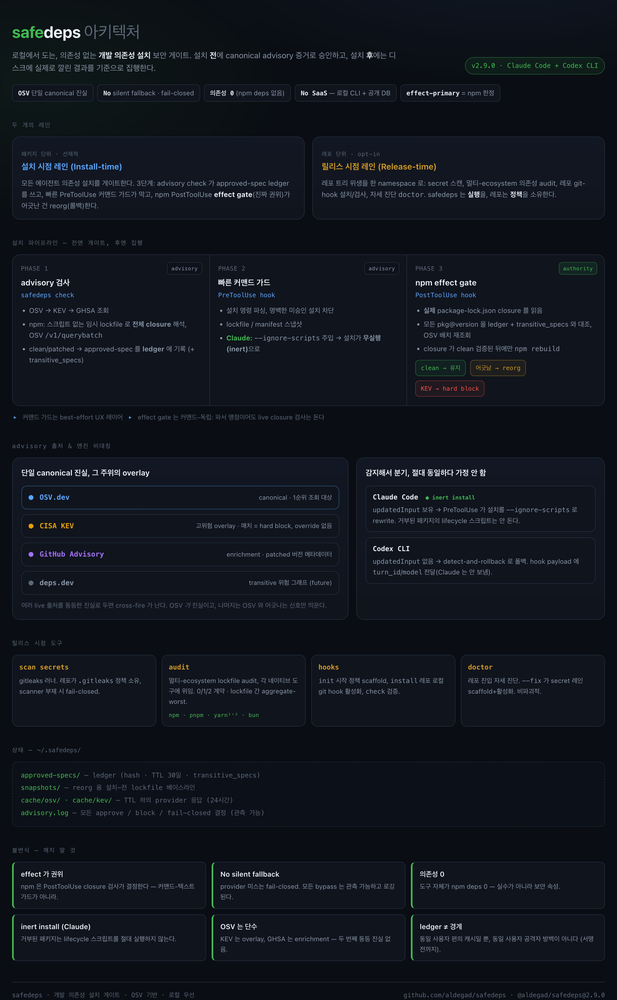

# safedeps

> **AI 코딩 에이전트가 취약하거나 승인되지 않은 의존성을 설치하지 못하게 하고, 새어 들어온 항목은 되돌리게 합니다.**
>
> `safedeps`는 Claude Code 또는 Codex CLI 에이전트가 실행하는 모든 의존성 설치를 게이팅합니다. OSV / CISA KEV / GitHub Advisory를 기준으로 패키지를 사전 승인하고, 실제 lockfile에 반영된 폐쇄성을 다시 검증하며, 일치하지 않는 항목은 자동으로 롤백합니다. 로컬 전용이며 런타임 의존성은 없습니다. *(한국어 README → [README.ko.md](./README.ko.md))*

- **사전 승인** — 각 `pkg@version`와 npm의 전체 전이적 폐쇄성을 OSV(표준), CISA KEV, GitHub Advisory에 대해 설치 전 승인 여부를 확인합니다.
- **실제 효과 적용 강제** — 설치 후 실제 `package-lock.json` 폐쇄성을 다시 검증하여, 래핑되거나 난독화된 명령이 게이트를 통과하지 못하게 합니다.
- **롤백** — 승인되지 않았거나 새로 취약해진 항목은 마지막으로 확정된 안전 스냅샷으로 되돌립니다. Claude Code에서는 설치가 관성 모드(`--ignore-scripts`)로 실행되어 거부된 패키지의 라이프사이클 스크립트가 실행되지 않습니다.

> **실제로 잡은 사례.** pre-commit 감사가 Dependabot이 놓친 취약한 전이적 `hono` 어드바이저리를 잡았습니다 — 커밋 시점에 어드바이저리 DB를 다시 조회해서. 패키지를 설치한 *뒤에* 공개된 CVE("그땐 안전해 보였는데 지금 발견됨")가 몇 주 뒤가 아니라 바로 다음 커밋에 드러납니다.

## Quickstart

```bash
# 1. CLI 설치 — npm 패키지는 스코프가 적용되므로 @aldegad/ 접두사를 사용합니다.
npm install -g @aldegad/safedeps

# 2. Claude Code / Codex에 훅 연결 (멱등성 보장)
cd "$(npm root -g)/@aldegad/safedeps" && node scripts/install/install-safedeps-hooks.mjs

# 3. 완료 — 이제 에이전트가 실행하는 모든 의존성 설치가 게이팅됩니다.
```

> `safedeps`는 CLI 명령어이며, npm 패키지는 **`@aldegad/safedeps`**입니다. npm의 스코프 없는 `safedeps`는 다른 패키지입니다. 정식 소스 트리를 사용하려면 [Installation](#installation)을 참고하세요.


## Distribution Model

Safedeps에는 두 가지 배포 채널이 있습니다.

1. **에이전트 스킬 + 훅 (표준)** — 저장소 자체가 스킬 폴더입니다. `SKILL.md`, 훅 스크립트, provider/ledger 라이브러리, 설치 헬퍼가 하나의 디렉터리에 함께 있습니다.
2. **npm 패키지 (CLI 편의성)** — `@aldegad/safedeps`가 `safedeps` 명령어를 설치합니다. npm 설치만으로는 Claude Code나 Codex가 스킬을 자동으로 발견하지 않으므로, 사용자는 여전히 훅/스킬 설치자를 실행하거나 스킬 폴더를 수동 등록해야 합니다.

GitHub 릴리스는 정식 스킬/훅 소스 트리를 기준 아티팩트로 사용하려는 경우에 사용합니다. 버전 관리된 전역 CLI가 필요한 경우에는 npm을 사용하세요.

용어 정리: safedeps는 Claude/Codex 훅과 로컬 CLI로 지원되는 에이전트 보안 스킬입니다. 나중에 플러그인 매니페스트로 래핑되지 않는 한 Codex 플러그인 번들은 아닙니다.

## Two Lanes

`safedeps`는 두 가지 보안 레인을 가집니다(전체 설계는 [`ARCHITECTURE.md`](./ARCHITECTURE.md) §1 참조):

- **설치 시점**(이 README의 초점) — advisory 확인 + 승인 사양 ledger + 빠른 PreToolUse 가드 + PostToolUse 효과 강제 + 설치 후 reorg. 설치 명령과 실제 lockfile 영향 범위 기준으로 패키지 단위로 동작.
- **릴리스 시점** — `safedeps gates run`, `safedeps scan secrets [--repo|--worktree|--staged]`, `safedeps audit [npm|pnpm|yarn|bun]`, `safedeps hooks install|check`. 원격 푸시/릴리스 전 repo 트리 시크릿 스캔, 의존성 감사, repo 로컬 git 훅 설치/검사, 그리고 옵트인 원격 리포지토리 posture 검사. 저장소 정책(`gitleaks` 설정, privacy paths)은 대상 repo가 소유하며 safedeps는 로컬 실행을 담당합니다. *(이전 `security-release-gates`를 흡수했습니다.)*

릴리스 시점의 시크릿 유출 영역은 **repo별 opt-in**입니다. `safedeps doctor`가 그 진입점입니다. repo의 `.gitleaks` 정책, `.githooks/pre-commit`, 활성 `core.hooksPath`, 스캐너 가용성(및 전역 설치 시점 게이트 상태)을 진단한 뒤, `safedeps doctor --fix`가 기본 정책을 스캐폴딩(`safedeps hooks init`)하고 활성화(`safedeps hooks install`)합니다. `--fix`를 선택하면 repo 로컬의 pre-commit 설정이 자동으로 적용되며 원격 CI 리소스를 소비하지 않습니다. 스캐폴딩은 비파괴적입니다 — 기존 repo 소유 `.gitleaks.toml`은 덮어쓰지 않습니다 — 그리고 pre-commit 훅은 시크릿 스캔(`safedeps scan secrets --staged`)과, 지원 lockfile이 있는 repo에서 매 커밋마다 의존성 감사(`safedeps audit`, npm/pnpm/yarn/bun 자동 감지)를 실행합니다. 실제 발견은 차단(fail-closed)되며, advisory DB 접근 불가 시에는 경고만 남기고 커밋은 통과시켜(오프라인 폴백) 가시성을 확보합니다. 원격 집행은 두 갈래로 나뉩니다. `main`에 대한 직접 push를 막는 브랜치 규칙은 비용이 들지 않는 no-runner posture로 권장하고, GitHub Actions 워크플로우와 필수 상태 검사는 실행 비용이 드는 명시적 opt-in로 둡니다. 자세한 내용은 [Secret-Leak Lane (per-repo)](#secret-leak-lane-per-repo) 참조.

## How It Works

[](./ARCHITECTURE.md)

`safedeps`는 각 설치를 기준으로 두 단계로 동작합니다.

- **이전 단계** — `safedeps check`가 패키지를 OSV(표준), CISA KEV, GitHub Advisory로 확인한 뒤 로컬 ledger에 승인 기록을 남깁니다. npm의 경우 패키지의 전체 의존성 폐쇄성을 해결해 모든 전이적 패키지도 검사합니다.
- **이후 단계** — PostToolUse 훅이 실제 `package-lock.json`에 반영된 내용을 다시 읽고, ledger에 없는 항목이나 advisory DB에서 새로 위험으로 표시된 항목을 롤백(리오그)합니다.

PreToolUse 명령 훅은 빠른 advisory 안내 장치로서, 명백히 승인되지 않은 설치 및 위험한 명령 형태를 차단해 에이전트에게 즉시 피드백을 제공합니다. 하지만 npm에서는 실제 권한 판단이 설치 후 효과 게이트에 있으며, 실제로 설치된 결과를 기준으로 판단하므로 래핑되거나 난독화된 설치 명령으로 패키지를 우회할 수 없습니다.

**스크립트 안전성(비활성 설치).** Claude Code에서는 PreToolUse 훅이 npm install에 `--ignore-scripts`를 추가해 설치를 **비활성(inert)** 상태로 실행합니다. 즉, 패키지는 디스크에 기록되지만 라이프사이클 스크립트는 아직 실행되지 않습니다. 이후 효과 게이트가 폐쇄성을 검증하고 통과 시에만 PostToolUse 훅이 `npm rebuild`를 실행해 검증된 스크립트를 실행합니다. 게이트가 거부한 패키지는 어떤 스크립트도 실행되기 전에 리오그됩니다. (이 기능은 Claude Code의 `updatedInput` capability를 사용합니다. Codex CLI는 이 기능을 노출하지 않으므로, Codex에서는 설치가 일반 실행되고 효과 게이트는 detect-and-rollback 방식입니다. 즉 악성 설치 스크립트가 롤백 전 1회 실행될 수 있습니다.)

이 효과 우선 모델은 현재 npm에만 적용됩니다. `pip`, `cargo`, `go`, `gem`, `maven`, `nuget`은 closure resolver가 추가될 때까지 v2.1 명령 게이트 + reorg 모델을 유지합니다.

```
                         PreToolUse                          PostToolUse
                  (safedeps-pre-guard.sh)          (safedeps-post-verify.sh)
                            |                                    |
  install cmd ──> [ Advisory/ledger UX ] ──> [ Execute ] ──> [ npm effect gate ]
                     |            |                           |       |
                  Block obvious Snapshot                  Clean?  Suspicious?
                  misses/risk   lock/manifest files,        |       |
                                package listings          Confirm  REORG
                                                              |       |
                                    |                       v       v
                                    +--- parent_snapshot_id ──> confirmed
                                                                    |
                                                              Rollback to last
                                                              confirmed snapshot
```

### Phase 1: Advisory Check (`safedeps check`)

에이전트가 의존성을 설치하기 전에 다음을 실행해야 합니다.

```bash
safedeps check <ecosystem> <pkg>@<version|range> --json
```

이 명령은 OSV(표준), CISA KEV(고위험 오버레이), GitHub Advisory(강화 정보)를 조회합니다. npm의 경우 먼저 스크립트가 없는 임시 lockfile을 `npm install --package-lock-only --ignore-scripts`로 생성한 뒤 전체 의존성 폐쇄성을 추출하고 OSV `/v1/querybatch`를 쿼리합니다. 정상이거나 안전하게 축소된 spec은 `~/.safedeps/approved-specs/`에 기록되고, npm 항목은 `transitive_specs`도 함께 저장합니다.

### Phase 2: Fast Command Guard + Snapshots (PreToolUse)

Claude Code 또는 Codex CLI가 `npm install`, `pip install`, `cargo add`, `go get`, `gem install` 같은 명령을 실행하려 할 때, 가드 훅이 빠른 advisory/UX 레이어를 제공합니다.

1. `package-lock.json`, `pnpm-lock.yaml`, `yarn.lock`, `package.json`을 `~/.safedeps/snapshots/`로 **스냅샷**합니다.
2. 이전 확정 스냅샷을 가리키는 `parent_snapshot_id`를 포함한 메타데이터를 **기록**해 체인 형성(블록 체인처럼)을 만듭니다.
3. 나중 diff 탐지를 위해 `node_modules`의 패키지 목록과 바이너리 목록에 대한 **설치 전 상태**를 캡처합니다.
4. 명시적 `pkg@version` 설치 명령에 대해 승인된 spec ledger를 **빠르게 확인**합니다.
5. 사전 비행 체크를 수행하고 다음 조건을 감지하면 실행을 **차단**합니다.
   - 타이포스쿼팅 패키지명 (`lod_sh`, `reacct`, `axois` 등)
   - 비표준 `--registry` URL(`registry.npmjs.org`, `registry.yarnpkg.com` 외부)
   - 파이프 기반 원격 실행 패턴 (`curl ... | bash`)
   - 설치 스크립트 안전성 명시적 비활성 (`npm config set ignore-scripts false`)

ledger 게이트나 사전 비행 체크에 실패하면 해당 명령은 실행 전에 **차단**됩니다. 명령 가드는 의도적으로 best-effort이며, 에이전트 루프를 개선하고 직접적인 누락을 잡는 데 초점을 둡니다. npm의 권한 판단은 설치 후 효과 게이트가 담당합니다.

### Phase 3: Post-install Effect Enforcement (`safedeps-post-verify.sh` -- PostToolUse)

설치 명령이 끝난 뒤 verify 훅이 변경 사항을 분석합니다. npm에서는 이것이 주요 집행 지점입니다. 실제 `package-lock.json` 폐쇄성을 읽고, 각 패키지를 승인된 direct entry와 해당 `transitive_specs`로 검증한 뒤 OSV 배치 조회를 다시 수행합니다.

1. **npm effect gate** — 잠금 파일의 어떤 패키지든 승인되지 않았거나 KEV 차단, 취약점 존재, 또는 fail-closed 검증 실패 시 reorg 수행.

2. **설치 스크립트 분석** — 새로 추가된 패키지의 `preinstall`, `install`, `postinstall` 스크립트에서 다음 항목 탐지:
   - 네트워크 접근 (`curl`, `wget`, `fetch`, `http`, `socket`, `dns`)
   - 동적 코드 실행 (`eval`, `exec`, `spawn`, `child_process`, `Function()`)
   - 민감 경로 접근 (`~/.ssh`, `.env`, `.aws`, `credentials`)
   - 난독화된 내용 (`base64`, `atob`, `Buffer.from`, 16진수/유니코드 이스케이프)

3. **Lock file diff analysis** — 스냅샷된 lock 파일 내용과 설치 후 버전 비교:
   - 비표준 registry를 가리키는 resolved URL
   - resolved URL의 보안 취약 프로토콜 (`http://`, `git://`)
   - 과도한 의존성 증가 (>50개 신규 resolved 항목, 의존성 혼란 공격 가능성)

4. **바이너리 검사** — `node_modules/.bin/`에서 새로 추가된 네이티브 바이너리(ELF, Mach-O, 공유 객체)를 확인해 JavaScript 프로젝트에서 나타나면 안 되는 항목 탐지.

### Confirm or Reorg

- **모든 검사 통과** — 해당 스냅샷이 `~/.safedeps/confirmed`에 **confirmed**로 표시됩니다. 이것이 새 안전 기준점입니다.
- **검사 실패 발생** — **reorg**가 트리거됩니다:
  1. lock file을 마지막 confirmed 스냅샷에서 복원
  2. 변경된 경우 `package.json` 복원
  3. `npm ci`(실패 시 `npm install` 대체)로 `node_modules` 재구성해 악성 아티팩트 제거
  4. 이벤트를 `~/.safedeps/reorg.log`에 기록
  5. Claude Code에 탐지 위협과 롤백 동작을 상세히 담은 시스템 메시지 전달

## Why "reorg"?

이름은 블록체인에서 **reorganization(reorg)**, 즉 확인되지 않은 블록열을 무효화하고 마지막으로 확인된 안전 상태로 체인을 되돌리는 개념에서 가져왔습니다. `safedeps`도 모든 설치를 동일하게 취급합니다. 확인되지 않은 블록 후보처럼, 공급망 점검 배터리를 통과할 때까지 설치는 잠정 상태에 머뭅니다. 실제 설치 결과가 다르면 툴이 **reorg**를 실행해 lock file, `package.json`, `node_modules`를 마지막 안전 스냅샷으로 되돌립니다.

하지만 reorg는 **최후의 방어선(backstop)**이지 최전선이 아닙니다. 대부분의 위험한 설치는 여기까지 오기 전에 멈춥니다. 사전 승인 게이트가 승인되지 않았거나 의심 패키지를 실행 전에 차단하고, Claude Code에서는 설치를 **비활성**(`--ignore-scripts`) 모드로 실행해 closure가 깨끗함을 확인할 때까지 라이프사이클 스크립트를 실행하지 않기 때문입니다. reorg는 잔여 케이스(승인된 직접 패키지가 승인되지 않았거나 취약한 전이적 패키지를 끌어오거나, advisory 계층을 우회해 래핑된 명령이 넘어왔을 때)에만 동작하며, 이 경우에도 스크립트가 실행되기 전에 파일을 되돌립니다.

빠른 advisory 피드백, 가시적인 rollback, 숨김 우회 경로 없음. 명령 가드는 best-effort UX이고, 설치 결과 자체가 최종 방어선입니다.

## The Blockchain Analogy

| 블록체인 개념 | Safedeps 대응 개념 |
|---|---|
| **블록 후보(Block candidate)** | `npm install` 이전에 찍힌 스냅샷 |
| **블록 검증(Block validation)** | 설치 후 효과 검사 (npm closure, scripts, lock diff, binaries) |
| **최종 확정 / confirmation** | `~/.safedeps/confirmed`에 기록된 snapshot ID |
| **체인 재구성(Chain reorganization)** | 마지막 confirmed 스냅샷으로 rollback + `node_modules` 재구성 |
| **부모 해시 연결(Parent hash linking)** | 각 스냅샷 `_meta.json`의 `parent_snapshot_id` |
| **체인 가지치기(Chain pruning)** | 오래된 미확정 스냅샷 정리, confirmed chain은 보존 |

## Detection Rules

| 분류 | 탐지 대상 | 단계 | 조치 |
|---|---|---|---|
| Typosquatting | 유명 패키지의 알려진 오타 패턴 | PreToolUse advisory guard | **차단** |
| Pipe execution | `curl \| bash`, `wget \| sh` | PreToolUse advisory guard | **차단** |
| Registry hijack | 비공식 소스에 대한 `--registry` 지정 | PreToolUse advisory guard | **차단** |
| Script safety bypass | `npm config set ignore-scripts false` | PreToolUse advisory guard | **차단** |
| Command indirection | `eval "npm install ..."`, 서브셸 확장, 변수 indirection | PreToolUse advisory guard | **Guard** |
| npx/dlx execution | `npx`, `pnpm dlx`, `yarn dlx` 패키지 실행 | PreToolUse advisory guard | **Guard** |
| 승인되지 않은 전이적 의존성 | npm `package-lock.json`에 있는 패키지가 직접 ledger 또는 `transitive_specs`에 없음 | PostToolUse npm primary effect gate | **Reorg** |
| 취약한 closure 패키지 | OSV/KEV 적중이 있는 npm 직접/전이 패키지 | PostToolUse npm primary effect gate | **Reorg** |
| 악성 설치 스크립트 | hooks 내 네트워크 호출, `eval`/`exec`, 민감 경로 접근 | PostToolUse effect verify | **Reorg** |
| 난독화 코드 | 설치 스크립트의 Base64, hex 인코딩, `Buffer.from` | PostToolUse effect verify | **Reorg** |
| Lock file 조작 | 비표준 registry의 resolved URL | PostToolUse effect verify | **Reorg** |
| 비보안 프로토콜 | resolved URL의 `http://` 또는 `git://` | PostToolUse effect verify | **Reorg** |
| 의존성 혼란(Dependency confusion) | 단일 설치에서 50개 초과 신규 의존성 추가 | PostToolUse effect verify | **Reorg** |
| 네이티브 바이너리 | `node_modules/.bin/`의 컴파일된 실행 파일 | PostToolUse effect verify | **Reorg** |

## Secret-Leak Lane (per-repo)

설치 시점 게이트는 전역이지만, 실제 `.env` 같은 비밀값이 커밋되는 것을 막는 것은 **repo별**로 opt-in입니다. 해당 탐지 정책은 각 repo 내부에 있으며 safedeps에 포함되지 않습니다. `safedeps doctor`가 그 간극을 메우는 진입점입니다.

```bash
# Diagnose this repo's posture (read-only). Exits non-zero if the secret lane has gaps.
$ safedeps doctor
safedeps doctor — repo security posture
repo:    /path/to/repo
profile: public

Secret-leak lane (per-repo)
  ✓ git worktree
  ✗ gitleaks config (.gitleaks.toml)             → safedeps hooks init --root "/path/to/repo"
  ✗ .githooks/pre-commit (present)               → safedeps hooks init --root "/path/to/repo"
  ✗ git hooks active (core.hooksPath=<unset>)    → safedeps hooks install --root "/path/to/repo"
  ✓ secret scanner available (gitleaks)

Dependency-install gate (global, all repos)
  ✓ dependency-install gate installed (~/.claude/skills/safedeps)

Remote repository governance (opt-in; no-runner vs CI-cost)
  ! remote PR security workflow (opt-in; may spend CI minutes)              → safedeps gates run --root "/path/to/repo" --strict
  – main direct-push protection for main (no runner minutes; opt-in)        → no-runner opt-in: require pull requests before updating main; do not require status checks unless CI cost is accepted
  – required PR status checks for main (CI-cost opt-in)                     → cost-bearing opt-in: add a safedeps workflow, then require it before merging main

3 gap(s) in the secret-leak lane.
Fix all at once:  safedeps doctor --fix --root "/path/to/repo"

# Scaffold the starter policy + activate the hooks (non-destructive).
$ safedeps doctor --fix
```

이 lane은 다음으로 구성됩니다.

- **`safedeps hooks init`**는 starter `.gitleaks.toml`(프라이빗 repo의 경우 `.gitleaks.private.toml`)과 `.githooks/pre-commit`을 스캐폴딩합니다. 기존 파일은 유지되며 덮어쓰지 않습니다. 정책 소유권은 repo에 있습니다.
- **`safedeps hooks install`**는 repo 로컬 훅(`core.hooksPath = .githooks`)을 활성화합니다.
- **pre-commit 훅은 두 가지 검사 실행**:
  - **시크릿 스캔** (`safedeps scan secrets --staged`) — 매 커밋마다 실행, **fail-closed**. 로컬 `gitleaks` 또는 Docker 스캐너가 실행 불가하면 무시하지 않고 커밋을 차단합니다.
  - 지원 lockfile이 있는 repo에서 **매 커밋마다 의존성 감사** (`safedeps audit`)를 실행. 있는 lockfile에서 ecosystem을 자동 감지해 — npm(`package-lock.json`), pnpm(`pnpm-lock.yaml`), yarn(`yarn.lock`), bun(`bun.lock`) — 각 도구의 네이티브 audit에 위임합니다. 이는 취약한 직접 또는 전이 의존성을 잡습니다. 특히 설치 당시에는 안전했으나 나중에 CVE가 공개된 경우(“그때는 괜찮았는데 지금은 위험”)도 잡아낼 수 있습니다. lockfile 변경 시점만이 아니라 매 커밋마다 실행하는 이유가 바로 여기에 있습니다. advisory DB를 재조회해 새로 공개된 CVE를 바로 다음 커밋에서 감지합니다. 판정과 가용성 실패는 분리되어 처리되며, 실제 탐지는 **차단**하고 advisory DB가 **접근 불가**(오프라인/레지스트리 오류)인 경우에는 **경고 후 커밋 통과**합니다. 이는 가시적인 가용성 폴백이며 조용한 생략이 아닙니다. (CI와 일일 재검사가 오프라인 커밋에서 못 본 부분을 보완합니다.)

  유일한 의도된 우회는 `git commit --no-verify`이며, 이는 사용자가 직접 결정합니다.

스캐폴딩된 `.gitleaks.toml`은 **기본값 템플릿**입니다. gitleaks 기본 규칙 세트를 확장하고, 실제 `.env` 커밋을 잡도록 규칙을 추가하며(`.env.example`/`.sample`/`.template` 변형은 allowlist 처리), fixture에 대한 repo 소유 `[allowlist]` 블록을 남깁니다. safedeps가 소유하는 것은 실행입니다. 즉 `safedeps scan secrets`를 통해 gitleaks를 실행하는 쪽이지, 정책 내용 자체는 repo가 관리합니다.

`safedeps doctor --json`은 `{ command, repo, profile, gaps, ok, checks[] }`를 반환합니다. `gaps`/`ok`는 per-repo 시크릿 유출 lane만 반영합니다. 원격 posture는 `lane: "remote"` 체크로 표시되지만, 원격 워크플로우/브랜치 규칙/필수 상태 검사 누락이 `ok`에 반영되지는 않습니다. `doctor --fix`는 로컬 전용으로, repo 훅을 스캐폴딩할 뿐 `.github/workflows`를 만들거나 GitHub Actions를 활성화하거나 브랜치 보호 설정을 변경하지 않습니다. 사용자가 “돈이 들지 않는 것만 설치해라”라고 요청할 때는 main에 대한 직접 push를 차단하는 no-runner 브랜치 규칙이 권장되며, Actions 기반 필수 체크는 비용이 드는 번들에 포함되지 않습니다.

## Installation

### Prerequisites

- 훅 지원이 되는 [Claude Code](https://docs.anthropic.com/en/docs/claude-code)
- `jq` — JSON 파싱 (누락 시 훅은 우아하게 종료)
- `shasum` 또는 `sha256sum` — 해시 계산
- `file` (선택) — 바이너리 탐지

```bash
# macOS
brew install jq

# Ubuntu / Debian
sudo apt-get install jq
```

### Setup From GitHub (Skill + Hooks)

**1. 저장소 클론:**

```bash
git clone https://github.com/aldegad/safedeps.git
cd safedeps
```

**2. 스킬 + 훅 설치:**

```bash
node scripts/install/install-safedeps-hooks.mjs
```

이 설치기는 멱등적입니다. 해당 경로가 존재하면 skill을 `~/.claude/skills/safedeps`와 `~/.codex/skills/safedeps`에 symlink로 연결하고, 일치하는 훅 설정을 패치합니다. `--link-bin` 옵션은 `safedeps`를 `~/.local/bin`에 PATH로 추가할 수도 있습니다. 이 PATH 링크는 선택 사항입니다. 훅 블록 메시지는 절대 경로 fallback를 지정하므로, PATH 설정이 없어도 게이트는 자체적으로 동작합니다.

**3. 필요한 경우 수동 훅 등록:**

`.claude/settings.json`(프로젝트 수준) 또는 `~/.claude/settings.json`(전역)을 편집합니다.

```json
{
  "hooks": {
    "PreToolUse": [
      {
        "matcher": "Bash",
        "hooks": [
          {
            "type": "command",
            "command": "~/.claude/skills/safedeps/scripts/safedeps-pre-guard.sh"
          }
        ]
      }
    ],
    "PostToolUse": [
      {
        "matcher": "Bash",
        "hooks": [
          {
            "type": "command",
            "command": "~/.claude/skills/safedeps/scripts/safedeps-post-verify.sh"
          }
        ]
      }
    ]
  }
}
```

**4. 실행 권한 확인:**

```bash
chmod +x ~/.claude/skills/safedeps/scripts/safedeps-pre-guard.sh
chmod +x ~/.claude/skills/safedeps/scripts/safedeps-post-verify.sh
```

이것으로 완료됩니다. Claude Code 또는 Codex CLI가 패키지 설치 명령을 실행할 때마다 가드가 자동 활성화됩니다.

### Setup From npm (CLI First)

```bash
npm install -g @aldegad/safedeps
safedeps version
```

npm은 표준 `bin` 항목을 통해 `safedeps`를 PATH에 배치합니다. 다만 Claude Code / Codex의 에이전트 스킬이나 훅은 자동 등록되지 않습니다. npm으로 설치한 복사본에서 훅을 사용하려면 설치된 패키지 루트에서 설치기를 실행하세요.

```bash
cd "$(npm root -g)/@aldegad/safedeps"
node scripts/install/install-safedeps-hooks.mjs
```

설치기는 멱등적이며 symlink/훅 항목만 추가합니다. `--link-bin` 플래그는 **GitHub 클론 설치를 사용했을 때만 유용**합니다. npm으로 설치하면 이미 CLI가 PATH에 있으므로 해당 플래그는 중복입니다.

에이전트 폴더 자체를 canonical 로컬 소스로 사용하려면 앞서의 GitHub 설정 방식을 사용하세요.

### Daily Re-check With macOS Alerts

승인된 spec ledger를 하루 한 번 재검사하기 위해 사용자별 LaunchAgent를 설치합니다.

```bash
node scripts/install/install-safedeps-recheck-agent.mjs install --hour 9 --minute 0
```

이 명령은 `~/.safedeps/approved-specs/`에 대해 `safedeps re-check --json`을 실행합니다. LLM 토큰은 사용하지 않으며, safedeps에서 사용하는 advisory provider만 호출합니다. 새 CVE/KEV가 발견되거나 spec이 폐기되거나 provider 확인이 생략되면 wrapper가 `~/.safedeps/recheck-alerts.jsonl`에 기록하고 macOS 알림을 표시합니다.

유용한 명령:

```bash
node scripts/install/install-safedeps-recheck-agent.mjs status
node scripts/install/install-safedeps-recheck-agent.mjs uninstall
tail -f ~/.safedeps/recheck.log
```

## Real-World Attack Coverage

`safedeps`는 실제 공급망 사고 패턴을 탐지하도록 설계되었습니다.

- **`event-stream` (2018)** — 암호화폐 지갑 키를 유출한 난독화된 `postinstall` 스크립트가 포함된 악성 패키지. 탐지: 설치 스크립트 분석(난독화 + 네트워크 접근 탐지).
- **`ua-parser-js` 하이재킹 (2021)** — 손상된 패키지에 `preinstall` 스크립트가 추가되어 채굴기를 다운로드해 실행. 탐지: 설치 스크립트 분석(네트워크 접근 + 코드 실행).
- **`colors` / `faker` 파괴 사례 (2022)** — 작성자 의도가었더라도, 비정상적인 의존성 동작이 의존성 폭증 체크를 유발.
- **Typosquatting 캠페인** — `crossenv`(=`cross-env`) 또는 `babelcli`(=`babel-cli`)처럼 잘못된 패키지명을 지속 배포. 탐지: 사전 비행 typosquatting 패턴 매칭.
- **Dependency confusion 공격** — 내부 패키지명이 공개 레지스트리에 더 높은 버전으로 게시됨. 탐지: 비표준 registry 감지 + 큰 의존성 수 변화.

## Logs and Snapshots

| 경로 | 설명 |
|---|---|
| `~/.safedeps/reorg.log` | 타임스탬프, 사유, 롤백된 파일까지 포함한 전체 reorg 이벤트 기록 |
| `~/.safedeps/confirmed` | 현재 confirmed(안전) 스냅샷 ID |
| `~/.safedeps/snapshots/` | 모든 스냅샷 파일(lock file, package.json 사본, 메타데이터) |

```bash
# View reorg history
cat ~/.safedeps/reorg.log

# Check current confirmed snapshot
cat ~/.safedeps/confirmed

# List all snapshots
ls -la ~/.safedeps/snapshots/
```

미확인 스냅샷은 자동으로 제거되어(최신 10개 유지) confirmed 스냅샷 체인은 항상 보존됩니다.

## Security Hardening

`safedeps`는 가드를 직접 공격하는 시나리오에 대응하기 위해 여러 방어층을 둡니다.

| 조치 | 예방 효과 |
|---|---|
| **JSON-safe metadata** | `project_dir`은 `jq -Rs`로 이스케이프되어 스냅샷 메타데이터에서 JSON 인젝션을 방지 |
| **Path canonicalization** | `realpath`/`readlink -f`로 `cwd`의 심볼릭 링크와 `..` 경로를 사용 전 해석 |
| **Atomic state files** | 스냅샷 ID와 프로젝트 디렉터리를 단일 JSON 파일로 기록해 TOCTOU 레이스를 방지 |
| **Stale lock recovery** | 60초 이상 된 락은 자동 제거해 `SIGKILL`/OOM으로 인한 영구 DoS 방지 |
| **Project-scoped state** | 프로젝트마다 개별 confirmed chain(`confirmed_${dir_hash}`) 사용으로 cross-project 간 간섭 방지 |
| **Restrictive permissions** | `umask 077`로 `~/.safedeps/`를 소유자만 읽을 수 있게 제한 |
| **Indirection detection** | `eval`, `$()`, 백틱 등 패키지 매니저 키워드와 결합된 명령은 설치 후보로 간주 |

## Project Structure

```
safedeps/
  bin/
    safedeps      # CLI -- advisory gate, ledger, revoke, re-check
  lib/
    providers/    # OSV / CISA KEV / GHSA adapters
    ledger/       # approved-spec ledger
    npm/          # lockfile closure resolver
    gates/        # repo-tree lane: scan / audit / hooks / doctor + templates/
  scripts/
    safedeps-pre-guard.sh       # PreToolUse hook -- advisory ledger UX + snapshots
    safedeps-post-verify.sh     # PostToolUse hook -- npm primary effect verification + reorg
    install/install-safedeps-hooks.mjs
    install/install-safedeps-recheck-agent.mjs
    install/migrate-safedeps-state.mjs
    safedeps-recheck-alert.sh
    test/
  package.json
  SKILL.md        # Claude Code / Codex skill manifest
  LICENSE         # Apache-2.0
```

## What's Different

`safedeps`는 AI 코딩 에이전트가 install 명령을 작성하는 **순간**에 패키지 설치를 가로챕니다. CI 스캔 시점, PR 리뷰 시점, 런타임 샌드박스 시점이 아닙니다. 이 타이밍이 핵심 차별점입니다.

일반 흐름:

1. 에이전트가 `npm install foo@1.2.3`(또는 다른 지원 install 명령 중 하나)을 작성합니다.
2. PreToolUse 훅이 빠른 advisory ledger 검사를 수행합니다. 직접 spec이 누락되었거나 만료되었거나 명백히 위험하면, 설치를 **차단**하고 차단 사유에 다음으로 실행할 정확한 `safedeps check npm foo@1.2.3` 명령을 제공합니다.
3. 에이전트가 `safedeps check`를 실행합니다. CLI가 OSV / CISA KEV / GitHub Advisory를 조회하고 안전할 경우 spec을 ledger에 **추가**합니다. KEV 일치 항목은 하드 블록되어 override가 없으며, 패치 가능한 CVE는 자동으로 고정 버전으로 범위를 좁입니다.
4. 에이전트가 설치를 재시도합니다. 이제 ledger 항목이 일치하므로 설치가 **진행**됩니다.
5. 설치 후 PostToolUse 훅이 npm 기본 권한 점검자로서 실제 lockfile 폐쇄성을 직접 ledger 항목, `transitive_specs`, OSV 배치 조회로 검증하고 설치 스크립트와 네이티브 바이너리를 확인한 뒤, 일치하지 않으면 마지막 confirmed snapshot으로 **자동 reorg**합니다.

매 설치 명령은 실행 전 빠른 advisory 피드백을 받으며, 매 npm 설치는 실행 후 closure 단위 집행을 받습니다. 사람이 PR 리뷰에서 의심 패키지를 잡을 시점 이전에 설치 시점에서 이미 잡히고, SaaS 의존성 없이 로컬 CLI와 공개 DB(OSV / KEV / GHSA)만 사용합니다.

두 가지 솔직한 경계:

- **명령 훅은 휴리스틱이며 sandbox가 아닙니다.** 비정형 wrapper, shell 인터프리터, 같은 사용자에 의한 로컬 `~/.safedeps` 상태 조작은 신뢰 경계 밖에 있습니다. npm effect 게이트가 backstop으로 이를 보완하며, command hook이 놓친 부분을 설치 결과를 기준으로 감지합니다. 즉 command-independent입니다. 설치로 보이는 명령이 보류 상태를 남기지 않고 끝나더라도(PreToolUse 파서가 인식 못한 경우), PostToolUse 훅은 여전히 실시간 `package-lock.json`에 대해 npm closure 검사를 수행합니다. 따라서 파서 블라인드 스팟이 backstop을 맹목적으로 만들지 않습니다. 다만 command-independent인 detection은 parser-missed install를 자동 롤백하려면 해당 프로젝트의 선행 confirmed-safe snapshot이 필요합니다. 최초 설치에서 베이스라인이 없으면 시스템 메시지와 advisory 로그로 강하게 경고되지만 자동 되돌리지는 않습니다.
- **효과 우선 집행은 현재 npm에서만 적용됩니다.** `pip`, `cargo`, `go`, `gem`, `maven`, `nuget`은 closure resolver가 도입될 때까지 v2.1 command-gate + reorg 모델을 유지합니다.

## Legacy / Migration: v1 `npm-reorg-guard`

v1 제품명은 `npm-reorg-guard`였고 상태 디렉터리로 `~/.npm-reorg-guard/`를 사용했습니다. v2는 상태를 `~/.safedeps/`로 이동했습니다. 이를 위한 원샷 마이그레이션이 제공됩니다.

```bash
safedeps migrate
```

- `~/.npm-reorg-guard/`가 존재하면 스냅샷 체인, confirmed 포인터, 로그를 `~/.safedeps/`로 복사하고 기존 디렉터리를 보관하여 활성 상태 루트가 둘로 생기지 않도록 합니다.
- 존재하지 않으면 이 명령은 no-op이며, 신규 v2 사용자에게는 필요 없습니다.

## License

[Apache License 2.0](LICENSE)