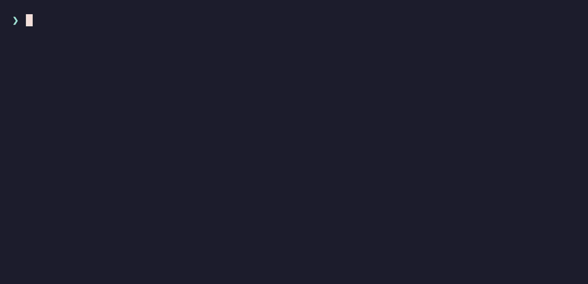

# safedeps

> **AI 코딩 에이전트가 취약하거나 미승인된 의존성을 설치하지 못하게 막고, 빠져나간 건 롤백한다.**
>
> `safedeps` 는 Claude Code·Codex CLI 에이전트가 실행하는 모든 의존성 install 을 게이트한다. 패키지를 OSV / CISA KEV / GitHub Advisory 로 사전 승인하고, 실제로 lockfile 에 깔린 closure 를 다시 검증하며, 어긋난 건 자동으로 롤백한다. 전부 로컬에서 돌고 런타임 의존성은 0.

- **사전 승인** — 모든 `pkg@version` 과 (npm 은) 그 전체 transitive closure 를 설치 *전에* OSV(정본)·CISA KEV·GitHub Advisory 로 검사한다.
- **실제 effect 강제** — 설치 후 실제 `package-lock.json` closure 를 다시 확인하므로, 래핑·난독화된 명령도 게이트를 못 빠져나간다.
- **롤백** — 미승인·신규 취약 패키지는 마지막 확정 안전 snapshot 으로 되돌린다. Claude Code 에서는 install 이 inert(`--ignore-scripts`)로 돌아 거부된 패키지의 lifecycle script 가 아예 실행되지 않는다.

## Quickstart

```bash
# 1. CLI 설치 — npm 패키지는 scoped, @aldegad/ 접두사 주의
npm install -g @aldegad/safedeps

# 2. Claude Code / Codex 에 hook 연결 (idempotent)
cd "$(npm root -g)/@aldegad/safedeps" && node scripts/install/install-safedeps-hooks.mjs

# 3. 끝 — 이제 에이전트가 실행하는 모든 의존성 install 이 자동으로 게이트된다.
```

> `safedeps` 는 CLI 명령어이고, npm 패키지는 **`@aldegad/safedeps`** 다 — npm 의 unscoped `safedeps` 는 무관한 남의 패키지. 전체 skill 소스 트리를 원하면 [설치](#설치) 참고.



*Detailed reference → [README.md](./README.md) (영문, SSoT)*

---

## 배포 모델

safedeps 에는 두 배포 surface 가 있다:

1. **Agent skill + hooks (canonical)** -- repo 자체가 skill folder 다. `SKILL.md`, hook script, provider/ledger library, install helper 가 한 디렉터리에 함께 있다.
2. **npm package (CLI convenience)** -- `@aldegad/safedeps` 는 `safedeps` command 를 설치한다. npm 설치만으로 Claude Code 나 Codex 가 skill 을 자동 discover 하지는 않는다. npm 설치 후에도 hook/skill installer 를 실행하거나 skill folder 를 수동 등록해야 한다.

전체 skill/hook source tree 를 canonical artifact 로 원하면 GitHub release 를 쓴다. versioned global CLI 가 주목적이면 npm 을 쓴다.

용어: safedeps 는 Claude/Codex hook 과 local CLI 로 동작하는 agent security skill 이다. plugin manifest 로 감싸기 전까지는 Codex plugin bundle 이 아니다.

---

## 두 lane

`safedeps` 는 두 보안 lane 을 소유한다 (전체 설계: [`ARCHITECTURE.md`](./ARCHITECTURE.md) §1):

- **install-time** (이 README 의 초점) — advisory check + approved-spec ledger + 빠른 PreToolUse guard + PostToolUse effect enforcement + post-install reorg. 패키지 단위, install 명령과 실제 lockfile effect 주변.
- **release-time** — `safedeps gates run`, `safedeps scan secrets [--repo|--worktree|--staged]`, `safedeps audit npm`, `safedeps hooks install|check`. repo 트리 secret scan, 의존성 audit, repo-local git hook 설치/검사 (push/release 전). repo-specific policy(gitleaks config, privacy 경로)는 대상 repo 에 남고 safedeps 는 실행 owner. *(옛 `security-release-gates` 흡수.)*

release-time lane 의 secret 누출 쪽은 **repo 별이고 opt-in** 이다. `safedeps doctor` 가 그 repo-entry 점검이다 — repo 의 `.gitleaks` policy, `.githooks/pre-commit`, 활성 `core.hooksPath`, scanner 가용성을 진단하고(전역 install-time gate 상태도 같이 보고), `safedeps doctor --fix` 가 시작 policy 를 scaffold(`safedeps hooks init`)하고 활성화(`safedeps hooks install`)한다. scaffold 는 비파괴적이라 repo 가 소유한 기존 `.gitleaks.toml` 은 덮어쓰지 않으며, pre-commit hook 은 매 커밋 비밀키 스캔(`safedeps scan secrets --staged`)을 돌리고 npm repo 면 매 커밋 의존성 audit(`safedeps audit npm`)도 돌린다 — 실제 취약점은 차단(fail-closed)하고, 어드바이저리 DB 도달 불가 시에는 경고만 하고 커밋을 통과시킨다(관측 가능한 오프라인 failover). [secret 누출 lane (repo 별)](#secret-누출-lane-repo-별) 참고.

---

## 어떻게 동작

`safedeps` 는 모든 install 을 두 동작으로 감싼다:

- **설치 전** — `safedeps check` 가 패키지를 OSV(canonical) + CISA KEV + GitHub Advisory 로 검사하고 로컬 ledger 에 승인을 기록한다. npm 은 패키지의 전체 의존성 closure 를 풀어 딸린 모든 transitive 패키지까지 검사한다.
- **설치 후** — PostToolUse hook 이 실제 `package-lock.json` 에 뭐가 깔렸는지 다시 읽고, ledger 에 없거나 advisory DB 가 새로 취약하다고 답하는 패키지를 reorg(롤백)한다.

설치 전 command hook(PreToolUse)은 빠른 advisory 넛지다 — 명백한 미승인 install 과 위험한 명령 형태를 막아 에이전트에게 즉시 피드백을 준다. 하지만 npm 의 진짜 권위는 설치 후 effect gate 다: 명령이 *어떻게 생겼는지* 가 아니라 *실제로 뭐가 깔렸는지* 를 보기 때문에, wrapper 나 난독화된 install 명령으로도 패키지를 통과시킬 수 없다.

**스크립트 안전 (무실행 설치).** Claude Code 에서는 PreToolUse hook 이 npm install 에 `--ignore-scripts` 를 붙여 rewrite 한다 — 그래서 설치가 **무실행(inert)** 으로 돈다(패키지는 디스크에 앉되 lifecycle script 는 아직 안 돎). 그다음 effect gate 가 closure 를 검증하고, 통과했을 때만 PostToolUse 가 `npm rebuild` 로 이제서야 검증된 스크립트를 실행한다. 게이트가 거부한 패키지는 *스크립트가 한 번도 돌기 전에* reorg 된다. (Claude Code 의 hook `updatedInput` 기능을 쓴다. Codex CLI 는 이 기능이 없어 Codex 에서는 install 이 정상 실행되고 effect gate 는 detect-and-rollback 이다 — 악성 install script 가 롤백 전에 1회 실행될 수 있다.)

이 effect-primary 모델은 현재 npm 한정이다. `pip`, `cargo`, `go`, `gem`, `maven`, `nuget` 은 closure resolver 가 붙기 전까지 v2.1 command-gate + reorg 모델을 유지한다.

```
                         PreToolUse                          PostToolUse
                  (safedeps-pre-guard.sh)          (safedeps-post-verify.sh)
                            |                                    |
  install cmd ──> [ Advisory / ledger UX ] ──> [ Execute ] ──> [ npm effect gate ]
                     |              |                          |       |
                  명백한 miss/    lock / manifest          깨끗?     의심?
                  risk block     snapshot                   |       |
                                                       Confirm   REORG
```

### 3 단계 구성

**① Advisory check (`safedeps check`)** — `safedeps check <ecosystem> <pkg>@<range>` 가 OSV(canonical) + CISA KEV(hard-risk overlay) + GHSA(enrichment) 를 조회한다. npm 은 temp dir 에서 `npm install --package-lock-only --ignore-scripts` 로 스크립트 실행 없는 lockfile 을 만들어 전체 closure 를 뽑고 OSV `/v1/querybatch` 로 묶어 검사한다. 깨끗하면 direct spec 과 `transitive_specs` 를 `~/.safedeps/approved-specs/<hash>.json` 에 30일 TTL 로 기록한다.

**② 빠른 command guard (`safedeps-pre-guard.sh`, PreToolUse)** — install 명령의 `pkg@version` 토큰을 ledger 와 대조하고 lockfile/manifest 를 snapshot 한다. 미승인이면 차단하고, 다음에 실행할 `safedeps check ...` 명령을 차단 사유에 박아준다 (PATH 에 있으면 `safedeps`, 없으면 절대경로). 에이전트는 그 메시지로 check → 재시도하면 된다. 이 단계는 빠른 advisory/UX 일 뿐 최종 권위는 아니다.

**③ Effect gate + reorg (`safedeps-post-verify.sh`, PostToolUse)** — 설치 후 실제 `package-lock.json` closure 전체를 ledger 의 direct entry + `transitive_specs` 와 대조하고 OSV batch 로 재확인한다. **npm 에서는 이 effect gate 가 primary 권위다.** 미승인·취약·provider fail-closed, 또는 의심스러운 install script·native binary 가 있으면 마지막 confirmed snapshot 으로 자동 reorg 한다.

---

## 어떤 명령을 보호하는가

| Ecosystem | 매칭하는 명령 |
|---|---|
| npm / pnpm / yarn | `npm install`, `npm add`, `pnpm add`, `yarn add`, `npx`, `pnpm dlx`, `yarn dlx` 등 |
| pip / poetry / uv / pipenv | `pip install`, `poetry add`, `uv add`, `uv pip install`, `pipenv install` |
| cargo | `cargo add`, `cargo install` |
| go | `go get`, `go install` |
| ruby | `gem install`, `bundle add` |
| maven / nuget | `mvn dependency:get`, `dotnet add package` |

---

## secret 누출 lane (repo 별)

install-time gate 는 전역이지만, secret 이나 진짜 `.env` 가 커밋되는 걸 막는 건 **repo 별이고 opt-in** 이다 — 탐지 policy 가 safedeps 가 아니라 각 repo 에 있기 때문이다. `safedeps doctor` 가 그 빈틈을 메우는 진입점이다.

```bash
# 이 repo 의 자세 진단 (read-only). secret lane 에 gap 이 있으면 non-zero 로 끝난다.
$ safedeps doctor
safedeps doctor — repo security posture
repo:    /path/to/repo
profile: public

Secret-leak lane (per-repo)
  ✓ git worktree
  ✗ gitleaks config (.gitleaks.toml)             → safedeps hooks init --root "/path/to/repo"
  ✗ .githooks/pre-commit (present)               → safedeps hooks init --root "/path/to/repo"
  ✗ git hooks active (core.hooksPath=<unset>)    → safedeps hooks install --root "/path/to/repo"
  ✓ secret scanner available (gitleaks)

Dependency-install gate (global, all repos)
  ✓ dependency-install gate installed (~/.claude/skills/safedeps)

3 gap(s) in the secret-leak lane.
Fix all at once:  safedeps doctor --fix --root "/path/to/repo"

# 시작 policy scaffold + hook 활성화 (비파괴적).
$ safedeps doctor --fix
```

lane 구성 요소:

- **`safedeps hooks init`** 가 시작용 `.gitleaks.toml`(private repo 면 `.gitleaks.private.toml`)과 `.githooks/pre-commit` 을 scaffold 한다. 기존 파일은 덮지 않고 유지 — policy 는 repo 가 소유한다.
- **`safedeps hooks install`** 이 repo-local hook 을 활성화한다(`core.hooksPath = .githooks`).
- **pre-commit hook 은 두 검사를 돌린다**:
  - **비밀키 스캔**(`safedeps scan secrets --staged`)을 매 커밋, **fail-closed**. scanner(로컬 `gitleaks` 또는 Docker)가 못 돌면 silent skip 이 아니라 커밋을 막는다.
  - **npm 의존성 audit**(`safedeps audit npm`)을 npm lockfile 이 있는 repo 면 **매 커밋**. 취약한 직접·*transitive* 의존성을 잡는다 — 패키지를 깐 *뒤에* 공개된 CVE("그땐 안전해 보였는데 지금 발견됨")까지 포함해서, 사람이 손으로 절대 못 보는 그것. lockfile 이 바뀔 때만이 아니라 매 커밋 돌리는 게 핵심이다: 어드바이저리 DB 를 다시 조회하니까 이미 깔린 의존성에 *새로* 뜬 CVE 가 바로 다음 커밋에 드러난다. 보안 판정과 가용성 실패는 구분된다 — 실제 취약점은 **차단**(fail-closed)하지만, 어드바이저리 DB 가 **도달 불가**(오프라인/레지스트리 오류)면 **경고만 하고 커밋을 통과**시킨다(관측 가능한 가용성 failover, silent skip 아님). 오프라인 커밋이 못 본 건 CI 와 데일리 re-check 가 다시 메운다.

  의도된 우회는 사람이 소유하는 `git commit --no-verify` 뿐이다.

scaffold 된 `.gitleaks.toml` 은 **네가 손보는 시작점**이다: gitleaks 기본 ruleset 을 extend 하고, 값이 할당된 `.env` 커밋을 잡는 rule 을 더하며(`.env.example`/`.sample`/`.template` 변형은 allowlist), fixture 용 repo-owned `[allowlist]` 블록을 남겨둔다. safedeps 는 *실행* — `safedeps scan secrets` 로 gitleaks 구동 — 만 소유하고 policy 내용은 소유하지 않는다.

`safedeps doctor --json` 은 `{ command, repo, profile, gaps, ok, checks[] }` 를 돌려준다; `gaps`/`ok` 는 repo 별 secret 누출 lane 만 반영한다.

---

## 설치

### 1) GitHub clone (skill 본체 설치, canonical)

```bash
git clone https://github.com/aldegad/safedeps.git
cd safedeps
node scripts/install/install-safedeps-hooks.mjs
```

Cross-engine installer 가 `~/.claude/skills/safedeps` 와 `~/.codex/skills/safedeps` 로 심볼릭 링크하고, `~/.claude/settings.json` 과 `~/.codex/hooks.json` 의 PreToolUse / PostToolUse hook 을 idempotent 하게 등록한다. backup-before-write. `--uninstall` 로 제거 가능.

### 2) npm 패키지 (CLI 편의 설치)

```bash
npm install -g @aldegad/safedeps
safedeps version
```

npm 은 표준 `bin` 엔트리로 `safedeps` 를 PATH 에 올린다. **에이전트 skill / hook 등록은 별도** — Claude Code / Codex 에서 자동 enforcement 가 필요하면 설치 후 한 번 더:

```bash
cd "$(npm root -g)/@aldegad/safedeps"
node scripts/install/install-safedeps-hooks.mjs
```

### 일일 재검증 (macOS LaunchAgent, 옵션)

```bash
node scripts/install/install-safedeps-recheck-agent.mjs install --hour 9 --minute 0
```

매일 1회 `safedeps re-check --json` 을 돌려 ledger 의 모든 승인 spec 을 재조회. LLM 토큰은 안 쓴다 (OSV / CISA / GHSA provider 호출만). 새 CVE / KEV / provider skip 이 발견되면 spec 을 revoke 하고 macOS notification 을 띄운다.

---

## 실제 supply-chain 공격에 어떻게 대응되나

| 사건 | 어떤 체크가 잡는가 |
|---|---|
| `event-stream` (2018) — `postinstall` 의 난독화 코드가 암호화폐 지갑 키 유출 | install script 분석 (난독화 + 네트워크 액세스 탐지) |
| `ua-parser-js` 탈취 (2021) — `preinstall` 이 cryptominer 다운로드·실행 | install script 분석 (네트워크 + 코드 실행) |
| `colors` / `faker` sabotage (2022) — 비정상적 dep 폭증 | dep explosion 검사 |
| typosquat 캠페인 (`crossenv`, `babelcli` 등) | pre-flight typosquat 패턴 매칭 |
| dependency confusion — 사내 패키지명을 public 에 더 높은 버전으로 publish | 비표준 registry 탐지 + 큰 dep 변경 검사 |

---

## 로그와 snapshot

| 경로 | 내용 |
|---|---|
| `~/.safedeps/advisory.log` | Advisory gate 의 모든 approve / block 결정 |
| `~/.safedeps/reorg.log` | Reorg 이벤트 history (timestamp, 사유, 되돌린 파일) |
| `~/.safedeps/approved-specs/` | 승인된 spec JSON 들 (per hash) |
| `~/.safedeps/snapshots/` | install 전 lock / manifest snapshot |
| `~/.safedeps/confirmed_<dir>` | 프로젝트별 마지막 confirmed snapshot id |
| `~/.safedeps/recheck.log` | 일일 재검증 wrapper 로그 |
| `~/.safedeps/recheck-alerts.jsonl` | 재검증으로 발견된 새 CVE / KEV / revoke 알람 jsonl |

---

## "reorg" 는 뭐고 왜 그 비유인가

블록체인에서 **reorg (재편성)** 은 미확정 블록 시퀀스를 무효화하고 마지막 확정된 안전 상태로 체인을 되돌린다. `safedeps` 는 모든 install 을 똑같이 본다 — 일련의 공급망 보안 검사를 통과하기 전까지는 미확정 블록 후보다. 설치된 effect 가 어긋나면 도구가 **reorg** 를 수행한다 — lock 파일, `package.json`, `node_modules` 를 마지막 확정된 안전 snapshot 으로 되돌린다.

하지만 reorg 는 **최전선이 아니라 backstop 이다.** 나쁜 install 의 대부분은 여기까지 오지도 않는다 — 사전 승인 게이트가 미승인·플래그된 패키지를 실행 전에 *거부* 하고, Claude Code 에서는 install 이 **inert (`--ignore-scripts`)** 로 돌아 closure 가 깨끗하다고 검증되기 전까지 lifecycle script 가 실행되지 않는다. reorg 가 발동하는 건 잔여 케이스뿐이다 — 승인된 직접 패키지가 미승인·취약 transitive 를 끌어오거나, 래핑된 명령이 advisory 계층을 빠져나간 경우 — 그리고 그때조차 실행되지도 못한 파일을 되돌린다.

빠른 advisory 피드백, 관측 가능한 rollback, silent fallback 없음. command guard 는 best-effort UX 이고, 설치 결과 effect 가 backstop 이다.

## 다른 도구와 뭐가 다른가

`safedeps` 는 **AI 에이전트가 코딩 중 install 명령을 작성하는 순간**에 끼어드는 도구다. CI 스캔, PR 권장, runtime sandbox 처럼 다른 시점에서 동작하는 도구들과 핵심 차별점이 여기 있다.

전형적인 흐름:

1. 에이전트가 `npm install foo@1.2.3` 같은 명령을 작성한다.
2. PreToolUse hook 이 빠른 advisory ledger check 를 수행한다. direct spec 이 없거나 만료됐거나 명백히 위험하면 install 을 **차단**하고, 다음에 실행할 정확한 `safedeps check npm foo@1.2.3` 명령을 reason 에 박아 에이전트에게 돌려준다.
3. 에이전트가 그 안내를 받아 `safedeps check` 를 호출 → OSV / CISA KEV / GitHub Advisory 조회 → 안전하면 **허용목록 (ledger) 에 박는다**. KEV 매치면 hard-block (override 불가), CVE 에 patch 가 있으면 안전 버전으로 자동 narrow.
4. 다시 install 시도 → 이번엔 ledger 매치되어 **통과**.
5. install 후 PostToolUse hook 이 npm primary authority 로 실제 lockfile closure 를 direct ledger / `transitive_specs` / OSV batch 와 대조하고, install script / native binary 를 검증한다. 어긋나면 마지막 안전 snapshot 으로 **자동 reorg**.

이 흐름으로 일반적인 package-manager install 명령은 실행 전에 빠른 advisory 피드백을 받고, npm install 은 실행 후 effect-time closure enforcement 를 받는다. 다만 command hook 은 best-effort 명령 휴리스틱이지 sandbox 가 아니다. 비정상 wrapper/interpreter 경로나 같은 사용자 권한으로 로컬 safedeps 상태를 조작하는 공격은 ledger 서명/강화 전까지 trust boundary 밖이다. npm effect-primary 모델은 아직 `pip`, `cargo`, `go`, `gem`, `maven`, `nuget` 에 적용되지 않으며, 이 ecosystem 들은 v2.1 command-gate + reorg 모델을 유지한다. SaaS 의존 없이 로컬 + 공개 DB (OSV / KEV / GHSA) 만 쓴다.

---

## Legacy / Migration: v1 `npm-reorg-guard`

v1 시절 이름이 `npm-reorg-guard` 였고 state 디렉토리가 `~/.npm-reorg-guard/` 였다. v2 로 rename 되면서 state 도 `~/.safedeps/` 로 옮겨야 하는데, 그 1회 이전을 자동화한 명령이 있다:

```bash
safedeps migrate
```

- `~/.npm-reorg-guard/` 가 있으면 snapshot chain / confirmed / log 들을 `~/.safedeps/` 로 복사하고 legacy 디렉토리를 archive 처리.
- 없으면 no-op (v2 처음 깐 사용자는 무관).

---

## 라이선스

[Apache License 2.0](LICENSE)
