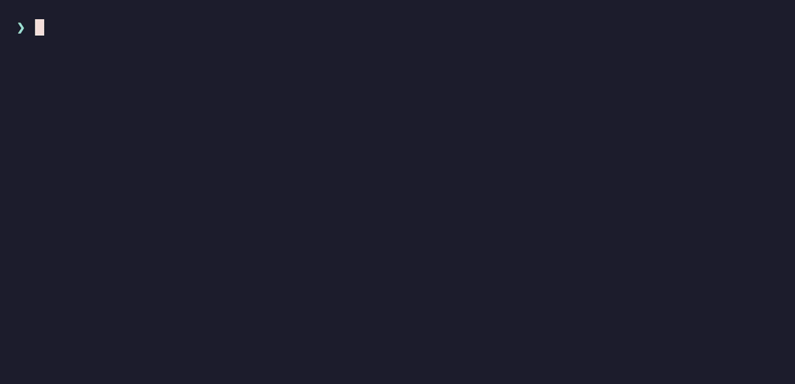
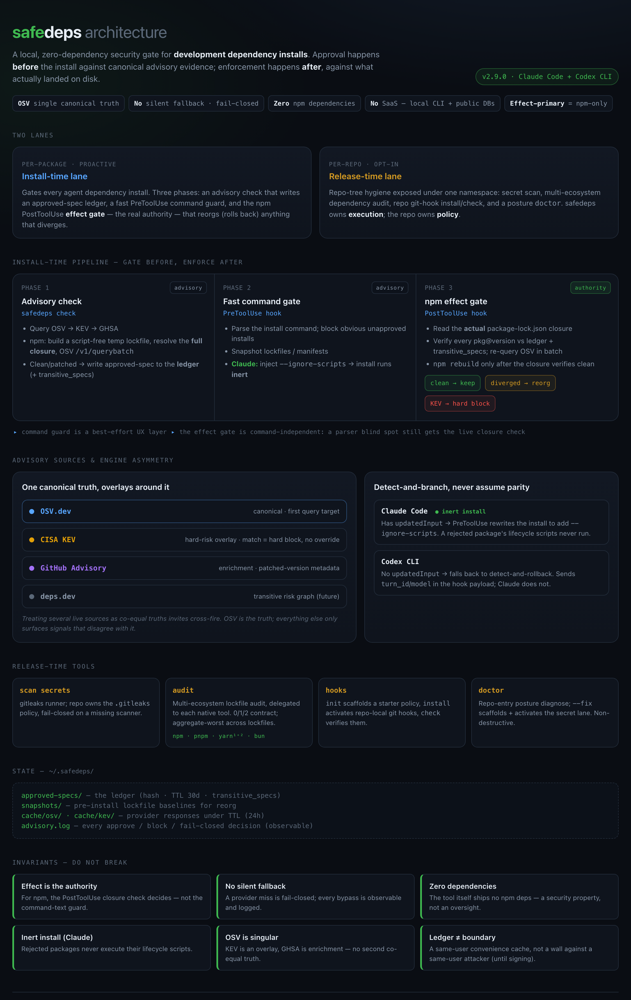

The managed kuma-server (`http://127.0.0.1:4312`) wasn't reachable, so per the kuma-translate skill's fallback I translated the document directly while preserving its structure.

# safedeps

> **AI 코딩 에이전트가 취약하거나 승인되지 않은 의존성을 설치하는 것을 막고, 빠져나간 것은 롤백하세요.**
>
> `safedeps`는 Claude Code 또는 Codex CLI 에이전트가 실행하는 모든 의존성 설치를 게이트합니다. OSV / CISA KEV / GitHub Advisory 기준으로 패키지를 사전 승인하고, 실제로 lockfile에 반영된 클로저를 재검증하며, 어긋난 것은 자동으로 롤백합니다. 로컬 전용이며 런타임 의존성이 없습니다. *(한국어 README → [README.ko.md](./README.ko.md))*

- **사전 승인** — npm의 경우 모든 `pkg@version`과 전체 전이(transitive) 클로저가 설치 *전에* OSV(표준), CISA KEV, GitHub Advisory 기준으로 승인됩니다.
- **실제 효과 강제** — 설치 후 실제 `package-lock.json` 클로저를 다시 확인하므로, 명령을 감싸거나 난독화해도 패키지를 게이트 밖으로 몰래 빼낼 수 없습니다.
- **롤백** — 승인되지 않았거나 새로 취약점이 발견된 것은 마지막으로 확인된 안전한 스냅샷으로 되돌립니다. Claude Code에서는 설치가 비활성(`--ignore-scripts`)으로 실행되므로, 거부된 패키지의 라이프사이클 스크립트는 절대 실행되지 않습니다.

> **실제 포착 사례.** 커밋 시점에 어드바이저리 DB를 다시 조회하는 pre-commit 감사에서 Dependabot이 놓친 취약한 전이 `hono` 어드바이저리를 잡아냈습니다. 패키지 설치 *후에* 공개된 CVE("그때는 안전해 보였지만 지금은 플래그됨")는 몇 주 후가 아니라 다음 커밋에서 드러납니다.

## 빠른 시작

```bash
# 1. Install the CLI — the npm package is scoped, note the @aldegad/ prefix
npm install -g @aldegad/safedeps

# 2. Wire the hooks into Claude Code / Codex (idempotent)
cd "$(npm root -g)/@aldegad/safedeps" && node scripts/install/install-safedeps-hooks.mjs

# 3. Done — every dependency install your agent runs is now gated.
```

> `safedeps`는 CLI 명령이고, npm 패키지는 **`@aldegad/safedeps`**입니다 — npm의 unscoped `safedeps`는 무관한 패키지입니다. 전체 스킬 소스 트리가 더 좋으신가요? [설치](#installation)를 참고하세요.



## 배포 모델

Safedeps에는 두 가지 배포 표면이 있습니다:

1. **에이전트 스킬 + 훅(표준)** — 저장소 자체가 스킬 폴더입니다. `SKILL.md`, 훅 스크립트, provider/ledger 라이브러리, 설치 헬퍼가 한 디렉터리에 함께 유지됩니다.
2. **npm 패키지(CLI 편의)** — `@aldegad/safedeps`가 `safedeps` 명령을 설치합니다. npm은 Claude Code나 Codex가 스킬을 자동으로 발견하게 만들지 **않습니다**. npm 설치 후에도 사용자는 훅/스킬 설치 프로그램을 실행하거나 스킬 폴더를 직접 등록해야 합니다.

전체 스킬/훅 소스 트리를 표준 산출물로 원한다면 GitHub 릴리스를 사용하세요. 주로 버전이 관리되는 전역 CLI를 원한다면 npm을 사용하세요.

용어: safedeps는 Claude/Codex 훅과 로컬 CLI로 뒷받침되는 에이전트 보안 스킬입니다. 나중에 플러그인 매니페스트로 감싸지 않는 한 Codex 플러그인 번들이 아닙니다.

## 두 개의 레인

`safedeps`는 두 가지 보안 레인을 담당합니다(전체 설계는 [`ARCHITECTURE.md`](./ARCHITECTURE.md) §1):

- **설치 시점**(이 README의 초점) — 어드바이저리 검사 + 승인 스펙 ledger + 빠른 PreToolUse 가드 + PostToolUse 효과 강제 + 설치 후 재정리. 설치 명령과 그 실제 lockfile 효과를 패키지 단위로 처리합니다.
- **릴리스 시점** — `safedeps gates run`, `safedeps scan secrets [--repo|--worktree|--staged]`, `safedeps audit [npm|pnpm|yarn|bun]`, `safedeps hooks install|check`. 저장소 트리 비밀 스캔, 의존성 감사, push/릴리스 전 저장소 로컬 git 훅 설치/확인, 그리고 옵트인 원격 저장소 상태 점검. 저장소별 정책(gitleaks 설정, 개인정보 경로)은 대상 저장소에 남고, safedeps는 로컬 실행을 담당합니다. *(이전 `security-release-gates` 흡수.)*

릴리스 시점 레인의 비밀 유출 쪽은 **저장소별 옵트인**입니다. `safedeps doctor`가 그 저장소 진입 검사입니다: 저장소의 `.gitleaks` 정책, `.githooks/pre-commit`, 활성 `core.hooksPath`, 스캐너 가용성을 진단하고(전역 설치 시점 게이트도 보고), `safedeps doctor --fix`는 시작용 정책을 스캐폴드(`safedeps hooks init`)하고 활성화합니다(`safedeps hooks install`). `--fix`를 선택하면 그 로컬 pre-commit 설정은 자동으로 진행되며 원격 CI 분을 소모하지 않습니다. 스캐폴드는 비파괴적입니다 — 저장소 소유의 기존 `.gitleaks.toml`은 절대 덮어쓰지 않으며 — pre-commit 훅은 비밀 스캔(`safedeps scan secrets --staged`)을 실행하고, 지원되는 lockfile이 있는 저장소의 모든 커밋에서 의존성 감사(`safedeps audit`, npm/pnpm/yarn/bun 자동 감지)도 실행합니다: 실제 발견 사항은 차단(fail-closed)하고, 어드바이저리 DB에 연결할 수 없으면 경고만 하고 커밋을 통과시킵니다(관찰 가능한 오프라인 폴오버). 원격 강제는 분리됩니다: 브랜치 규칙으로 `main`에 대한 직접 push를 차단하는 것이 러너 없는 권장 자세이며, GitHub Actions 워크플로와 필수 상태 검사는 호스팅 러너에 비용이 들 수 있으므로 명시적 비용 부담 옵트인으로 남습니다. [비밀 유출 레인(per-repo)](#secret-leak-lane-per-repo) 참고.

## 작동 방식

[](./ARCHITECTURE.md)

`safedeps`는 모든 설치를 중심으로 두 가지 동작을 합니다:

- **설치 전** — `safedeps check`가 OSV(표준), CISA KEV, GitHub Advisory 기준으로 패키지를 승인하고, 승인을 로컬 ledger에 기록합니다. npm의 경우 패키지의 전체 의존성 클로저를 해석해 모든 전이 패키지도 검사합니다.
- **설치 후** — PostToolUse 훅이 `package-lock.json`에 실제로 반영된 내용을 다시 읽고, ledger에 없거나 어드바이저리 DB가 새로 플래그하는 것이 있으면 재정리(롤백)합니다.

두 훅 이벤트 모두 등록된 명령은 작은 엔트리 shim(`safedeps-hook-entry.sh`)입니다. 훅은 심링크를 통해 저장소 체크아웃에서 실시간으로 실행되므로, 일시적으로 깨진 체크아웃(진행 중인 merge, 반쯤 저장된 편집)은 예전에는 종료 코드에 따라 모든 Bash 호출을 날것의 구문 오류로 차단하거나 게이트를 조용히 비활성화했습니다. shim은 둘 다 설명이 있는 fail-closed 거부로 바꿉니다: 무엇이 깨졌는지, merge가 진행 중인지, 어떻게 복구하는지 알려줍니다. 자세한 내용: [ARCHITECTURE — Phase 0](./ARCHITECTURE.md).

**시간이 다 되는 것은 갭이 아니라 답입니다.** 에이전트 런타임은 각 훅에 고정 예산(30초)을 주고 만료되면 종료시킵니다 — 그러면 도구 호출은 계속 진행되므로, 오래 걸리는 게이트는 그냥 사라집니다. 명령 스캔은 명령이 길수록 비용이 커지므로, 명령에 패딩을 붙이는 것만으로도 그 선을 넘을 수 있었습니다. pre-install 가드는 이제 자체적으로 더 작은 예산을 유지하고, 제때 판단을 끝내지 못하면 차단하면서 그렇게 말합니다: 메시지가 `UNDECIDED, not unsafe`로 시작하므로 누구도 타임아웃을 발견 사항으로 오해하지 않습니다. 예산과는 거리가 먼 짧은 명령은 영향을 받지 않습니다.

pre-install 명령 훅(PreToolUse)은 빠른 어드바이저리 넛지입니다 — 명백히 승인되지 않은 설치와 위험한 명령 형태를 차단해 에이전트가 즉시 피드백을 받게 합니다. 하지만 npm의 실제 권위는 post-install 효과 게이트입니다: 명령이 어떻게 보였는지가 아니라 *실제로 설치된 것*을 판단하므로, 감싸거나 난독화한 설치 명령도 패키지를 통과시킬 수 없습니다.

**스크립트 안전(비활성 설치).** Claude Code에서는 PreToolUse 훅이 npm install을 재작성해 `--ignore-scripts`를 추가하므로 설치가 **비활성(inert)** 상태로 실행됩니다 — 패키지는 디스크에 내려오지만 라이프사이클 스크립트는 아직 실행되지 않습니다. 효과 게이트가 클로저를 검증하고, 통과해야만 PostToolUse 훅이 `npm rebuild`를 실행해 검증된 스크립트를 실행합니다. 게이트가 거부한 패키지는 어떤 스크립트도 실행되기 전에 재정리됩니다. (이것은 Claude Code 훅의 `updatedInput` 기능을 사용합니다. Codex CLI는 이 기능을 노출하지 않으므로, Codex에서는 설치가 정상적으로 실행되고 효과 게이트는 감지-후-롤백 방식입니다 — 악성 설치 스크립트가 롤백 전에 한 번 실행될 수 있습니다.)

이 효과 우선 모델은 현재 npm 전용입니다. `pip`, `cargo`, `go`, `gem`, `maven`, `nuget`은 클로저 리졸버가 나올 때까지 v2.1 명령 게이트 + 재정리 모델을 유지합니다.

```
                         PreToolUse                          PostToolUse
                  (safedeps-pre-guard.sh)          (safedeps-post-verify.sh)
                            |                                    |
  install cmd ──> [ Advisory/ledger UX ] ──> [ Execute ] ──> [ npm effect gate ]
                     |            |                           |       |
                  Block obvious Snapshot                  Clean?  Suspicious?
                  misses/risk   lock/manifest files,        |       |
                                package listings          Confirm  REORG
                                                              |       |
                                    |                       v       v
                                    +--- parent_snapshot_id ──> confirmed
                                                                    |
                                                              Rollback to last
                                                              confirmed snapshot
```

### 1단계: 어드바이저리 검사(`safedeps check`)

에이전트가 의존성을 설치하기 전에 다음을 실행해야 합니다:

```bash
safedeps check <ecosystem> <pkg>@<version|range> --json
```

이 명령은 OSV(표준), CISA KEV(고위험 오버레이), GitHub Advisory(보강)를 조회합니다. npm의 경우 먼저 `npm install --package-lock-only --ignore-scripts`로 스크립트 없는 임시 lockfile을 만들고, 전체 의존성 클로저를 추출해 OSV `/v1/querybatch`를 조회합니다. 승인되거나 안전하게 좁혀진 스펙은 `~/.safedeps/approved-specs/`에 기록되며, npm 항목은 `transitive_specs`도 기록합니다.

**Yarn 프로젝트 범위 클로저.** 대상 디렉터리가 루트 `resolutions` 항목이 있는 Yarn Berry 프로젝트인 경우, `check`는 새로 게시된 패키지 프로브 대신 해당 프로젝트의 실제 `yarn.lock`에서 `yarn info`를 통해 클로저를 해석합니다. 이렇게 하면 `resolutions`로 취약한 전이 의존성을 패치된 버전에 고정한 프로젝트가 실제 해석된 의존성 트리 기준으로 승인을 받을 수 있습니다 — 게시된 패키지 클로저만으로는 여전히 취약한 버전이 보여 설치가 거부될 것입니다. 승인은 그 정확한 프로젝트에만 적용됩니다: ledger 키에 프로젝트 디렉터리, `resolutions`, `yarn.lock` 내용의 해시가 포함되므로 다른 프로젝트에서는, 또는 `resolutions`/`yarn.lock`이 변경된 후에는 검사를 충족할 수 없습니다. `resolutions`가 선언되었지만 요청한 패키지를 프로젝트의 해석된 그래프에서 검증할 수 없거나, lockfile이 지원되는 Yarn Berry lockfile이 아니면 검사는 fail-closed를 유지합니다.

**Yarn 후보 구체화(v2.11.0).** 위 클로저는 패키지가 이미 `yarn.lock`에 있어야 하는데, 이는 가장 중요한 경우 — 지금 추가하려는 의존성을 검사하는 경우 —에는 해당하지 않습니다. 그 후보에 대해 `check`는 거부하는 대신 개인 미러에서 클로저를 구축합니다. safedeps는 프로젝트의 표준 해석 입력, 즉 루트 및 워크스페이스 `package.json` 파일, `yarn.lock`, `.yarnrc.yml`, 그리고 `.yarn/releases`, `.yarn/plugins`, `.yarn/patches` 파일의 임시 미러를 복사합니다. 그 외에는 아무것도 복사하지 않습니다; `node_modules`, 캐시, unplugged 패키지, 설치 상태, VCS 데이터는 제외됩니다. 후보는 미러의 매니페스트에만 추가되며, Yarn이 `yarn install --mode=update-lockfile --no-immutable`로 그곳에서 해석합니다. 이 모드는 링크 단계 없이 lock 해석만 업데이트하므로 후보의 라이프사이클 스크립트는 절대 실행되지 않고, 프로젝트 트리 자체도 전혀 쓰이지 않습니다.

승인은 그것을 만든 것이 무엇인지 기록합니다: 정확한 입력 집합의 해시, 입력 파일 목록, 생성된 lockfile의 해시, 후보 locator, 정확한 Yarn 명령, `private-project-mirror` 격리 모드. ledger는 이 중 하나라도 누락된 항목을 거부합니다. safedeps는 Yarn 실행 전후로 프로젝트 입력을 다시 해시합니다; 그 사이에 매니페스트, `resolutions`, 설정, 또는 lockfile이 변경되면 후보는 혼합된 프로젝트 상태에 대해 승인되는 대신 무효화됩니다. 입력 복사, Yarn 실행, 생성된 lockfile에서의 후보 해석 중 어떤 실패든 `project-candidate-materialization-unavailable`로 거부합니다. 게시된 패키지 클로저로의 폴백은 없습니다 — 검증할 수 없는 구체화는 다운그레이드가 아니라 거부입니다.

**npm `overrides` 인식 (v2.12.0).** 동일한 문제가 일반 npm에도 존재합니다. `overrides`는 취약한 전이 의존성을 패치된 버전으로 고정하는 표준 방법이지만, 클로저 프로브는 빈 매니페스트를 사용했기 때문에 *게시된* 트리를 해석했고, 저장소가 이미 수정한 설치는 거부되었습니다. 이제 `check`는 소비 저장소의 `overrides`를 발견하여 프로브에 적용하므로 실제 설치가 그렇게 하듯 전이 의존성을 해석합니다. 발견은 `SAFEDEPS_NPM_OVERRIDES_JSON`이 설정되어 있으면 그것을 읽고, 그렇지 않으면 비어 있지 않은 `overrides`를 가진 가장 가까운 `package.json`을 읽으며, 작업 디렉터리에서 위로 올라가 저장소 루트에서 멈춥니다. 여기에는 `.git`이 디렉터리가 아니라 파일인 워크트리 루트도 포함됩니다. 구체적인 버전 고정만 존중되며, `"$react"` 같은 `$`-참조는 독립 프로브에서 의미가 없으므로 버려집니다.

`overrides`를 존중한다고 해서 취약점이 숨겨지지는 않습니다. 프로브는 여전히 각 override를 구체적인 버전으로 해석하고 OSV는 그 정확한 버전으로 조회되므로, 여전히 취약한 릴리스를 가리키는 override도 다른 것과 마찬가지로 플래그 처리됩니다. override를 프로브 매니페스트에 적용할 수 없으면 safedeps는 그 사실을 알리고 override 없이 계속합니다. 이는 검사를 더 엄격하게 만들 뿐입니다.

클로저가 이제 소비 프로젝트에 의존하므로 승인도 그 프로젝트에 한정됩니다. 게시된 패키지의 승인은 정확히 프로젝트와 무관하기 때문에 전역적입니다. `overrides`에서 파생된 승인은 그렇지 않습니다. 따라서 원장 항목은 프로젝트 루트, override 집합, 그리고 둘의 해시를 담고, 키는 그 해시를 포함합니다. 전이 의존성을 패치한 저장소에서 얻은 승인은 그렇게 하지 않은 저장소의 검사를 충족하지 못합니다. 그런 저장소의 실제 설치는 취약한 버전을 해석할 것이기 때문입니다. override 집합을 바꾸면 키도 바뀝니다. `overrides`가 없는 저장소는 영향을 받지 않으며 기존의 일반적인 전역 승인을 유지합니다.

### Phase 2: 빠른 명령 가드 + 스냅샷 (PreToolUse)

Claude Code 또는 Codex CLI가 `npm install`, `pip install`, `cargo add`, `go get`, `gem install` 또는 유사한 명령을 실행하려고 할 때, 가드 훅은 빠른 경고/UX 계층을 제공합니다:

1. 현재 `package-lock.json`, `pnpm-lock.yaml`, `yarn.lock`, `package.json`을 `~/.safedeps/snapshots/`에 **스냅샷**합니다.
2. 이전에 확인된 스냅샷을 연결하는 `parent_snapshot_id`를 포함한 **메타데이터를 기록**합니다(블록처럼 체인을 형성).
3. 나중에 diff 기반 탐지를 위해 `node_modules`의 설치 전 상태(패키지 목록과 바이너리 목록)를 **캡처**합니다.
4. 명시적인 `pkg@version` 설치 명령에 대해 승인된 스펙 원장을 **빠르게 확인**합니다.
5. **사전 점검을 실행**하고 다음을 감지하면 명령을 완전히 **차단**합니다:
   - 오타 스쿼팅 패키지 이름(`lod_sh`, `reacct`, `axois` 등)
   - 비표준 `--registry` URL(`registry.npmjs.org`와 `registry.yarnpkg.com` 외의 모든 것)
   - 파이프 원격 실행 패턴(`curl ... | bash`)
   - 설치 스크립트 안전성의 명시적 비활성화(`npm config set ignore-scripts false`)

원장 게이트나 사전 점검이 실패하면 명령은 **실행 전에 차단**됩니다. 아무것도 설치되지 않습니다. 이 명령 가드는 의도적으로 best-effort입니다. 에이전트 루프를 개선하고 직접적인 실수를 잡아내지만, npm의 권위는 설치 후 효과 게이트에 있습니다.

**명령 가드가 보지 못하는 것과 생태계별 비용.** 가드는 셸에 텍스트를 넘겨주는 구문적 형태, 즉 `sh -c`, `eval`, 명령 치환, 셸로의 파이프로 설치를 인식합니다. 그 목록 밖의 형태는 통과합니다: herestring, `xargs`로 만들어진 명령줄, 파일에 쓰인 후 실행되는 스크립트. npm의 경우 이것은 놓침이 아니라 *지연된* 탐지입니다. 효과 게이트가 실제 lockfile을 읽고 명령이 어떻게 작성되었는지와 무관하게 결과를 잡아내기 때문입니다. 단, 게이트가 30초 훅 예산 안에 끝나는 경우에 한합니다. 이는 측정된 범위이지 보장된 것이 아닙니다(아래 참조). `pip`, `cargo`, `go`, `gem`, `maven`, `nuget`의 경우 가드 뒤에 클로저 해석기가 없으므로 같은 형태는 **완전한 놓침**입니다. `~/.safedeps/advisory.log`에 `UNVERIFIED`로 기록될 뿐 다른 일은 일어나지 않습니다. "가드가 이 형태를 파싱하지 않는다"는 말을 npm 한정으로 읽지 마십시오. 경계는 `scripts/test/consumer-forms.sh`에서 측정되어 고정되어 있으며, `ARCHITECTURE.md`는 경계를 넓히는 것이 해결책이 아닌 이유를 설명합니다.

**"지연된 탐지"가 실제로 도달하는 범위.** 효과 게이트는 30초로 등록되며 런타임이 그 지점에서 종료시키므로, npm의 지연된 탐지는 게이트가 끝마치는 동안에만 실제로 유효합니다. 그 비용은 프로젝트 lockfile 클로저의 크기에 달려 있습니다. 예전에는 승인된 스펙 원장의 크기에도 달려 있었습니다. 게이트가 클로저의 모든 패키지에 대해 원장에 따로따로 질문했고, 각 질문이 원장 디렉터리 전체를 읽었기 때문입니다. 738개 항목의 원장에서는 클로저가 **네 개 패키지**만 되어도 30초를 넘겼습니다. v2.16.0은 클로저당 원장을 한 번만 읽습니다. 이제 원장 축은 평평하며, 같은 머신에서 콜드 어드바이저리 캐시로 게이트는 클로저가 **약 390개 패키지**에 가까울 때 30초를 넘습니다. 그 아래에서는 백스톱이 작동하고, 그 위(대형 애플리케이션의 lockfile)에서는 게이트가 종료되어 설치를 판정하지 못합니다. 교차 지점은 머신, 네트워크, 캐시에 따라 움직이므로 직접 측정하십시오: `scripts/measure/effect-gate-cost.sh <package-lock.json> --ledger ~/.safedeps/approved-specs`.

**롤백이 중간에 끊기면 safedeps가 알려줍니다.** 게이트가 클로저를 거부하면 프로젝트를 롤백합니다: lock과 매니페스트 파일을 복원한 다음 `node_modules`를 다시 빌드합니다. v2.16.0 이전에는 로그 항목과 리포트가 마지막에 기록되었기 때문에, 롤백 도중 종료된 훅은 아무 기록도 남기지 않았습니다. 어떤 경우에는 프로젝트가 이미 되돌려져 있어, 마치 설치가 조용히 스스로를 되돌린 것처럼 보였습니다. 이제 게이트는 실행하기 전에 무엇을 하려는지 먼저 기록하고, 롤백이 스스로 보고한 뒤에는 그 메모를 지웁니다. 실행을 넘어 살아남은 메모는 끝나지 않은 롤백입니다: 다음 명령이 그것을 한 번 보고하고, `~/.safedeps/rollback-incidents/`에 기록하며, `~/.safedeps/reorg.log`에 `REORG INTERRUPTED`를 추가하고, 어느 단계까지 도달했는지와 트리를 복구하는 방법을 알려줍니다.

**버전 고정이 없는 설치는 게이트 대상이 아니며, 그 사실도 알려줍니다.** 원장 확인은 파싱 가능한 `pkg@version` 피연산자에 대해 실행됩니다. `pip install evil`, `cargo add evil`, `go get example.com/evil`, `gem install evil`은 버전을 고정하지 않고 패키지 이름만 지정하므로 스펙이 생성되지 않고 원장 게이트는 실행되지 않습니다. 이를 위한 래퍼는 필요 없습니다. 버전 생략만으로 충분합니다. npm의 경우 효과 게이트가 결과 lockfile에 대해 여전히 적용되고, 다른 생태계에서는 설치가 검증 없이 진행됩니다. 이 경우는 이제 생태계와 명령을 명시하여 `~/.safedeps/advisory.log`에 `UNGATED`로 기록됩니다. 이 기록은 **차단하지 않습니다**: 고정되지 않은 모든 설치를 거부하는 것은 일반적인 `cargo add x` 워크플로를 깨뜨리는 정책 변경이므로, 저장소 소유자의 결정으로 남습니다. 기록은 그 결정을 증거로 답변 가능하게 만듭니다. 일상적인 설치는 의도적으로 로그에서 제외되며, 경계는 어떤 플래그가 나타나는지가 아니라 패키지가 이름이 지정되었는지에 따라 그어집니다. 어떤 플래그가 값을 취하는지는 도구의 속성이므로, pip의 `-t`/`-f`는 값을 취하지만 go와 gem의 플래그는 그렇지 않습니다. `pip install -r requirements.txt`와 `npm install`은 아무 패키지도 이름을 지정하지 않으며, 가져오기 대신 작업 트리에서 빌드하는 `pip install .`도 마찬가지입니다. 소스 플래그는 자신의 인자만 소비하므로 `pip install -r requirements.txt evil`은 여전히 `evil`을 설치하고 여전히 기록됩니다. 모든 설치에서 발생하는 기록은 신호가 아니라 잡음이지만, 플래그가 나타날 때마다 조용해지는 기록은 더 나쁩니다. 실제로 없는 커버리지가 있는 것처럼 읽히기 때문입니다.

### Phase 3: 설치 후 효과 강제 (`safedeps-post-verify.sh` -- PostToolUse)

설치 명령이 완료된 후, verify 훅은 무엇이 변경되었는지 분석합니다. npm의 경우 이것이 1차 강제 표면입니다: 실제 `package-lock.json` 클로저를 읽고, 모든 패키지를 승인된 직접 항목과 그 `transitive_specs`에 대해 검증하며, OSV 배치로 클로저를 다시 확인합니다.

1. **npm 효과 게이트** -- lockfile 패키지가 미승인, KEV 차단, 취약, 또는 fail-closed로 검증 불가이면 reorg를 수행합니다.

2. **설치 스크립트 분석** -- 새로 추가된 패키지의 `preinstall`, `install`, `postinstall` 스크립트에서 다음을 포함하는 것을 스캔합니다:
   - 네트워크 접근(`curl`, `wget`, `fetch`, `http`, `socket`, `dns`)
   - 동적 코드 실행(`eval`, `exec`, `spawn`, `child_process`, `Function()`)
   - 민감한 경로 접근(`~/.ssh`, `.env`, `.aws`, `credentials`)
   - 난독화된 콘텐츠(`base64`, `atob`, `Buffer.from`, hex/유니코드 이스케이프)

3. **Lock 파일 diff 분석** -- 스냅샷된 lock 파일 내용을 설치 후 버전과 비교합니다:
   - 비표준 레지스트리를 가리키는 resolved URL
   - resolved URL의 안전하지 않은 프로토콜(`http://`, `git://`)
   - 비정상적으로 많은 의존성 추가(50개 이상의 새 resolved 항목, 잠재적 dependency confusion을 나타냄)

4. **바이너리 검사** -- JavaScript 프로젝트에 나타나지 않아야 하는 새로 추가된 네이티브 바이너리(ELF, Mach-O, 공유 객체)가 `node_modules/.bin/`에 있는지 확인합니다.

### Confirm 또는 Reorg

- **모든 검사 통과** -- 스냅샷이 `~/.safedeps/confirmed`에서 **confirmed**로 표시됩니다. 이것이 새로운 안전 기준선이 됩니다.
- **검사 중 하나라도 실패** -- **reorg**가 트리거됩니다:
  1. 마지막 확인된 스냅샷에서 lock 파일을 복원합니다.
  2. `package.json`이 수정되었다면 복원합니다.
  3. 악성 아티팩트를 제거하기 위해 `npm ci`(또는 대체로 `npm install`)로 `node_modules`를 다시 빌드합니다.
  4. 이벤트가 `~/.safedeps/reorg.log`에 기록됩니다.
  5. Claude Code는 감지된 위협과 롤백 조치를 설명하는 시스템 메시지를 받습니다.

## 왜 "reorg"인가?

이 이름은 블록체인에서 차용한 것으로, **재구성(reorg)**은 미확정 블록들의 시퀀스를 무효화하고 체인을 마지막으로 확인된 안전한 상태로 되돌립니다. `safedeps`도 모든 설치를 같은 방식으로 취급합니다: 공급망 검사 배터리를 통과할 때까지는 미확정 블록 후보입니다. 설치된 효과가 어긋나면 도구는 **reorg**를 수행합니다. lock 파일, `package.json`, `node_modules`를 마지막으로 확인된 안전한 스냅샷으로 되돌리는 것입니다.

하지만 reorg는 **최후의 방어선(backstop)이지 최전선이 아닙니다.** 대부분의 나쁜 설치는 거기에 도달하지 못합니다: 사전 승인 게이트는 실행 전에 미승인 또는 플래그된 패키지를 *거부*하며, Claude Code에서는 설치가 **inert**(`--ignore-scripts`)하게 실행되어 클로저가 깨끗하게 검증될 때까지 라이프사이클 스크립트가 실행되지 않습니다. reorg는 잔여 사례에서 발생합니다. 승인된 직접 패키지가 미승인 또는 취약한 전이 의존성을 끌어오거나, 래핑된 명령이 경고 계층을 빠져나가는 경우입니다. 그때조차도 실행된 적이 없는 파일을 롤백합니다.

빠른 경고 피드백, 관찰 가능한 롤백, 숨겨진 폴백 없음. 명령 가드는 best-effort UX이고, 설치된 효과가 백스톱입니다.

## 블록체인 유추

| 블록체인 개념 | Safedeps 대응 |
|---|---|
| **블록 후보** | `npm install` 전에 찍은 스냅샷 |
| **블록 검증** | 설치 후 효과 검사(npm 클로저, 스크립트, lock diff, 바이너리) |
| **최종성 / 확정** | `~/.safedeps/confirmed`에 기록된 스냅샷 ID |
| **체인 재구성** | 마지막 확인된 스냅샷으로 롤백 + `node_modules` 재빌드 |
| **부모 해시 연결** | 각 스냅샷 `_meta.json`의 `parent_snapshot_id` |
| **체인 정리** | 오래된 미확정 스냅샷 정리, 확인된 체인 보존 |

## 탐지 규칙

| 카테고리 | 잡아내는 것 | 단계 | 조치 |
|---|---|---|---|
| 오타 스쿼팅 | 인기 패키지의 알려진 오타 패턴 | PreToolUse 경고 가드 | **Block** |
| 파이프 실행 | `curl \| bash`, `wget \| sh` | PreToolUse 경고 가드 | **Block** |
| 레지스트리 하이재킹 | 비공식 소스를 가리키는 `--registry` | PreToolUse 경고 가드 | **Block** |
| 스크립트 안전 우회 | `npm config set ignore-scripts false` | PreToolUse 경고 가드 | **Block** |
| 명령 간접화 | `eval "npm install ..."`, 서브셸 확장, 변수 간접화 | PreToolUse 경고 가드 | **Guard** |
| npx/dlx 실행 | `npx`, `pnpm dlx`, `yarn dlx` 패키지 실행 | PreToolUse 경고 가드 | **Guard** |
| 미승인 전이 의존성 | 직접 원장 또는 `transitive_specs`에 없는 npm `package-lock.json` 패키지 | PostToolUse npm 1차 효과 게이트 | **Reorg** |
| 취약한 클로저 패키지 | OSV/KEV 히트가 있는 npm 직접/전이 패키지 | PostToolUse npm 1차 효과 게이트 | **Reorg** |
| 악성 설치 스크립트 | 훅의 네트워크 호출, `eval`/`exec`, 민감한 경로 접근 | PostToolUse 효과 검증 | **Reorg** |
| 난독화된 코드 | 설치 스크립트의 Base64, hex 인코딩, `Buffer.from` | PostToolUse 효과 검증 | **Reorg** |
| Lock 파일 변조 | 비표준 레지스트리의 resolved URL | PostToolUse 효과 검증 | **Reorg** |
| 안전하지 않은 프로토콜 | `http://` 또는 `git://` resolved URL | PostToolUse 효과 검증 | **Reorg** |
| Dependency confusion | 단일 설치의 50개 이상의 새 의존성 | PostToolUse 효과 검증 | **Reorg** |
| 네이티브 바이너리 | `node_modules/.bin/`의 컴파일된 실행 파일 | PostToolUse 효과 검증 | **Reorg** |

## 시크릿 유출 레인 (저장소별)

설치 시점 게이트는 전역(global)이지만, 시크릿이나 실제 `.env` 파일이 커밋되는 것을 막는 것은 **저장소별(per-repo)**이며 옵트인으로 유지된다 — 그 탐지 정책은 safedeps가 아니라 각 저장소에 있다. 이 격차를 메우는 진입점이 `safedeps doctor`다.

```bash
# Diagnose this repo's posture (read-only). Exits non-zero if the secret lane has gaps.
$ safedeps doctor
safedeps doctor — repo security posture
repo:    /path/to/repo
profile: public

Secret-leak lane (per-repo)
  ✓ git worktree
  ✗ gitleaks config (.gitleaks.toml)             → safedeps hooks init --root "/path/to/repo"
  ✗ .githooks/pre-commit (present)               → safedeps hooks init --root "/path/to/repo"
  ✗ git hooks active (core.hooksPath=<unset>)    → safedeps hooks install --root "/path/to/repo"
  ✓ secret scanner available (gitleaks)

Dependency-install gate (global, all repos)
  ✓ dependency-install gate installed (~/.claude/skills/safedeps)

Remote repository governance (opt-in; no-runner vs CI-cost)
  ! remote PR security workflow (opt-in; may spend CI minutes)              → safedeps gates run --root "/path/to/repo" --strict
  – main direct-push protection for main (no runner minutes; opt-in)        → no-runner opt-in: require pull requests before updating main; do not require status checks unless CI cost is accepted
  – required PR status checks for main (CI-cost opt-in)                     → cost-bearing opt-in: add a safedeps workflow, then require it before merging main

3 gap(s) in the secret-leak lane.
Fix all at once:  safedeps doctor --fix --root "/path/to/repo"

# Scaffold the starter policy + activate the hooks (non-destructive).
$ safedeps doctor --fix
```

이 레인의 구성 요소:

- **`safedeps hooks init`** — 스타터 `.gitleaks.toml`(비공개 저장소의 경우 `.gitleaks.private.toml`)과 `.githooks/pre-commit`을 생성한다. 기존 파일은 유지되며 절대 덮어쓰지 않는다 — 정책의 소유권은 저장소에 있다.
- **`safedeps hooks install`** — 저장소 로컬 훅을 활성화한다(`core.hooksPath = .githooks`).
- **pre-commit 훅은 두 가지 검사를 실행한다**:
  - **시크릿 스캔**(`safedeps scan secrets --staged`) — 모든 커밋에서 실행되며 **fail-closed**(실패 시 차단)다. 스캐너(로컬 `gitleaks` 또는 Docker)를 실행할 수 없으면 조용히 건너뛰지 않고 커밋을 차단한다.
  - **의존성 감사**(`safedeps audit`) — 지원되는 락파일이 있는 저장소에서는 **모든 커밋**에서 실행된다. 존재하는 락파일(들)에서 생태계를 자동 감지한다 — npm(`package-lock.json`), pnpm(`pnpm-lock.yaml`), yarn(`yarn.lock`), bun(`bun.lock`) — 그리고 해당 도구의 네이티브 감사에 위임한다. 이를 통해 취약한 직접 *또는 전이* 의존성이 잡힌다 — 패키지를 설치한 *후에* 공개된 CVE까지 포함해서("그때는 안전해 보였고, 지금은 플래그됨"), 인간이 손으로는 절대 검토하지 않는 종류의 문제다. 락파일이 바뀔 때만이 아니라 **모든 커밋**에서 실행하는 것이 핵심이다: 어드바이저리 DB를 다시 조회하므로 이미 설치된 의존성에 새로 공개된 CVE가 바로 다음 커밋에서 드러난다. 판정과 가용성 실패는 분리되어 있다: 실제 발견 사항이면 **차단**(fail-closed)하지만, 어드바이저리 DB에 **연결할 수 없으면**(오프라인/레지스트리 오류) 훅은 **경고만 하고 커밋을 통과시킨다** — 관찰 가능한 가용성 페일오버이며, 결코 조용한 건너뛰기가 아니다. (그러면 CI와 일일 재검사가 오프라인 커밋이 검증하지 못한 부분을 다시 커버한다.)

  의도된 유일한 우회는 `git commit --no-verify`이며, 이는 사람의 몫이다.

생성된 `.gitleaks.toml`은 **사용자가 조정하는 스타터**다: gitleaks의 기본 규칙셋을 확장하고, 값이 할당된 시크릿이 있는 채로 커밋된 `.env`를 위한 규칙을 추가하며(`.env.example`/`.sample`/`.template` 변형은 허용 목록에 포함), 테스트 픽스처를 위한 저장소 소유의 `[allowlist]` 블록을 남겨둔다. safedeps가 소유하는 것은 *실행* — `safedeps scan secrets`로 gitleaks를 실행하는 것 — 이지 정책 내용이 아니다.

`safedeps doctor --json`은 `{ command, repo, profile, gaps, ok, checks[] }`를 반환한다; `gaps`/`ok`는 저장소별 시크릿 유출 레인만 반영한다. 원격 상태는 `lane: "remote"` 검사로 나타나지만, 원격 워크플로우, 브랜치 규칙, 필수 상태 검사가 없어도 `ok`는 바뀌지 않는다. `doctor --fix`는 로컬 전용이다: 저장소 훅을 생성할 뿐 `.github/workflows`를 만들지 않고, GitHub Actions를 활성화하지 않으며, 브랜치 보호를 변경하지 않는다. 사용자가 "비용이 들지 않는 것은 전부 설치"라고 요청하면 `main`으로의 직접 푸시를 차단하는 러너 없는 브랜치 규칙이 권장된다; Actions 기반 필수 검사는 그 무비용 번들에 포함되지 않는다.

## 설치

### 사전 요구사항

- 훅을 지원하는 [Claude Code](https://docs.anthropic.com/en/docs/claude-code)
- `jq` — JSON 파싱(없으면 훅이 정상적으로 종료됨)
- `shasum` 또는 `sha256sum` — 해시 계산
- `file`(선택) — 바이너리 감지

```bash
# macOS
brew install jq

# Ubuntu / Debian
sudo apt-get install jq
```

### GitHub에서 설치 (스킬 + 훅)

**1. 저장소를 클론한다:**

```bash
git clone https://github.com/aldegad/safedeps.git
cd safedeps
```

**2. 스킬과 훅을 설치한다:**

```bash
node scripts/install/install-safedeps-hooks.mjs
```

인스톨러는 멱등적이다. 해당 루트들이 존재하면 스킬을 `~/.claude/skills/safedeps`와 `~/.codex/skills/safedeps`에 심링크하고, 일치하는 훅 설정을 패치하며, `--link-bin`을 사용하면 `~/.local/bin`을 통해 `safedeps`를 PATH에 추가할 수도 있다. 그 PATH 링크는 선택 사항이다: 훅은 차단 메시지에서 절대 경로 폴백을 명시하므로 게이트는 자체 완결적이며 PATH 설정이 전혀 없어도 동작한다.

**3. 필요한 경우 수동 훅 등록:**

`.claude/settings.json`(프로젝트 수준) 또는 `~/.claude/settings.json`(전역)을 편집한다:

```json
{
  "hooks": {
    "PreToolUse": [
      {
        "matcher": "Bash",
        "hooks": [
          {
            "type": "command",
            "command": "~/.claude/skills/safedeps/scripts/safedeps-pre-guard.sh"
          }
        ]
      }
    ],
    "PostToolUse": [
      {
        "matcher": "Bash",
        "hooks": [
          {
            "type": "command",
            "command": "~/.claude/skills/safedeps/scripts/safedeps-post-verify.sh"
          }
        ]
      }
    ]
  }
}
```

**4. 권한을 확인한다:**

```bash
chmod +x ~/.claude/skills/safedeps/scripts/safedeps-pre-guard.sh
chmod +x ~/.claude/skills/safedeps/scripts/safedeps-post-verify.sh
```

이것으로 끝이다. 가드는 Claude Code 또는 Codex CLI가 패키지 설치 명령을 실행할 때마다 자동으로 활성화된다.

### npm에서 설치 (CLI 우선)

```bash
npm install -g @aldegad/safedeps
safedeps version
```

npm은 표준 `bin` 항목을 통해 `safedeps`를 PATH에 추가한다. Claude Code / Codex용 에이전트 스킬이나 훅은 등록하지 **않는다**. npm으로 설치된 복사본에서 훅을 활성화하려면 설치된 패키지 루트에서 인스톨러를 실행한다:

```bash
cd "$(npm root -g)/@aldegad/safedeps"
node scripts/install/install-safedeps-hooks.mjs
```

인스톨러는 멱등적이며 심링크/훅 항목만 추가한다. `--link-bin` 플래그는 **npm 대신 GitHub 클론으로 설치한 경우에만 유용하다** — npm은 이미 CLI를 PATH에 추가하므로 이 경로에서는 플래그가 중복된다.

스킬 폴더 자체를 표준 로컬 소스로 삼으려면 위의 GitHub 설치 방식을 선호한다.

### macOS 알림과 함께하는 일일 재검사

승인 스펙 원장을 하루 한 번 재검사하는 사용자별 LaunchAgent를 설치한다:

```bash
node scripts/install/install-safedeps-recheck-agent.mjs install --hour 9 --minute 0
```

이것은 `~/.safedeps/approved-specs/`를 대상으로 `safedeps re-check --json`을 실행한다. LLM 토큰을 사용하지 않으며 safedeps가 사용하는 어드바이저리 제공자만 호출한다. 새 CVE/KEV가 발견되거나, 스펙이 폐기되거나, 제공자 검사가 건너뛰어지거나, 원장 항목에 일치하는 `advisory.log` 승인 기록이 없으면(위조 의심), 래퍼는 `~/.safedeps/recheck-alerts.jsonl`을 작성하고 macOS 알림을 띄운다.

유용한 명령:

```bash
node scripts/install/install-safedeps-recheck-agent.mjs status
node scripts/install/install-safedeps-recheck-agent.mjs uninstall
tail -f ~/.safedeps/recheck.log
```

## 실제 공격 사례 커버리지

`safedeps`는 실제 공급망 사고 뒤에 있는 패턴을 잡아내도록 설계되었다:

- **`event-stream` (2018)** — 난독화된 코드로 암호화폐 지갑 키를 빼돌린 악성 `postinstall` 스크립트. 탐지: 설치 스크립트 분석(난독화 + 네트워크 접근 감지).
- **`ua-parser-js` 하이재킹 (2021)** — 손상된 패키지가 크립토마이너를 다운로드해 실행하는 `preinstall` 스크립트를 추가. 탐지: 설치 스크립트 분석(네트워크 접근 + 코드 실행).
- **`colors` / `faker` 사보타지 (2022)** — 작성자 본인이 시작한 것이었지만, 비정상적인 의존성 동작은 의존성 폭발 검사를 트리거했을 것이다.
- **타이포스쿼팅 캠페인** — `cross-env` 대신 `crossenv`, `babel-cli` 대신 `babelcli` 같은 패키지를 게시하는 진행 중인 캠페인. 탐지: 사전 타이포스쿼팅 패턴 매칭.
- **의존성 혼동 공격** — 내부 패키지 이름이 더 높은 버전 번호로 공개 레지스트리에 게시됨. 탐지: 비표준 레지스트리 감지 + 큰 의존성 수 변화.

## 로그와 스냅샷

| 경로 | 설명 |
|---|---|
| `~/.safedeps/reorg.log` | 타임스탬프, 사유, 롤백된 파일을 포함한 전체 reorg 이벤트 이력 |
| `~/.safedeps/confirmed` | 현재 확인(안전)된 스냅샷 ID |
| `~/.safedeps/snapshots/` | 모든 스냅샷 파일(락 파일, package.json 사본, 메타데이터) |

```bash
# View reorg history
cat ~/.safedeps/reorg.log

# Check current confirmed snapshot
cat ~/.safedeps/confirmed

# List all snapshots
ls -la ~/.safedeps/snapshots/
```

오래된 미확인 스냅샷은 자동으로 정리되며(최근 10개 유지), 확인된 스냅샷 체인은 항상 보존된다.

## 보안 강화

`safedeps`는 가드 자체를 노리는 공격에 대한 다층 방어를 포함한다:

| 조치 | 방지하는 것 |
|---|---|
| **JSON 안전 메타데이터** | `project_dir`은 `jq -Rs`로 이스케이프되어 스냅샷 메타데이터의 JSON 주입을 방지 |
| **경로 정규화** | 사용 전에 `realpath`/`readlink -f`가 `cwd`의 심링크와 `..` 트래버설을 해석 |
| **원자적 상태 파일** | 스냅샷 ID와 프로젝트 디렉터리를 단일 JSON 파일로 작성하여 TOCTOU 경합 방지 |
| **오래된 락 복구** | 60초보다 오래된 락은 자동으로 제거되어 `SIGKILL`/OOM로 인한 영구 DoS 방지 |
| **프로젝트 범위 상태** | 각 프로젝트가 고유한 확인 스냅샷 체인(`confirmed_${dir_hash}`)을 가져 프로젝트 간 간섭 방지 |
| **제한적 권한** | `umask 077`으로 `~/.safedeps/`를 소유자만 읽을 수 있게 보장 |
| **간접 실행 감지** | 패키지 매니저 키워드와 함께 `eval`, `$()`, 백틱을 사용하는 명령을 설치 후보로 취급 |

## 프로젝트 구조

```
safedeps/
  bin/
    safedeps      # CLI -- advisory gate, ledger, revoke, re-check
  lib/
    providers/    # OSV / CISA KEV / GHSA adapters
    ledger/       # approved-spec ledger
    npm/          # lockfile closure resolver
    gates/        # repo-tree lane: scan / audit / hooks / doctor + templates/
  scripts/
    safedeps-pre-guard.sh       # PreToolUse hook -- advisory ledger UX + snapshots
    safedeps-post-verify.sh     # PostToolUse hook -- npm primary effect verification + reorg
    install/install-safedeps-hooks.mjs
    install/install-safedeps-recheck-agent.mjs
    install/migrate-safedeps-state.mjs
    safedeps-recheck-alert.sh
    test/
  package.json
  SKILL.md        # Claude Code / Codex skill manifest
  LICENSE         # Apache-2.0
```

## 무엇이 다른가

`safedeps`는 **AI 코딩 에이전트가 설치 명령을 작성하는 순간** 패키지 설치를 가로챈다 — CI 스캔 시점, PR 리뷰 시점, 런타임 샌드박스 시점이 아니다. 그 타이밍이 핵심 차별점이다.

일반적인 흐름:

1. 에이전트가 `npm install foo@1.2.3`(또는 다른 지원되는 설치 동사)을 작성한다.
2. PreToolUse 훅이 빠른 어드바이저리 원장 검사를 수행한다. 직접 스펙이 없거나, 만료되었거나, 명백히 위험하면 설치를 **차단**하고, 차단 사유에 에이전트가 다음에 실행해야 할 정확한 `safedeps check npm foo@1.2.3` 명령을 반환한다.
3. 에이전트가 `safedeps check`를 실행한다. CLI는 OSV / CISA KEV / GitHub Advisory를 조회하고, 안전하면 스펙을 **원장에 추가**한다. KEV 매치는 하드 블록이다(오버라이드 불가). 패치가 있는 CVE는 수정 버전으로 자동 좁혀진다.
4. 에이전트가 설치를 다시 시도한다. 이제 원장 항목이 일치하므로 설치가 **진행**된다.
5. 설치 후에는 PostToolUse 훅이 npm의 1차 권위자다: 직접 원장 항목, `transitive_specs`, OSV 배치와 실제 락파일 클로저를 대조 검증한 다음 설치 스크립트와 네이티브 바이너리를 확인하고, 무엇이든 어긋났으면 마지막 확인 스냅샷으로 **자동 reorg**한다.

모든 설치 명령은 실행 전에 빠른 advisory 피드백을 받고, 모든 `npm install`은 실행 후에 클로저(closure) 수준의 강제 검증을 받습니다. 사람이 PR 리뷰에서 잡아낼 수상한 패키지는 이미 설치 시점에 걸리며 — SaaS 의존성은 없고, 로컬 CLI와 공개 데이터베이스(OSV / KEV / GHSA)만 있을 뿐입니다.

두 가지 솔직한 경계:

- **명령 훅은 휴리스틱이지 샌드박스가 아닙니다.** 비정상적인 래퍼, 셸 인터프리터, 또는 같은 사용자가 로컬 `~/.safedeps` 상태를 조작하는 경우는 신뢰 경계 밖에 있습니다. npm effect gate가 백스톱입니다 — 명령 텍스트가 아니라 설치된 결과물을 검사하기 때문에 명령 훅이 놓친 것도 잡아냅니다. **명령 독립적(command-independent)**입니다. 설치처럼 보이는 명령이 대기 상태(pending state)를 남기지 않았을 때(PreToolUse 파서가 인식하지 못한 경우)에도 PostToolUse 훅은 현재의 `package-lock.json`을 대상으로 npm 클로저 검사를 실행하므로, 파서의 사각지대가 백스톱까지 가리지는 않습니다. 탐지는 항상 명령 독립적이며, 파서가 놓친 설치의 *자동 롤백*은 해당 프로젝트에 대해 사전에 확인된 안전한 스냅샷이 있어야만 가능합니다 — 기준(baseline)이 없는 최초 설치의 경우 크게 플래그가 표시되지만(systemMessage + advisory 로그) 자동으로 되돌려지지는 않습니다.
- **효과 우선(effect-primary) 강제 검증은 현재 npm 전용입니다.** `pip`, `cargo`, `go`, `gem`, `maven`, `nuget`은 클로저 리졸버가 도입될 때까지 v2.1 명령 게이트 + reorg 모델을 유지합니다.

## 레거시 / 마이그레이션: v1 `npm-reorg-guard`

v1 제품 이름은 `npm-reorg-guard`였고 상태 디렉터리로 `~/.npm-reorg-guard/`를 사용했습니다. v2는 상태를 `~/.safedeps/`로 옮깁니다. 일회성 마이그레이션이 제공됩니다:

```bash
safedeps migrate
```

- `~/.npm-reorg-guard/`가 존재하면 스냅샷 체인, confirmed 포인터, 로그를 `~/.safedeps/`로 복사하고 레거시 디렉터리를 아카이브 처리하여 활성 상태 루트가 두 개 생기지 않게 합니다.
- 존재하지 않으면 이 명령은 no-op입니다(새 v2 사용자는 필요하지 않습니다).

## 라이선스

[Apache License 2.0](LICENSE)