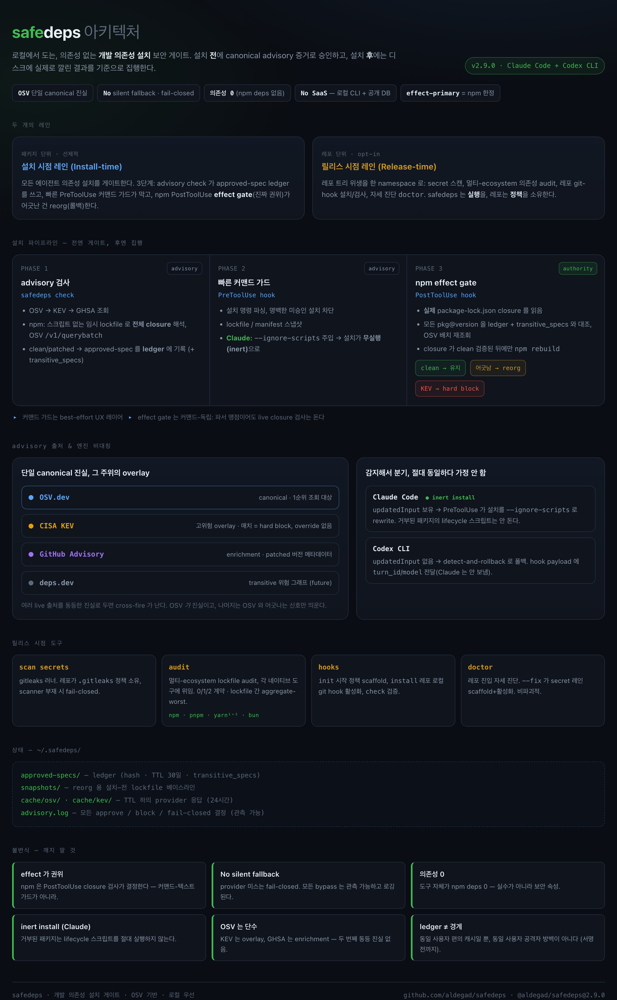

# safedeps

> **AI 코딩 에이전트가 취약하거나 승인되지 않은 의존성을 설치하지 못하게 하고, 새어 들어온 항목은 되돌리게 합니다.**
>
> `safedeps`는 Claude Code 또는 Codex CLI 에이전트가 실행하는 모든 의존성 설치를 게이팅합니다. OSV / CISA KEV / GitHub Advisory를 기준으로 패키지를 사전 승인하고, 실제 lockfile에 반영된 폐쇄성을 다시 검증하며, 일치하지 않는 항목은 자동으로 롤백합니다. 로컬 전용이며 런타임 의존성은 없습니다. *(한국어 README → [README.ko.md](./README.ko.md))*

- **사전 승인** — 각 `pkg@version`와 npm의 전체 전이적 폐쇄성을 OSV(표준), CISA KEV, GitHub Advisory에 대해 설치 전 승인 여부를 확인합니다.
- **실제 효과 적용 강제** — 설치 후 실제 `package-lock.json` 폐쇄성을 다시 검증하여, 래핑되거나 난독화된 명령이 게이트를 통과하지 못하게 합니다.
- **롤백** — 승인되지 않았거나 새로 취약해진 항목은 마지막으로 확정된 안전 스냅샷으로 되돌립니다. 확정 스냅샷이 아직 없는 프로젝트는 명령 전 상태로 되돌리고, 메시지가 어느 쪽인지 말합니다. Claude Code에서는 safedeps 가 npm 설치마다 `--ignore-scripts` 를 붙여, 거부된 패키지의 라이프사이클 스크립트가 설치 중에 돌지 않게 합니다. 이것은 설계이지 약속이 아닙니다. npm 이 그 플래그를 지키는지는 명령에 보이지 않는 셸 상태가 정하므로, safedeps 는 플래그를 붙였다는 것만 보고합니다.

> **실제로 잡은 사례.** pre-commit 감사가 Dependabot이 놓친 취약한 전이적 `hono` 어드바이저리를 잡았습니다 — 커밋 시점에 어드바이저리 DB를 다시 조회해서. 패키지를 설치한 *뒤에* 공개된 CVE("그땐 안전해 보였는데 지금 발견됨")가 몇 주 뒤가 아니라 바로 다음 커밋에 드러납니다.

## Quickstart

```bash
# 1. CLI 설치 — npm 패키지는 스코프가 적용되므로 @aldegad/ 접두사를 사용합니다.
npm install -g @aldegad/safedeps

# 2. Claude Code / Codex에 훅 연결 (멱등성 보장)
cd "$(npm root -g)/@aldegad/safedeps" && node scripts/install/install-safedeps-hooks.mjs

# 3. 완료 — 이제 에이전트가 실행하는 모든 의존성 설치가 게이팅됩니다.
```

> `safedeps`는 CLI 명령어이며, npm 패키지는 **`@aldegad/safedeps`**입니다. npm의 스코프 없는 `safedeps`는 다른 패키지입니다. 정식 소스 트리를 사용하려면 [Installation](#installation)을 참고하세요.


## Distribution Model

Safedeps에는 두 가지 배포 채널이 있습니다.

1. **에이전트 스킬 + 훅 (표준)** — 저장소 자체가 스킬 폴더입니다. `SKILL.md`, 훅 스크립트, provider/ledger 라이브러리, 설치 헬퍼가 하나의 디렉터리에 함께 있습니다.
2. **npm 패키지 (CLI 편의성)** — `@aldegad/safedeps`가 `safedeps` 명령어를 설치합니다. npm 설치만으로는 Claude Code나 Codex가 스킬을 자동으로 발견하지 않으므로, 사용자는 여전히 훅/스킬 설치자를 실행하거나 스킬 폴더를 수동 등록해야 합니다.

GitHub 릴리스는 정식 스킬/훅 소스 트리를 기준 아티팩트로 사용하려는 경우에 사용합니다. 버전 관리된 전역 CLI가 필요한 경우에는 npm을 사용하세요.

용어 정리: safedeps는 Claude/Codex 훅과 로컬 CLI로 지원되는 에이전트 보안 스킬입니다. 나중에 플러그인 매니페스트로 래핑되지 않는 한 Codex 플러그인 번들은 아닙니다.

## Two Lanes

`safedeps`는 두 가지 보안 레인을 가집니다(전체 설계는 [`ARCHITECTURE.md`](./ARCHITECTURE.md) §1 참조):

- **설치 시점**(이 README의 초점) — advisory 확인 + 승인 사양 ledger + 빠른 PreToolUse 가드 + PostToolUse 효과 강제 + 설치 후 reorg. 설치 명령과 실제 lockfile 영향 범위 기준으로 패키지 단위로 동작.
- **릴리스 시점** — `safedeps gates run`, `safedeps scan secrets [--repo|--worktree|--staged]`, `safedeps audit [npm|pnpm|yarn|bun]`, `safedeps hooks install|check`. 원격 푸시/릴리스 전 repo 트리 시크릿 스캔, 의존성 감사, repo 로컬 git 훅 설치/검사, 그리고 옵트인 원격 리포지토리 posture 검사. 저장소 정책(`gitleaks` 설정, privacy paths)은 대상 repo가 소유하며 safedeps는 로컬 실행을 담당합니다. *(이전 `security-release-gates`를 흡수했습니다.)*

릴리스 시점의 시크릿 유출 영역은 **repo별 opt-in**입니다. `safedeps doctor`가 그 진입점입니다. repo의 `.gitleaks` 정책, `.githooks/pre-commit`, 활성 `core.hooksPath`, 스캐너 가용성(및 전역 설치 시점 게이트 상태)을 진단한 뒤, `safedeps doctor --fix`가 기본 정책을 스캐폴딩(`safedeps hooks init`)하고 활성화(`safedeps hooks install`)합니다. `--fix`를 선택하면 repo 로컬의 pre-commit 설정이 자동으로 적용되며 원격 CI 리소스를 소비하지 않습니다. 스캐폴딩은 비파괴적입니다 — 기존 repo 소유 `.gitleaks.toml`은 덮어쓰지 않습니다 — 그리고 pre-commit 훅은 시크릿 스캔(`safedeps scan secrets --staged`)과, 지원 lockfile이 있는 repo에서 매 커밋마다 의존성 감사(`safedeps audit`, npm/pnpm/yarn/bun 자동 감지)를 실행합니다. 실제 발견은 차단(fail-closed)되며, advisory DB 접근 불가 시에는 경고만 남기고 커밋은 통과시켜(오프라인 폴백) 가시성을 확보합니다. 원격 집행은 두 갈래로 나뉩니다. `main`에 대한 직접 push를 막는 브랜치 규칙은 비용이 들지 않는 no-runner posture로 권장하고, GitHub Actions 워크플로우와 필수 상태 검사는 실행 비용이 드는 명시적 opt-in로 둡니다. 자세한 내용은 [Secret-Leak Lane (per-repo)](#secret-leak-lane-per-repo) 참조.

## How It Works

[](./ARCHITECTURE.md)

`safedeps`는 각 설치를 기준으로 두 단계로 동작합니다.

- **이전 단계** — `safedeps check`가 패키지를 OSV(표준), CISA KEV, GitHub Advisory로 확인한 뒤 로컬 ledger에 승인 기록을 남깁니다. npm의 경우 패키지의 전체 의존성 폐쇄성을 해결해 모든 전이적 패키지도 검사합니다.
- **이후 단계** — PostToolUse 훅이 npm 이 쓰는 lockfile 에서 실제로 설치된 내용을 다시 읽고, ledger에 없는 항목이나 advisory DB에서 새로 위험으로 표시된 항목을 롤백(리오그)합니다.

두 훅 이벤트에 등록되는 커맨드는 작은 엔트리 셔틀(`safedeps-hook-entry.sh`)입니다. 훅은 심링크를 거쳐 레포 체크아웃을 라이브로 실행하므로, 체크아웃이 일시적으로 깨진 상태(머지 진행 중, 저장이 덜 된 편집)에서는 종료코드에 따라 모든 Bash 호출이 문법 오류 한 줄로 막히거나 게이트가 조용히 꺼지곤 했습니다. 셔틀은 둘 다 설명이 붙은 fail-closed 거부로 바꿉니다. 무엇이 깨졌는지, 머지가 진행 중인지, 어떻게 복구하는지를 말합니다. 머신이 프로세스를 띄우지 못한 순간의 호출도 게이트 없이 통과시키지 않고 거부합니다. 상세: [ARCHITECTURE — Phase 0](./ARCHITECTURE.ko.md).

**시간이 다하는 것도 답이지 공백이 아닙니다.** 에이전트 런타임은 훅마다 고정 예산을 주고 그게 지나면 훅을 죽이는데, 그다음 tool call 은 그대로 진행됩니다 — 즉 오래 걸리는 게이트는 그냥 사라집니다. 커맨드 스캔 비용은 커맨드가 길수록 커지므로, 패딩을 붙이는 것만으로 그 선을 넘길 수 있었습니다. 이제 설치 전 guard 는 더 작은 자기 예산을 갖고, 시간 안에 판정을 못 끝내면 차단하고 그 사실을 말합니다. 메시지가 `UNDECIDED, not unsafe` 로 시작해서 아무도 타임아웃을 적발로 읽지 않게 합니다. 예산 근처에도 못 가는 짧은 커맨드는 영향받지 않습니다.

**읽지 못한 커맨드도 같은 방식으로 다룹니다.** guard 는 커맨드를 `awk`·`grep`·`sed` 로 읽는데, 실패한 도구는 아무것도 돌려주지 않았고, 그것이 "설치 아님" 으로 읽혔습니다. 이제 실패한 읽기를 기록하고, 무엇이든 실행을 허용하기 전에 확인합니다. 커맨드 어디에든 패키지 매니저 이름이 있으면 `UNDECIDED` 로 차단하고, 없으면 실행하되 실패를 stderr 와 `~/.safedeps/advisory.log` 에 남깁니다. 읽기가 실패한 뒤에 적발을 보고할 deny 는 대신 `UNDECIDED` 를 보고합니다. guard 는 따옴표·주석·heredoc·중첩 치환을 한 번에, 셸이 읽는 방식대로 읽습니다. 그래서 heredoc, 아포스트로피가 든 주석, 여러 줄 문자열이 그 뒤의 설치를 가리지 못하고, 끝내 닫히지 않는 명령은 읽지 못한 것으로 다룹니다. 설치 앞의 대입(`FOO="a b" pip install ...`)도 같은 방식으로 읽으므로 그 값도 설치를 가리지 못하고, `case` 갈래나 중첩 치환 안의 설치도 마찬가지입니다. bash, zsh, dash 가 한 커맨드를 다르게 읽는 곳에서는 각 셸이 읽는 방식대로 모두 읽고, 그중 어느 셸이라도 실행할 설치를 전부 판정합니다. `--ignore-scripts` 는 세 셸이 npm 설치 자리를 똑같이 읽을 때만 넣고, 그렇지 않으면 커맨드를 `UNDECIDED` 로 차단합니다.

PreToolUse 명령 훅은 빠른 advisory 안내 장치로서, 명백히 승인되지 않은 설치 및 위험한 명령 형태를 차단해 에이전트에게 즉시 피드백을 제공합니다. 하지만 npm에서는 실제 권한 판단이 설치 후 효과 게이트에 있으며, 실제로 설치된 결과를 기준으로 판단하므로 래핑되거나 난독화된 설치 명령으로 패키지를 우회할 수 없습니다.

**스크립트 안전성(비활성 설치).** Claude Code에서는 PreToolUse 훅이 npm install에 `--ignore-scripts`를 추가합니다. 목표는 **비활성(inert)** 설치입니다. 패키지는 디스크에 기록되고, 라이프사이클 스크립트는 closure 가 검증된 뒤 아래의 rebuild 를 통해서만 돕니다. 이것은 목표이지 약속이 아닙니다. npm 이 플래그를 지키는지는 명령이 도는 셸이 정하므로, safedeps 는 플래그를 더했다는 것만 말합니다. 플래그는 npm 이 참으로 읽는 자리에 붙습니다. npm 은 같은 옵션이 여러 번 오면 마지막 값을 따르므로, 훅은 먼저 그 설치의 마지막 인자 뒤에 플래그를 둡니다. 거기서는 설치에 `--ignore-scripts=false` 나 `--no-ignore-scripts` 가 있어도 스크립트를 다시 켤 수 없습니다. 그다음 플래그를 둔 설치를 npm 이 읽는 방식대로 다시 읽고, 플래그가 참이고 다른 것은 바뀌지 않았을 때만 그 자리를 씁니다. `--cache` 처럼 다음 단어를 값으로 받는 옵션이 마지막 단어이면 플래그가 캐시 디렉터리가 되어 버리므로, 플래그는 그 단어 앞에 갑니다. 다시 쓰는 설치는 safedeps 가 설치의 단어를 읽기 전에 하던 재작성도 그대로 담습니다. 한 문장짜리 명령이면 끝에 플래그 하나, 그 밖에는 동사마다 바로 뒤에 하나입니다. 그리고 어느 경우든 동사마다 바로 뒤에 하나를 둡니다. 이것이 바닥입니다. 훅이 더한 플래그 몇 개를 지우면 그 이전의 재작성이 되므로, 훅이 단어를 잘못 읽거나 셸이 단어를 바꿔도 npm 은 적어도 그 재작성이 준 것을 받습니다. 셸에 넘기는 큰따옴표 스크립트 안의 설치처럼 훅이 읽어서 플래그 자리를 정할 수 없을 때도, 한 문장짜리 명령은 이전 재작성의 끝 플래그를 받고 downgrade 가 기록됩니다. 셸이 명령을 실행할 때 바꾸는 단어는 무엇이든 될 수 있습니다. 훅은 셸이 펼치는 것을 나열하지 않습니다. 셸이 건드리지 않는 것을 나열합니다. 따옴표 밖의 모든 글자가 영문자, 숫자, `. _ / @ : + , = % -` 중 하나이고 단어가 `~` 나 `=` 로 시작하지 않을 때만, 그 단어를 쓴 그대로로 칩니다. 틸드, 중괄호, `$`, glob, 괄호처럼 그 밖의 글자가 있으면 셸이 실행 때 정할 수 있는 단어입니다. 큰따옴표 안의 `$` 도 셉니다. 거기서도 펼쳐지기 때문입니다. 그런 단어가 있는 설치는 미리 읽을 수 없습니다. 그 설치는 두 플래그를 그대로 두고, npm 이 어느 쪽을 따를지 아무도 읽지 못했다는 사실을 `advisory.log` 에 기록합니다. PostToolUse 훅은 설치가 스크립트를 돌리지 않았다고 말하는 일이 없습니다. 그런 설치에는 스크립트가 돌았을 수 있다는 말을 더합니다. `--ignore-scripts=false` 처럼 스크립트를 요청한 설치도 거기에 기록되고, 그 스크립트는 아래의 rebuild 를 통해서만 돕니다. 훅이 설치를 그대로 두는 것은 그 설치 자신의 인자가 이미 플래그를 참으로 두고 이전 재작성도 그대로 두었을 때뿐이고, 인자는 npm 이 인자를 읽는 방식으로 읽습니다. `echo` 나 다른 문장에 있는 같은 글자는 세지 않습니다. 훅은 각 설치의 인자를 셸이 이어 붙이는 방식대로 읽습니다. 그래서 따옴표 안에서 플래그처럼 보이는 줄은 옵션 값의 일부입니다. 동사 앞에 `--` 가 있는 설치는 npm 이 플래그를 옵션으로 읽을 자리가 없으므로 바닥만 남기고 downgrade 로 기록됩니다. 이후 효과 게이트가 폐쇄성을 검증하고 통과 시에만 PostToolUse 훅이 `npm rebuild`를 실행해 검증된 스크립트를 실행합니다. 게이트가 거부한 패키지는 어떤 스크립트도 실행되기 전에 리오그됩니다. rebuild 는 게이트가 읽은 트리만 다룹니다. 게이트가 읽은 디렉터리에서 `--global=false --location=project` 로 돌기 때문에 프로젝트 `.npmrc` 가 rebuild 를 전역 트리로 돌릴 수 없습니다. rebuild 는 트리 전체에 대해 돌기 때문에, 이번 설치가 바꾼 것만이 아니라 트리 전체를 묻습니다. `node_modules` 에 `.package-lock.json` 기록이 없거나, rebuild 가 돌 트리에 다음 중 하나가 있다고 npm 이 답하면 그 패키지를 지목한 경고와 함께 건너뜁니다. 어느 lockfile 에도 기록되지 않은 패키지나 패키지 버전, lockfile 이 공개 registry 에서 왔다고 기록하지 않은 패키지(사설 registry, git URL, tarball), 공개 registry 로 기록됐지만 npm 이 다른 registry 에서 받은 패키지, 선언된 워크스페이스 멤버가 아닌 디렉터리(`file:` 디렉터리 의존성)입니다. 이 질문은 `npm query '*'` 로 npm 에게 묻고, 이 질의는 `npm rebuild` 처럼 `file:` 의존성 안의 `node_modules` 까지 따라갑니다. npm 이 답하지 않아도 rebuild 를 건너뜁니다. `registry.npmjs.org` 기록은 바이트가 어디서 왔는지 말해 주지 않습니다. npm 의 기본값 `replace-registry-host=npmjs` 는 그 URL 을 npm 에 설정된 registry 에서 받고, 기록에는 URL 을 그대로 적습니다. 그래서 npm 이 어느 registry 에서 받는지도 `npm config ls --json` 으로 npm 에게 묻습니다. 명령 전에 설치 자신의 인자와 환경으로 한 번, 명령 뒤에 게이트가 읽은 디렉터리에서 한 번입니다. 두 답이 모두 공개 registry 라고 할 때만 그 기록을 공개 registry 의 것으로 칩니다. (이 기능은 Claude Code의 `updatedInput` capability를 사용합니다. Codex CLI는 이 기능을 노출하지 않으므로, Codex에서는 설치가 일반 실행되고 효과 게이트는 detect-and-rollback 방식입니다. 즉 악성 설치 스크립트가 롤백 전 1회 실행될 수 있습니다.)

이 효과 우선 모델은 현재 npm에만 적용됩니다. `pip`, `cargo`, `go`, `gem`, `maven`, `nuget`은 closure resolver가 추가될 때까지 v2.1 명령 게이트 + reorg 모델을 유지합니다.

```
                         PreToolUse                          PostToolUse
                  (safedeps-pre-guard.sh)          (safedeps-post-verify.sh)
                            |                                    |
  install cmd ──> [ Advisory/ledger UX ] ──> [ Execute ] ──> [ npm effect gate ]
                     |            |                           |       |
                  Block obvious Snapshot                  Clean?  Suspicious?
                  misses/risk   lock/manifest files,        |       |
                                package listings          Confirm  REORG
                                                              |       |
                                    |                       v       v
                                    +--- parent_snapshot_id ──> confirmed
                                                                    |
                                                              Rollback to last
                                                              confirmed snapshot
```

### Phase 1: Advisory Check (`safedeps check`)

에이전트가 의존성을 설치하기 전에 다음을 실행해야 합니다.

```bash
safedeps check <ecosystem> <pkg>@<version|range> --json
```

이 명령은 OSV(표준), CISA KEV(고위험 오버레이), GitHub Advisory(강화 정보)를 조회합니다. npm의 경우 먼저 스크립트가 없는 임시 lockfile을 `npm install --package-lock-only --ignore-scripts`로 생성한 뒤 전체 의존성 폐쇄성을 추출하고 OSV `/v1/querybatch`를 쿼리합니다. 정상이거나 안전하게 축소된 spec은 `~/.safedeps/approved-specs/`에 기록되고, npm 항목은 `transitive_specs`도 함께 저장합니다.

**Yarn project-scoped closure.** 대상 디렉터리가 루트 `resolutions`를 가진 Yarn Berry 프로젝트라면, `check`는 새로운 published-package probe 대신 그 프로젝트의 실제 `yarn.lock`을 `yarn info`로 읽어 폐쇄성을 계산합니다. 덕분에 `resolutions`로 취약한 transitive dependency를 patched version으로 고정한 프로젝트는 실제 resolved dependency tree 기준으로 승인받을 수 있습니다 -- published package closure만 봤다면 여전히 취약한 version이 보여 install이 거부됐을 것입니다. 승인 범위는 그 프로젝트 하나로 한정됩니다. ledger key가 project directory, `resolutions`, `yarn.lock` content의 hash를 포함하므로, 다른 프로젝트나 `resolutions`/`yarn.lock`이 바뀐 이후에는 같은 승인을 재사용할 수 없습니다. `resolutions`가 선언돼 있는데도 요청한 package를 프로젝트의 resolved graph에서 검증할 수 없거나 lockfile이 지원되는 Yarn Berry lockfile이 아니면, check는 fail-closed 상태를 유지합니다.

**Yarn candidate materialization (v2.11.0).** 위의 closure는 package가 이미 `yarn.lock`에 있어야 동작하는데, 정작 가장 중요한 경우인 "이제부터 추가하려는 dependency 검사"에는 그 전제가 성립하지 않습니다. 그런 candidate에 대해 `check`는 거부하는 대신 private mirror에서 closure를 만듭니다. safedeps는 프로젝트의 canonical resolution input만 임시 mirror로 복사합니다 -- 루트와 workspace의 `package.json`, `yarn.lock`, `.yarnrc.yml`, 그리고 `.yarn/releases`, `.yarn/plugins`, `.yarn/patches` 파일입니다. 그 외에는 복사하지 않습니다. `node_modules`, cache, unplugged package, install state, VCS 데이터는 제외됩니다. candidate는 mirror의 manifest에만 추가되고, Yarn이 거기서 `yarn install --mode=update-lockfile --no-immutable`로 해석합니다. 이 모드는 link 단계 없이 lock resolution만 갱신하므로 candidate의 lifecycle script는 실행되지 않고, 사용자의 프로젝트 tree에는 아무것도 쓰지 않습니다.

승인에는 그 승인을 만들어낸 근거가 함께 기록됩니다. 정확한 input set의 hash, input 파일 목록, 생성된 lockfile의 hash, candidate locator, 정확한 Yarn 명령, 그리고 `private-project-mirror` isolation 모드입니다. 이 중 하나라도 없으면 ledger가 해당 entry를 거부합니다. safedeps는 Yarn 실행 전후로 프로젝트 input을 다시 hash합니다. 그 사이에 manifest, `resolutions`, config, lockfile이 바뀌었다면 뒤섞인 프로젝트 상태로 승인하지 않고 candidate를 무효화합니다. input 복사, Yarn 실행, 생성된 lockfile에서의 candidate 해석 중 하나라도 실패하면 `project-candidate-materialization-unavailable`로 거부합니다. published-package closure로 되돌아가는 fallback은 없습니다 -- 검증할 수 없는 materialization은 완화가 아니라 거부입니다.

**npm `overrides` 인지 (v2.12.0).** 같은 문제가 일반 npm 에도 있습니다. 취약한 transitive 를 patched version 으로 고정하는 표준 처방이 `overrides` 인데, closure probe 가 빈 manifest 를 써서 published tree 를 해석하는 바람에 이미 고쳐놓은 레포의 설치까지 거부했습니다. 이제 `check` 는 소비 레포의 `overrides` 를 찾아 probe 에 반영하므로, 실제 설치와 같은 방식으로 transitive 를 해석합니다. 탐색은 `SAFEDEPS_NPM_OVERRIDES_JSON` 이 설정돼 있으면 그것을, 아니면 작업 디렉터리에서 위로 올라가며 만나는 첫 번째 비어있지 않은 `overrides` 를 쓰고, 저장소 루트에서 멈춥니다 -- `.git` 이 디렉터리가 아니라 파일인 worktree 루트도 포함합니다. 구체 버전 핀만 인정하고 `"$react"` 같은 `$`-reference 는 버립니다. 독립 probe 에서는 의미가 없기 때문입니다.

`overrides` 를 반영해도 취약점을 숨길 수는 없습니다. probe 는 여전히 각 override 를 구체 버전으로 해석하고 OSV 는 바로 그 버전으로 조회되므로, 여전히 취약한 릴리스를 가리키는 override 는 다른 것과 똑같이 걸립니다. overrides 를 probe manifest 에 반영하지 못하면 safedeps 가 그 사실을 알리고 overrides 없이 진행하는데, 이는 검사를 더 엄격하게 만들 뿐입니다.

closure 가 소비 프로젝트에 의존하게 됐으므로 승인도 거기에 스코프됩니다. published-package 승인이 전역인 건 정확히 그것이 프로젝트 무관이기 때문이고, `overrides` 에서 유도된 승인은 그렇지 않습니다. 그래서 ledger entry 가 project root, override 집합, 그리고 둘의 hash 를 싣고 키가 그 hash 를 포함합니다. transitive 를 patch 한 레포에서 얻은 승인은 patch 하지 않은 레포의 검사를 만족시키지 못합니다. 그 레포의 실제 설치는 취약한 버전을 해석하니까요. override 집합이 바뀌면 키도 바뀝니다. `overrides` 가 없는 레포는 영향이 없고 기존 전역 승인 그대로입니다.

### Phase 2: Fast Command Guard + Snapshots (PreToolUse)

Claude Code 또는 Codex CLI가 `npm install`, `pip install`, `cargo add`, `go get`, `gem install` 같은 명령을 실행하려 할 때, 가드 훅이 빠른 advisory/UX 레이어를 제공합니다.

1. `package-lock.json`, `pnpm-lock.yaml`, `yarn.lock`, `package.json`을 `~/.safedeps/snapshots/`로 **스냅샷**합니다.
2. 이전 확정 스냅샷을 가리키는 `parent_snapshot_id`를 포함한 메타데이터를 **기록**해 체인 형성(블록 체인처럼)을 만듭니다.
3. 나중 diff 탐지를 위해 `node_modules`의 패키지 목록과 바이너리 목록에 대한 **설치 전 상태**를 캡처합니다.
4. 명시적 `pkg@version` 설치 명령에 대해 승인된 spec ledger를 **빠르게 확인**합니다.
5. 사전 비행 체크를 수행하고 다음 조건을 감지하면 실행을 **차단**합니다.
   - 타이포스쿼팅 패키지명 (`lod_sh`, `reacct`, `axois` 등)
   - 명령줄의 `--registry` 로 적은 비표준 registry(`registry.npmjs.org`, `registry.yarnpkg.com` 외부). npm 이 `.npmrc` 나 `npm_config_registry` 에서 읽는 registry 는 막지 않습니다. 사내 registry, 미러, 프록시가 그렇게 설정되고, 아직 registry 를 승인할 길이 없기 때문입니다. 설치 자신의 인자와 환경으로 npm 에게 어느 registry 에서 받는지 묻고, 설치 후 훅은 그런 registry 가 공개 registry URL 로 내준 것을 그대로 두되, safedeps 는 그것을 `npm rebuild` 하지 않습니다. registry 자신의 URL 로 기록된 새 패키지는 비표준 출처라 롤백됩니다(아래 표). safedeps 는 그대로 둔 바이트를 기록하므로 같은 바이트를 받은 이 머신의 다른 프로젝트도 그것을 rebuild 하지 않고, 이 버전에는 그 기록을 풀 길이 없습니다(경계 참고)
   - 파이프 기반 원격 실행 패턴 (`curl ... | bash`)
   - 설치 스크립트 안전성 명시적 비활성 (`npm config set ignore-scripts false`)

ledger 게이트나 사전 비행 체크에 실패하면 해당 명령은 실행 전에 **차단**됩니다. 명령 가드는 의도적으로 best-effort이며, 에이전트 루프를 개선하고 직접적인 누락을 잡는 데 초점을 둡니다. npm의 권한 판단은 설치 후 효과 게이트가 담당합니다.

**명령 가드가 읽는 것.** 매니저가 문서화한 방식이나 셸이 허용하는 방식으로 쓴 설치입니다. 별칭(`npm i`, `pnpm i`, `bun a`)과 npm 파서가 받아들이는 모든 명령어 철자(`npm upd`, `npm installTest`), 동사 앞의 옵션(`pip --quiet install`), 버전이 붙은 인터프리터(`pip3.11`, `python3.11 -m pip`), 패키지를 받아 실행하는 실행기(`npx`, `npm exec`, `pnpm dlx`, `yarn dlx`, `bunx`, `uvx`, `pipx run`, `go run <모듈>@<버전>`), 매니저별 `create`(`npm create vite` 와 `npm init vite` 는 `create-vite` 를 실행하므로 검사하고 기록하는 패키지도 `create-vite` 입니다. `pnpm create`, `yarn create`, `bun create` 도 같습니다), 묶음·제어문(`( ... )`, `if ...; then ...`), 따옴표로 감싼 spec, 줄 이음을 모두 읽습니다. 백슬래시와 따옴표도 셸과 같은 규칙으로 읽습니다. 어느 단어가 명령이고, 어느 것이 옵션 값이고, 어느 것이 패키지인지는 매니저마다의 옵션 표로 읽습니다. 그래서 `npm --prefix x install evil@1.0.0`, `pnpm --dir x add`, `cargo --config x install`, `pip install --log x` 도 실제 그대로의 설치로 읽고, npm 은 npm 11 과 npm 10 이 각자 옵션을 읽는 방식 둘 다로 읽습니다. v2.18.0 전까지는 이 표기 대부분이 판정도 기록도 없이 가드를 통과했습니다.

**명령 가드가 못 보는 것과, 그 비용이 생태계마다 다르다는 것.** 셸에게 넘기는 텍스트는 가드가 열거한 형태에서만 인식합니다 — `sh -c`, `eval`, 명령 치환, 셸로 들어가는 파이프. `sh -c`·`eval` script 는 셸이 넘기는 단어 그대로(이스케이프된 따옴표까지) 읽으므로, 그 안의 설치는 실제 패키지로 판정됩니다. 셸로 들어가는 파이프에는 가드가 읽는 설치 옆에서도 단독일 때와 같은 질문을 묻고, 그 질문은 보이는 설치 자신의 단어도 셉니다. 그래서 설치 옆의 그런 파이프는 거부됩니다. `npm install x && cat setup.sh | sh` 처럼 설치와 상관없는 셸 파이프를 설치와 한 명령에 섞으면 거부되니, 둘은 따로 실행하세요. 명령 치환, 백쿼트, 큰따옴표 `sh -c`, `eval` 안의 파이프는 그 안쪽 텍스트에만 질문을 물으므로, `$_` 로 설치의 단어를 다시 만드는 파이프는 v2.17.2 때처럼 기록 없이 통과합니다. v2.18.2 가 맡습니다. 그 목록 바깥의 형태는 통과합니다: herestring, `xargs` 가 조립한 명령줄, 파일로 쓴 뒤 실행하는 스크립트. 설치를 인자 그대로 실행하는 래퍼(`sudo`, `timeout`, `nohup`, `nice`)도 통과합니다. 셸이 따옴표를 벗겨 만드는 명령어 단어나 러너의 패키지도 가드는 알아보지 못합니다. `'pip' install x==1`, 그리고 패키지 뒤에 옵션만 오는 `npx "evil@1.0.0"` 이 그렇습니다. 매니저와 동사 사이에서 셸이 실행 때 값을 정하는 단어도 넘어 보지 못합니다. `pip $x install x==1` 에서 `x` 가 비면 셸은 `pip install x==1` 을 실행합니다. v2.17.2 도 이것들을 놓쳤고, 셸처럼 읽는 것은 계획돼 있습니다. npm 에서는 이것이 미탐이 아니라 **지연 탐지**입니다. 효과 게이트가 살아 있는 lockfile 을 읽어서 명령을 어떻게 썼든 결과를 잡기 때문입니다 — 단 게이트가 30초 훅 예산 안에서 끝날 때까지만이고, 그 범위는 주어진 것이 아니라 측정된 값입니다(아래 참고). `pip`, `cargo`, `go`, `gem`, `maven`, `nuget` 에는 가드 뒤에 closure resolver 가 없으므로 같은 형태가 **완전 미탐**입니다 — `~/.safedeps/advisory.log` 에 `UNVERIFIED` 로 기록되고 그걸로 끝입니다. "가드가 이 형태를 파싱하지 않는다" 를 npm 기준으로 읽지 마세요. 경계는 `scripts/test/consumer-forms.sh` 에 측정되어 고정돼 있고, 왜 경계를 넓히는 게 답이 아닌지는 `ARCHITECTURE.md` 가 설명합니다.

**"지연 탐지" 가 실제로 어디까지 닿나.** 효과 게이트는 30초로 등록돼 있고 런타임은 거기서 게이트를 죽입니다. 그래서 npm 의 지연 탐지는 게이트가 끝나는 동안에만 실재합니다. 게이트 비용은 프로젝트 lockfile closure 크기를 탑니다. 예전에는 승인 스펙 원장 크기까지 같이 탔습니다 — 게이트가 closure 패키지마다 원장에 따로 물었고 그 질문 하나하나가 원장 디렉터리 전체를 읽었습니다 — 그래서 738개짜리 원장에서는 closure **4개**에서 이미 30초를 넘었습니다. v2.16.0 은 원장을 closure 당 한 번만 읽습니다. 원장 축은 이제 평평하고, 같은 머신에서 어드바이저리 캐시가 비어 있을 때 게이트는 closure **390개** 근처에서 30초를 넘습니다. 그 아래에서는 백스톱이 실재하고, 그 위 — 큰 애플리케이션의 lockfile — 에서는 게이트가 죽고 설치는 판정되지 않습니다. 교차 지점은 머신·네트워크·캐시에 따라 움직이므로 본인 것을 재세요: `scripts/measure/effect-gate-cost.sh <package-lock.json> --ledger ~/.safedeps/approved-specs`.

**롤백이 도중에 끊기면 safedeps 가 그렇게 말합니다.** 게이트가 closure 를 거부하면 프로젝트를 되돌립니다 — lock 과 manifest 파일을 복원한 뒤 프로젝트 자신의 `node_modules` 를 지웁니다. v2.16.0 이전에는 로그 기록과 보고가 맨 마지막이라, 롤백 도중에 죽은 훅은 아무 기록도 남기지 않았습니다. 어떤 경우에는 프로젝트가 이미 되돌아간 채였고, 그건 설치가 이유 없이 스스로 취소된 것처럼 보입니다. 이제 게이트는 무엇을 하려는지 행동 전에 적고, 롤백이 스스로를 보고한 뒤에 그 메모를 지웁니다. 자기 실행보다 오래 살아남은 메모가 곧 끝나지 않은 롤백입니다. 다음 명령이 그것을 한 번 보고하고, `~/.safedeps/rollback-incidents/` 에 기록하고, `~/.safedeps/reorg.log` 에 `REORG INTERRUPTED` 를 덧붙이고, 어느 단계까지 갔는지, 롤백을 돌리던 프로세스를 검사한 결과, 프로젝트의 의존성 파일 가운데 스냅샷과 다른 것을 말합니다. 원인도 복구 명령도 주지 않습니다. [읽는 법](#롤백-뒤에-safedeps-가-하는-말-읽는-법)은 아래에 있습니다. "오래 살아남았다" 는 메모가 남아 있다는 뜻이 아니라 그것을 쓴 프로세스가 사라졌다는 뜻입니다. 아직 일하는 롤백은 일부러 메모를 디스크에 두므로, 그동안 상관없는 명령은 조용합니다(v2.16.1).

**버전을 안 적은 설치도 게이트를 안 거치며, 이제 그 사실이 기록됩니다.** 원장 검사는 파싱 가능한 `pkg@version` 피연산자에 대해서만 돕니다. `pip install evil`, `cargo add evil`, `go get example.com/evil`, `gem install evil` 은 패키지를 지목하지만 버전을 안 적으므로 spec 이 안 나오고 원장 게이트가 아예 안 돕니다. 여기엔 래핑도 필요 없습니다 — 버전을 안 적으면 됩니다. 효과 게이트가 결과를 읽는 곳에서는 결과에 대해 계속 강제합니다. 게이트가 읽는 디렉터리에 흔적을 남긴 npm CLI 설치가 그렇습니다. npm 은 이런 설치를 `package-lock.json` 에 기록하고, 저장하지 말라는 설치(`--no-save`, `--no-package-lock`)는 `node_modules/.package-lock.json` 에만 기록하는데, 게이트는 둘 다 읽습니다. 그 밖에서는 그대로 미검증 설치가 됩니다. pip, cargo, go, gem, maven, nuget 이 그렇고, pnpm·yarn·bun, 프로젝트나 사용자 `.npmrc` 가 기록 밖에 두는 npm 설치, 전역 트리에 없는 패키지를 설치하는 `npm link <pkg>`(앞에 경로가 있어도: `npm link ../lib <pkg>`), 떨어질 곳이 그 안에서 정해지는 `sh -c`·`eval` payload 안의 npm 설치, lockfile 을 건드리지 않고 패키지를 받아 오는 `npx` 같은 실행기도 그렇습니다. 이 경우가 이제 `~/.safedeps/advisory.log` 에 `UNGATED` 로 기록되고, 기록에는 명령과 함께 버전 없이 설치되는 패키지가 하나하나 적힙니다. 게이트가 본 곳에 흔적을 남기지 않은 npm 설치도 설치 후 훅이 기록합니다. 전역 설치(npm 이 읽는 그대로: `-g`, `-gf`, `--location=global`, `npm_config_global=true`, `.npmrc` 의 `global`. npm 에게 묻기 때문에 철자 목록이 정하지 않습니다)나, 셸이 실행 시점에 정하는 것으로 옮겨진 설치(`cd "$DIR"`)가 그렇습니다. 아래 "설치는 흔적을 남긴 곳에서만 읽힙니다" 를 보세요. 기록의 단위는 이름이 아니라 적힌 그대로의 패키지입니다. `pnpm add left-pad@1.0.0 && pnpm add left-pad` 는 앞의 설치만 고정하고 뒤의 설치는 고정하지 않으므로 뒤의 것이 기록됩니다. 기록은 게이트와 같은 방식으로 명령을 읽습니다. 그래서 플래그로 버전을 준 설치(`gem install rails -v 7.1.0`)는 고정된 것으로 치고, 게이트가 잘못 읽은 패키지는 사라지지 않고 기록에 드러납니다. 해가 없는 기록 몇 가지는 일부러 남깁니다. `pip install x==1 x` 를 pip 가 고정 버전으로 푸는 경우, 고정해서 설치한 패키지를 다시 설치해 아무것도 바뀌지 않는 경우, 명령 앞부분이 설치할 바이너리를 실행기가 부르는 경우, 기록이 모르는 플래그가 값을 받는 경우입니다. 이 기록은 **차단하지 않습니다** — 버전 없는 설치를 전부 거부하는 것은 평범한 `cargo add x` 흐름을 막는 정책 변경이라 레포 소유자의 결정으로 남기고, 기록은 그 결정을 근거로 답할 수 있게 만드는 역할입니다. 평범한 설치가 로그에 안 남는 것도 의도이며, 기준은 어떤 플래그가 붙었는지가 아니라 패키지를 지목하는지입니다. 어떤 플래그가 값을 받는지는 도구마다 다르므로 — pip 의 `-t`·`-f` 는 값을 받고 go·gem 의 같은 철자는 안 받습니다 — 그 표도 생태계별로 갈라 둡니다. `pip install -r requirements.txt` 와 `npm install` 은 지목하지 않고, 작업 트리에서 빌드하는 `pip install .` 도 마찬가지입니다. 프로젝트에 이미 있는 바이너리를 실행하는 `npx tsc` 같은 실행기는 아무것도 받아 오지 않으므로 역시 남지 않습니다. 소스 플래그는 자기 인자만 소비하므로 `pip install -r requirements.txt evil` 은 여전히 `evil` 을 설치하고 그래서 기록됩니다. 모든 설치마다 찍히는 기록은 신호가 아니라 소음이지만, 플래그만 보이면 침묵하는 기록은 더 나쁩니다 — 없는 커버리지를 있는 것처럼 읽히게 하기 때문입니다.

**아무것도 저장하지 않는 npm 설치도 읽힙니다.** v2.18.0 전까지 효과 게이트는 명령이 시작된 디렉터리의 `package-lock.json` 만 읽었습니다. `npm install x --no-save`, `--package-lock=false`, 같은 설정을 환경변수나 `.npmrc` 로 준 경우, `npm -C sub install x`, `cd sub && npm install x` 는 모두 그 파일을 건드리지 않았고, 그래서 게이트는 전부 깨끗하다고 확인했습니다. Claude Code 에서는 그 확인이 `npm rebuild` 를 부르므로, 무실행 설치가 결국 검증 안 된 패키지의 설치 스크립트를 돌렸습니다. 로컬 레지스트리에 실제 npm 을 돌려 재 보니 npm 은 이 설치들을 전부 기록합니다. 저장하지 않는 설치는 `node_modules/.package-lock.json` 에, 옮겨진 설치는 그 디렉터리의 `package-lock.json` 에 남습니다. 이제 게이트는 숨은 lockfile 을 읽고 `-C` 와 리터럴 `cd` 를 따라가며, 이 형태들은 모두 롤백됩니다. closure 만이 아니라 모든 검사가 그것을 읽습니다. 아래의 설치 스크립트 검사와 출처 검사는 예전에 `package-lock.json` 이나 `package.json` 이 바뀔 때만 돌았습니다. 그래서 승인된 이름과 버전을 단 tarball 이 파일이나 http URL 에서 왔을 때 저장하지 않으면 두 검사를 통과했고, rebuild 가 그 스크립트를 돌렸습니다. 이제 두 검사는 저장 여부와 상관없이 설치가 두 기록 중 어디에든 새로 들인 것을 읽습니다. 따라가는 곳은 npm 이 실제로 설치하는 디렉터리이고, 이름 붙은 디렉터리와 늘 같지는 않습니다. 그 디렉터리는 npm 에게 묻습니다(설치 명령 자신의 인자를 붙인 `npm prefix` 와 `npm root`). npm 은 `package.json` 이나 `node_modules` 가 있는 가장 가까운 디렉터리까지 올라가고, 워크스페이스 멤버라면 그 멤버를 선언한 루트까지 갑니다. 다만 심링크를 거쳐 닿은 멤버에서는 올라가지 않습니다. `src` 에 `package.json` 이 없을 때 `cd src && npm install x` 는 프로젝트의 lockfile 에 기록하고, 워크스페이스의 `packages/a` 안에서 돈 설치도 그렇습니다. 게이트는 그 lockfile 을 읽습니다. npm 의 규칙을 bash 로 옮긴 사본은 심링크 멤버에서 틀렸고, 그래서 이제는 npm 에게 묻습니다. npm 에게 물을 수 없거나 제때 답이 없으면, 또는 명령이 셸이 실행 시점에 정하는 값을 npm 에 넘기면, 이유를 적고 cwd 를 봅니다. 워크스페이스에서는 루트 lockfile 이 각 멤버를 경로로 기록합니다. 게이트는 더 이상 그 경로를 패키지 이름으로 읽지 않고, 롤백은 루트뿐 아니라 멤버의 `package.json` 도 복원합니다. 그래서 `npm install x -w packages/a` 도 디스크에서 되돌려집니다. `.npmrc` 가 설치를 두 기록 밖으로 보내는 경우는 따로이며, 아래 경계에서 다룹니다. `scripts/test/lockless-forms.sh` 가 이것들을 종단으로 돌립니다.

**설치는 흔적을 남긴 곳에서만 읽힙니다.** 명령 텍스트로 디렉터리를 고르는 방식은 세 차례 리뷰에서 매번 틀렸고, 그때마다 결과는 조용한 통과였습니다. `false && cd sub; npm install x` 는 현재 디렉터리에 설치하는데, 게이트는 실행되지 않은 `cd` 를 따라갔습니다. `command cd sub; npm install x` 는 `sub` 에 설치하는데, 게이트는 그 철자를 따라가지 않았습니다. 어느 쪽이든 설치가 건드리지 않은 디렉터리를 읽고 깨끗하다고 했습니다. 철자 목록으로는 이것이 닫히지 않습니다. 명령이 먼저 `npm init` 을 돌리거나 `.npmrc` 를 써서 npm 이 읽는 것 자체를 바꿀 수도 있기 때문입니다. 그래서 이제 텍스트는 볼 곳만 고릅니다. 명령이 돌기 직전에 safedeps 는 그곳의 시각과 npm lockfile 두 개를 적어 두고, 명령 뒤에 둘 중 하나가 다시 쓰였는지 봅니다. npm 은 무언가를 설치하면 이미 있던 것을 다시 설치할 때도 `node_modules/.package-lock.json` 을 다시 씁니다. 둘 다 다시 쓰이지 않았으면 그 설치를 `UNGATED` 로 기록하고, 아무것도 찾지 못한 검사를 그대로 적습니다: `no install trace in <dir>: neither npm lockfile there is newer than the baseline taken before this command or has another inode`. 거기서는 아무것도 rebuild 하지 않으며, Claude Code 에서는 사용자에게 알립니다. 설치가 다른 곳에 떨어졌는지 아무것도 설치하지 않았는지는 말하지 않습니다. safedeps 가 구분할 수 없기 때문입니다. `--dry-run` 이나 실패한 설치도 같은 모양으로 나타나는데, 이것은 통과가 아니라 소음입니다. `npm install a; cd sub; npm install b` 처럼 한 명령의 npm 설치 둘 사이에 무언가가 있어도 기록됩니다. 앞 설치의 흔적이 뒤 설치를 대신 답해 버리기 때문입니다. 실행되지 않을 수 있는 `cd` 는 실행이 증명되는 데까지만 따라가므로, `false && cd sub; npm install x` 는 현재 디렉터리에서 읽혀 롤백되고 `cd sub || exit` 은 여전히 따라갑니다. `scripts/test/effect-trace-grid.sh` 가 모든 형태를 종단으로 돌립니다.

### Phase 3: Post-install Effect Enforcement (`safedeps-post-verify.sh` -- PostToolUse)

설치 명령이 끝난 뒤 verify 훅이 변경 사항을 분석합니다. npm에서는 이것이 주요 집행 지점입니다. `package-lock.json` 과 npm 의 숨은 `node_modules/.package-lock.json` 에서 실제 폐쇄성을 읽고, 각 패키지를 승인된 direct entry와 해당 `transitive_specs`로 검증한 뒤 OSV 배치 조회를 다시 수행합니다.

1. **npm effect gate** — 잠금 파일의 어떤 패키지든 승인되지 않았거나 KEV 차단, 취약점 존재, 또는 fail-closed 검증 실패 시 reorg 수행.

2. **설치 스크립트 분석** — 설치가 새로 들인 패키지의 `preinstall`, `install`, `postinstall` 스크립트를 봅니다. 새로 들인 패키지란 `node_modules` 에 새로 생긴 것, 그리고 두 npm 기록 중 하나가 명령 전 어느 기록에도 없던 버전·출처·integrity 로 지금 담고 있는 것입니다. 다음 항목을 탐지합니다:
   - 네트워크 접근 (`curl`, `wget`, `fetch`, `http`, `socket`, `dns`)
   - 동적 코드 실행 (`eval`, `exec`, `spawn`, `child_process`, `Function()`)
   - 민감 경로 접근 (`~/.ssh`, `.env`, `.aws`, `credentials`)
   - 난독화된 내용 (`base64`, `atob`, `Buffer.from`, 16진수/유니코드 이스케이프)

3. **Lock file diff analysis** — lock 파일을 명령 전에 떠 둔 사본과 비교합니다. npm 에서는 출처를 두 기록 모두에서 읽고, 명령 전 어느 기록에도 없던 출처만 셉니다:
   - 비표준 registry를 가리키는 resolved URL. `https://registry.npmjs.org/` 나 `https://registry.yarnpkg.com/` 으로 시작하는 URL 만 공개 registry 이고, 그것도 npm 이 실제로 거기서 받았다고 답할 때만입니다(`replace-registry-host` 가 `never` 가 아니면 npm 은 그런 URL 을 설정된 registry 에서 받습니다). 설치가 링크한 디렉터리 의존성도 프로젝트가 선언한 워크스페이스가 아니면 비표준 출처입니다
   - resolved URL의 보안 취약 프로토콜 (`http://`, `git://`)
   - 과도한 의존성 증가 (`package-lock.json` 의 신규 resolved 항목 50개 초과, 의존성 혼란 공격 가능성)

4. **바이너리 검사** — `node_modules/.bin/`에서 새로 추가된 네이티브 바이너리(ELF, Mach-O, 공유 객체)를 확인해 JavaScript 프로젝트에서 나타나면 안 되는 항목 탐지.

### Confirm or Reorg

- **모든 검사 통과** — 검증된 설치가 남긴 그대로의 lock·manifest 파일을 새 스냅샷으로 기록하고, 그 스냅샷을 `~/.safedeps/confirmed_<dir hash>`에 **confirmed**로 표시합니다. 이것이 새 안전 기준점이므로, 이후의 롤백은 이 설치를 남깁니다.

  예전에는 검증된 설치 *이전*에 찍은 스냅샷이 기준점이었고, 그래서 기준점이 설치 한 번만큼 뒤처져 있었습니다. 로컬 레지스트리에 실제 npm 으로 측정한 결과, 승인된 `npm install a` 다음에 승인되지 않은 `npm install b` 를 하면 프로젝트가 `package.json`, lockfile, `node_modules` 어디에도 `a` 가 없는 상태로 롤백됐습니다. 이제는 Claude Code 와 Codex 모두에서 `a` 는 남고 `b` 만 빠집니다(`scripts/test/lockless-forms.sh`).

  기준점은 파일이지 `node_modules` 가 아닙니다. 롤백은 `node_modules` 를 지우고, 다음 설치가 복원된 파일로 그것을 다시 만듭니다. 그래서 아무것도 저장하지 않은 검증된 설치(`--no-save`)는 기준점에 들어가지 않고, 이후 롤백에서 그 패키지는 `node_modules` 와 함께 사라집니다. 검증된 상태를 기록하지 못하면 기준점은 그대로 두고, 이후 롤백이 이 설치까지 되돌린다는 사실을 알려 줍니다.

  파일은 검사가 읽기 전에 복사되고, 검사가 끝났을 때 프로젝트가 같은 바이트를 담고 있을 때만 그 사본이 기준점이 됩니다. 그 사이 다른 설치가 파일을 바꿨다면 지금 있는 것은 검사받지 않은 것이므로, 기준점은 움직이지 않고 그 이유를 알려 줍니다.
- **검사 실패 발생** — **reorg**가 트리거됩니다:
  1. lock file을 마지막 confirmed 스냅샷에서 복원. 확정 스냅샷이 아직 없는 프로젝트는 명령 직전에 뜬 스냅샷으로 돌아갑니다. 그 상태는 아무도 검증하지 않았고 거부된 것이 남아 있을 수 있으므로, 메시지와 `reorg.log`, `advisory.log` 가 모두 그 스냅샷이 이 명령 전에 뜬 것이고 어떤 확정 스냅샷도 그것을 가리키지 않는다고 말합니다.
  2. 변경된 경우 `package.json` 복원
  3. 악성 아티팩트를 치우려고 프로젝트 자신의 `node_modules` 를 지움. 단, 명령이 프로젝트에 무언가를 쓴 것이 보일 때만입니다: 설치 흔적이 있거나, `package.json`·lockfile 이 명령 직전에 뜬 스냅샷과 다르거나, `node_modules` 가 그때 뜬 목록과 다르거나 그 뒤에 수정됐을 때입니다. 아무것도 쓰지 않은 명령이면 `node_modules` 를 그대로 두고, 메시지가 아무것도 찾지 못한 검사를 하나씩 적습니다. 롤백은 패키지 매니저를 부르지 않으므로 설치 스크립트도 돌리지 않고, 재설치 명령도 주지 않습니다. 무엇을 복원하고 지웠는지, 그 뒤 `package.json`·`package-lock.json`·`npm-shrinkwrap.json` 을 검사한 결과를 말합니다. 재설치가 어디에 쓸지는 npm 이 정하고, 그 설치도 다른 설치처럼 게이트를 지납니다. 복원이나 제거가 실패하면 종료 코드와 함께 한 줄로 적고, 롤백은 나머지를 계속합니다.
     롤백은 심볼릭 링크를 따라 프로젝트 밖으로 나가지 않습니다. `node_modules`·`package.json`·lockfile 이 다른 디렉터리를 가리키는 링크면 그 단계는 거부되고, 메시지와 `reorg.log`(`REORG REFUSED`)에 그 이름과 링크가 가리키는 곳이 남습니다.
  4. 이벤트를 `~/.safedeps/reorg.log`에 기록. 메시지에 실린 줄과 같은 줄입니다.
  5. Claude Code에 탐지 위협과 롤백 동작을 상세히 담은 시스템 메시지 전달

#### 롤백 뒤에 safedeps 가 하는 말 읽는 법

롤백 메시지, 거부된 단계, 건너뛴 rebuild, 끝나지 않은 롤백의 보고는 닫힌 한 벌의 줄로 쓰입니다. 줄 하나는 safedeps 가 한 일이거나, 그 줄을 쓸 때 돌린 검사의 결과입니다. 어떤 줄도 왜 그렇게 됐는지, npm 이 무엇을 할지, 디렉터리 안에 무엇이 있는지, 다음에 무엇을 하라는지는 말하지 않습니다. 줄 뒤에 있는 규칙은 여기에 적습니다.

| 줄 | 뜻 |
|---|---|
| `Rollback snapshot: <id>, a confirmed snapshot` | 프로젝트의 확정 기록이 이 스냅샷을 가리킵니다. safedeps 가 검증한 설치가 남긴 파일입니다. |
| `Rollback snapshot: <id>, taken before this command; no confirmed snapshot names it` | 프로젝트에 확정 스냅샷이 없었습니다. 파일은 명령 전 상태로 돌아갔습니다. 그 상태는 아무도 검증하지 않았고, 거부된 패키지가 남아 있을 수 있습니다. |
| `restored <path>` / `removed <path>` | 파일이 이제 스냅샷과 같거나, 경로가 없습니다. safedeps 가 행동한 뒤에 확인했습니다. |
| `not restored <path>: cp exit <n>; ...` / `not removed <path>: rm exit <n>; <path> exists` | 그 단계가 실패했습니다. 줄은 종료 코드와 그 경로를 검사한 결과를 말합니다. 디렉터리 안에 무엇이 남았는지는 말하지 않습니다. `rm -rf` 는 지울 수 있는 것을 지운 뒤에 실패합니다. |
| `not restored <path>: <path> exists and is not a regular file` | 그 경로가 디렉터리이거나 다른 종류의 파일이라서 safedeps 가 그 위에 복사하지 않았습니다. 디렉터리에 `cp` 하면 그 안에 파일을 씁니다. |
| `refused restore of <path>: ...` / `refused removal of <path>: ...` | 그 경로가 심볼릭 링크이고, 줄이 링크가 가리키는 곳을 말합니다. safedeps 는 링크를 따라가지 않고, 읽은 프로젝트 밖에 쓰지 않습니다. |
| `kept <path>` 와 그 아래 검사 줄 | 명령이 `node_modules` 에 썼다는 것을 어떤 검사도 보이지 못해서 지우지 않았습니다. 아래 줄들이 그 검사입니다. `node_modules` 가 심볼릭 링크면 다음 줄이 그 사실과 링크가 가리키는 곳을 말하고, 검사는 링크가 가리키는 곳을 읽습니다. 패키지 목록은 `node_modules` 아래 세 단계까지의 `package.json` 만 읽으므로, 더 깊이 쓰인 패키지(`node_modules/<a>/node_modules/<b>`)는 목록에 나오지 않습니다. |
| 이유 줄 하나, 그 다음 `removed <path>/node_modules` | 명령이 `node_modules` 에 썼다는 것을 처음 보인 검사입니다. 설치 흔적, 명령 직전 스냅샷과 달랐던 node manifest·lockfile, 그 스냅샷의 목록에 없는 항목, 그 스냅샷보다 새로운 것, 또는 명령 전 스냅샷이 아예 없음 가운데 하나입니다. |
| `<path> exists` / `<path> does not exist` / `<path>/package.json has the key workspaces` | 롤백 뒤 프로젝트 루트에 있는 것입니다. safedeps 는 패키지를 재설치하지 않고, 재설치가 어디에 쓸지 판단하지 않습니다. 프로젝트 자신의 `node_modules` 만 지우고, 워크스페이스 멤버의 것은 지우지 않습니다. |
| `The rollback changed nothing.` | 어떤 단계도 `cp` 나 `rm` 을 돌리지 않았습니다. 돌다가 실패한 단계는 바꾼 것이 없다고 하지 않습니다. `rm -rf` 는 지울 수 있는 것을 지운 뒤에 실패합니다. |
| `no install trace in <dir>: ...` | 그 디렉터리의 npm lockfile 둘 다 명령 동안 바뀌지 않았습니다. 거기에는 이 설치의 흔적이 없습니다. |
| `safedeps added --ignore-scripts to this install` | 이 훅이 쓴 pre-guard 기록이 safedeps 가 설치를 플래그를 달아 고쳐 썼다고 말하고, post 훅이 받은 명령이 바이트 하나 다르지 않게 그 기록에 담긴 명령입니다. 그 기록은 이 호출 자신의 것입니다(아래). safedeps 가 쓴 명령에는 플래그가 실려 있었습니다. 명령이 스스로 `npm rebuild` 를 돌리면 설치 스크립트는 그래도 돕니다. rebuild 건너뜀 줄과 같습니다. |
| `safedeps asked for --ignore-scripts on this install; the command this hook received is not the one safedeps wrote` | 이 훅이 쓴 pre-guard 기록이 safedeps 가 명령을 고쳐 썼다고 말하는데, post 훅은 다른 명령을 받았습니다. 런타임이 safedeps 가 쓴 그대로 돌리지 않은 것입니다. 설치의 스크립트가 돌았다고 보십시오. |
| `safedeps did not add --ignore-scripts to this install` | 이 훅이 쓴 pre-guard 기록이 safedeps 가 명령을 고쳐 쓰지 않았다고 말합니다. Codex 에서는 할 수 없습니다. 기록을 쓰지 못한 pre-guard 는 명령을 고쳐 쓰지 않고, 그 사실을 `advisory.log` 에 남깁니다. 기록 파일이 없으면 줄을 내지 않습니다(아래). |
| `... did not run npm rebuild: <fact>` | safedeps 는 프로젝트 루트의 `package.json`·lockfile·`node_modules` 가 링크가 아니고 이 설치의 흔적이 있는 디렉터리에서만 rebuild 합니다. 이 줄은 safedeps 가 한 일을 말합니다. 설치 스크립트가 돌았는지는 말하지 않습니다. 명령이 스스로 rebuild 했다면 스크립트는 이미 돌았습니다. |
| `... ran npm rebuild: exit <n>` | safedeps 가 돌린 rebuild 가 그 종료 코드로 실패했습니다. |

이 세 줄은 명령이 무엇을 다는지가 아니라 safedeps 가 한 일을 말합니다. safedeps 는 명령에서 플래그를 읽지 않습니다. "did not add" 는 설치 스크립트가 돌았는지 말하지 않습니다. 명령이 단어나 환경이나 `.npmrc` 로 스스로 플래그를 걸 수 있습니다. Codex 에서는 safedeps 가 플래그를 넣을 수 없습니다.

세 줄은 모두 post 훅이 이 명령에 대한 pre-guard 의 기록을 찾았을 때만 나옵니다. backstop 의 롤백에는 셋 다 없습니다. backstop 은 post 훅이 그 기록을 찾지 못했거나, 찾은 기록이 가리키는 스냅샷에 meta 파일이 없거나, 찾은 기록이 스냅샷을 가리키지 않거나, 찾은 기록이 JSON 객체 하나가 아닐 때 돌고, 머리말이 어느 쪽인지 말합니다("this hook found no record of this command from before it ran", "this hook found a pre-guard record, and the snapshot it names has no meta file", "this hook found a pre-guard record, and the record names no snapshot", 또는 "this hook found a pre-guard record, and the record is not one JSON object"). `tool_use_id` 를 적지 않은 호출이라면 기록이 post 훅이 계산하지 않은 키 아래에 있을 수 있고, meta 파일이 없는 스냅샷이나 없는 스냅샷에는 고쳐 쓰기의 기록이 없으므로, backstop 은 safedeps 가 한 일을 말하지 않습니다.

줄은 기록이 밝힌 사실로만 냅니다. 기록에는 버전이 있고, 이 사실을 밝히는 것은 v2.18.0 부터 쓰는 버전 2 기록뿐입니다. 버전 2 기록에서 "safedeps 가 명령을 고쳐 쓰지 않았다" 는 값 false 이고, "고쳐 썼다" 는 값 true 와 safedeps 가 쓴 명령입니다. v2.17.2 기록에는 버전이 없고 둘 다 밝히지 않습니다. 그 false 는 고쳐 쓰지 않았다는 뜻이 아니었습니다. 기록 쓰기가 실패해도 고쳐 쓴 명령은 나갔기 때문입니다. 그 true 에는 비교할 명령이 없습니다. 그런 기록, 없는 기록, 두 사실 중 어느 것도 밝히지 않는 기록에는 세 줄 중 어느 것도 내지 않고, `advisory.log` 에 그 기록을 적습니다. post 훅이 읽지 못한 기록(JSON 객체 하나가 아닌 파일 등)에도 줄이 없고, `advisory.log` 에 읽지 못했다고 남깁니다. 예전에는 이 모양마다 기록에 없는 값으로 "did not add" 나 "asked" 를 냈고, 그 줄은 거짓일 수 있었습니다.

**post 훅이 쓰는 기록은 자기 호출의 기록입니다.** pre-guard 는 설치의 기록을 호출의 `tool_use_id` 아래에 둡니다. 한 호출의 두 훅이 모두 받고 다른 호출은 받지 않는 값입니다. post 훅은 그 기록만 읽습니다. 두 세션이 같은 디렉터리에서 같은 명령을 동시에 돌려도 post 훅마다 자기 호출의 기록을 씁니다. pre-guard 가 통과시킨 뒤 거부된 호출과 실행 중에 취소된 호출은 post 훅이 돌지 않고, 그 기록은 24시간 정리를 기다립니다. 뒤의 어느 호출도 그 기록을 읽지 않습니다. v2.18.1 전에는 기록을 명령이 돈 디렉터리와 명령으로 찾았고, 두 경우 모두 post 훅이 다른 호출의 기록을 쓸 수 있었습니다. 그 기록에서 나온 줄은 모두 다른 호출에 관한 것일 수 있었고, 확정 스냅샷이 없는 롤백은 다른 호출의 스냅샷으로 되돌려 두 호출 사이에 고친 내용이 사라졌습니다. `tool_use_id` 를 적지 않은 훅 입력은 지금도 그렇게 맞추고, `advisory.log` 가 그 사실을 적습니다. Claude Code 와 Codex 는 둘 다 그 값을 보냅니다. 실패한 호출도 판정합니다. Claude Code 는 실행된 뒤 실패한 Bash 호출에 `PostToolUse` 가 아니라 `PostToolUseFailure` 를 부르고, 설치기는 post 훅을 둘 다에 등록합니다. 그래서 실패한 설치도 다른 설치처럼 검사하고, 기록을 남기지 않습니다. Codex 는 실패한 Bash 호출에도 `PostToolUse` 를 부릅니다. 설치마다 기록을 두기 전의 pre-guard 가 기기에 하나 남기던 기록(`current_state`, `current_snapshot_id`)은 어느 호출도 가리키지 않으므로 읽지 않습니다. 기록이 스냅샷보다 오래 남을 수도 있습니다. 기록은 24시간 남고, 스냅샷 정리는 그보다 먼저 스냅샷을 지울 수 있습니다. 기록이 가리키는 스냅샷에 meta 파일이 없는 호출은 backstop 으로 가고, `advisory.log` 가 그 기록을 적습니다. 기록이 스냅샷을 가리키지 않는 호출도 그렇습니다. 손상된 기록만 그렇게 됩니다. 기록이 JSON 객체 하나가 아닌 호출도 그렇습니다. v2.18.0 전에는 post 훅이 앞의 두 곳에서 아무 말 없이 멈췄고 설치를 검사하지 않았습니다. 세 번째는 그 명령을 부를 때마다 24시간 동안 훅을 오류로 끝냈습니다. 프로젝트 디렉터리를 적지 않은 기록은 훅 자신의 작업 디렉터리가 아니라 명령이 돈 디렉터리에서 판정합니다. 확정 스냅샷으로의 롤백은 손상된 기록이 무엇을 적었든 늘 판정하는 디렉터리의 확정 스냅샷을 씁니다. 테스트는 같은 명령의 겹치는 두 호출을 엔진마다 하나씩 돌려, 각자 자기 기록으로 말하는지 검사합니다.

끝나지 않은 롤백의 보고도 같은 모양입니다. 그 `Rollback snapshot:` 줄은 보고를 쓰는 시점에 프로젝트의 confirmed 기록이 그 스냅샷을 가리키는지를 롤백 메시지처럼 말합니다. `Owner:` 는 그 프로세스가 일하고 있지 않다는 것을 보인 검사입니다. 돌고 있지 않거나, 좀비이거나, 그 pid 가 나중에 시작한 다른 프로세스의 것이거나, 멈춰 있습니다. 멈춘 프로세스는 죽지 않았습니다. 프로세스를 다시 이어 주면 롤백도 이어지므로, 프로젝트를 고치기 전에 그 프로세스를 어떻게 할지 먼저 정하십시오. `Checked at the time of this report` 아래에는 `node_modules` 가 무엇인지와, 감시 대상 파일 가운데 스냅샷과 다른 것만 적힙니다. 그 파일들을 확인한 뒤에 재설치하십시오.

공개 레지스트리가 아닌 레지스트리에 대한 경고와 safedeps 가 rebuild 하지 않은 트리에 대한 경고는 지금도 문장입니다. rebuild 하기 전에 사용자에게 확인하라고 말하며, 그것은 의도입니다.

## Why "reorg"?

이름은 블록체인에서 **reorganization(reorg)**, 즉 확인되지 않은 블록열을 무효화하고 마지막으로 확인된 안전 상태로 체인을 되돌리는 개념에서 가져왔습니다. `safedeps`도 모든 설치를 동일하게 취급합니다. 확인되지 않은 블록 후보처럼, 공급망 점검 배터리를 통과할 때까지 설치는 잠정 상태에 머뭅니다. 실제 설치 결과가 다르면 툴이 **reorg**를 실행합니다. lock file 과 `package.json` 을 마지막 안전 스냅샷으로, 프로젝트에 아직 그것이 없으면 명령 직전 상태로 되돌립니다. 명령이 `node_modules` 에 쓴 것이 보이면 `node_modules` 를 지우고, 다음 설치가 게이트를 지나 다시 깝니다.

하지만 reorg는 **최후의 방어선(backstop)**이지 최전선이 아닙니다. 대부분의 위험한 설치는 여기까지 오기 전에 멈춥니다. 사전 승인 게이트가 승인되지 않았거나 의심 패키지를 실행 전에 차단하고, Claude Code에서는 설치를 **비활성**(`--ignore-scripts`) 모드로 실행해 closure가 깨끗함을 확인할 때까지 라이프사이클 스크립트를 실행하지 않기 때문입니다. reorg는 잔여 케이스(승인된 직접 패키지가 승인되지 않았거나 취약한 전이적 패키지를 끌어오거나, advisory 계층을 우회해 래핑된 명령이 넘어왔을 때)에만 동작하며, 이 경우에도 스크립트가 실행되기 전에 파일을 되돌립니다.

빠른 advisory 피드백, 가시적인 rollback, 숨김 우회 경로 없음. 명령 가드는 best-effort UX이고, 설치 결과 자체가 최종 방어선입니다.

## The Blockchain Analogy

| 블록체인 개념 | Safedeps 대응 개념 |
|---|---|
| **블록 후보(Block candidate)** | `npm install` 이전에 찍힌 스냅샷 |
| **블록 검증(Block validation)** | 설치 후 효과 검사 (npm closure, scripts, lock diff, binaries) |
| **최종 확정 / confirmation** | 검증된 설치 후 상태를 스냅샷으로 기록해 `~/.safedeps/confirmed_<dir hash>`에 쓴 것 |
| **체인 재구성(Chain reorganization)** | 마지막 confirmed 스냅샷으로, 없으면 명령 직전 상태로 rollback, 명령이 `node_modules` 에 썼으면 `node_modules` 제거 |
| **부모 해시 연결(Parent hash linking)** | 각 스냅샷 `_meta.json`의 `parent_snapshot_id` |
| **체인 가지치기(Chain pruning)** | 오래된 미확정 스냅샷 정리, confirmed chain은 보존 |

## Detection Rules

| 분류 | 탐지 대상 | 단계 | 조치 |
|---|---|---|---|
| Typosquatting | 유명 패키지의 알려진 오타 패턴 | PreToolUse advisory guard | **차단** |
| Pipe execution | `curl \| bash`, `wget \| sh` | PreToolUse advisory guard | **차단** |
| Registry hijack | `--registry` 로 적은 공개 밖 registry | PreToolUse advisory guard | **차단** |
| Configured registry | `.npmrc`, `npm_config_registry` 로 정한 공개 밖 registry (npm 에게 물음) | PostToolUse effect verify | **유지, rebuild 없음** |
| Script safety bypass | `npm config set ignore-scripts false` | PreToolUse advisory guard | **차단** |
| Command indirection | `eval "npm install ..."`, 서브셸 확장, 변수 indirection | PreToolUse advisory guard | **Guard** |
| npx/dlx execution | `npx`, `npm exec`, `pnpm dlx`, `yarn dlx`, `bunx`, `uvx`, `pipx run` 패키지 실행, 그리고 `npm create`/`npm init <initializer>`, `pnpm create`, `yarn create`, `bun create` | PreToolUse advisory guard | **Guard** |
| 승인되지 않은 전이적 의존성 | npm `package-lock.json`에 있는 패키지가 직접 ledger 또는 `transitive_specs`에 없음 | PostToolUse npm primary effect gate | **Reorg** |
| 취약한 closure 패키지 | OSV/KEV 적중이 있는 npm 직접/전이 패키지 | PostToolUse npm primary effect gate | **Reorg** |
| 악성 설치 스크립트 | hooks 내 네트워크 호출, `eval`/`exec`, 민감 경로 접근 | PostToolUse effect verify | **Reorg** |
| 난독화 코드 | 설치 스크립트의 Base64, hex 인코딩, `Buffer.from` | PostToolUse effect verify | **Reorg** |
| 비표준 출처 | 설치가 새로 들인, 공개 registry 밖의 resolved URL 이나 선언된 워크스페이스가 아닌 링크 디렉터리 (커밋된 lockfile 은 기록대로 설치됨, 경계 참고) | PostToolUse effect verify | **Reorg** |
| 비보안 프로토콜 | 설치가 새로 들인 `http://` 또는 `git://` resolved URL | PostToolUse effect verify | **Reorg** |
| 의존성 혼란(Dependency confusion) | 단일 설치에서 50개 초과 신규 의존성 추가 | PostToolUse effect verify | **Reorg** |
| 네이티브 바이너리 | `node_modules/.bin/`의 컴파일된 실행 파일 | PostToolUse effect verify | **Reorg** |

## Secret-Leak Lane (per-repo)

설치 시점 게이트는 전역이지만, 실제 `.env` 같은 비밀값이 커밋되는 것을 막는 것은 **repo별**로 opt-in입니다. 해당 탐지 정책은 각 repo 내부에 있으며 safedeps에 포함되지 않습니다. `safedeps doctor`가 그 간극을 메우는 진입점입니다.

```bash
# Diagnose this repo's posture (read-only). Exits non-zero if the secret lane has gaps.
$ safedeps doctor
safedeps doctor — repo security posture
repo:    /path/to/repo
profile: public

Secret-leak lane (per-repo)
  ✓ git worktree
  ✗ gitleaks config (.gitleaks.toml)             → safedeps hooks init --root "/path/to/repo"
  ✗ .githooks/pre-commit (present)               → safedeps hooks init --root "/path/to/repo"
  ✗ git hooks active (core.hooksPath=<unset>)    → safedeps hooks install --root "/path/to/repo"
  ✓ secret scanner available (gitleaks)

Dependency-install gate (global, all repos)
  ✓ dependency-install gate installed (~/.claude/skills/safedeps)

Remote repository governance (opt-in; no-runner vs CI-cost)
  ! remote PR security workflow (opt-in; may spend CI minutes)              → safedeps gates run --root "/path/to/repo" --strict
  – main direct-push protection for main (no runner minutes; opt-in)        → no-runner opt-in: require pull requests before updating main; do not require status checks unless CI cost is accepted
  – required PR status checks for main (CI-cost opt-in)                     → cost-bearing opt-in: add a safedeps workflow, then require it before merging main

3 gap(s) in the secret-leak lane.
Fix all at once:  safedeps doctor --fix --root "/path/to/repo"

# Scaffold the starter policy + activate the hooks (non-destructive).
$ safedeps doctor --fix
```

이 lane은 다음으로 구성됩니다.

- **`safedeps hooks init`**는 starter `.gitleaks.toml`(프라이빗 repo의 경우 `.gitleaks.private.toml`)과 `.githooks/pre-commit`을 스캐폴딩합니다. 기존 파일은 유지되며 덮어쓰지 않습니다. 정책 소유권은 repo에 있습니다.
- **`safedeps hooks install`**는 repo 로컬 훅(`core.hooksPath = .githooks`)을 활성화합니다.
- **pre-commit 훅은 두 가지 검사 실행**:
  - **시크릿 스캔** (`safedeps scan secrets --staged`) — 매 커밋마다 실행, **fail-closed**. 로컬 `gitleaks` 또는 Docker 스캐너가 실행 불가하면 무시하지 않고 커밋을 차단합니다.
  - 지원 lockfile이 있는 repo에서 **매 커밋마다 의존성 감사** (`safedeps audit`)를 실행. 있는 lockfile에서 ecosystem을 자동 감지해 — npm(`package-lock.json`), pnpm(`pnpm-lock.yaml`), yarn(`yarn.lock`), bun(`bun.lock`) — 각 도구의 네이티브 audit에 위임합니다. 이는 취약한 직접 또는 전이 의존성을 잡습니다. 특히 설치 당시에는 안전했으나 나중에 CVE가 공개된 경우(“그때는 괜찮았는데 지금은 위험”)도 잡아낼 수 있습니다. lockfile 변경 시점만이 아니라 매 커밋마다 실행하는 이유가 바로 여기에 있습니다. advisory DB를 재조회해 새로 공개된 CVE를 바로 다음 커밋에서 감지합니다. 판정과 가용성 실패는 분리되어 처리되며, 실제 탐지는 **차단**하고 advisory DB가 **접근 불가**(오프라인/레지스트리 오류)인 경우에는 **경고 후 커밋 통과**합니다. 이는 가시적인 가용성 폴백이며 조용한 생략이 아닙니다. (CI와 일일 재검사가 오프라인 커밋에서 못 본 부분을 보완합니다.)

  유일한 의도된 우회는 `git commit --no-verify`이며, 이는 사용자가 직접 결정합니다.

스캐폴딩된 `.gitleaks.toml`은 **기본값 템플릿**입니다. gitleaks 기본 규칙 세트를 확장하고, 실제 `.env` 커밋을 잡도록 규칙을 추가하며(`.env.example`/`.sample`/`.template` 변형은 allowlist 처리), fixture에 대한 repo 소유 `[allowlist]` 블록을 남깁니다. safedeps가 소유하는 것은 실행입니다. 즉 `safedeps scan secrets`를 통해 gitleaks를 실행하는 쪽이지, 정책 내용 자체는 repo가 관리합니다.

`safedeps doctor --json`은 `{ command, repo, profile, gaps, ok, checks[] }`를 반환합니다. `gaps`/`ok`는 per-repo 시크릿 유출 lane만 반영합니다. 원격 posture는 `lane: "remote"` 체크로 표시되지만, 원격 워크플로우/브랜치 규칙/필수 상태 검사 누락이 `ok`에 반영되지는 않습니다. `doctor --fix`는 로컬 전용으로, repo 훅을 스캐폴딩할 뿐 `.github/workflows`를 만들거나 GitHub Actions를 활성화하거나 브랜치 보호 설정을 변경하지 않습니다. 사용자가 “돈이 들지 않는 것만 설치해라”라고 요청할 때는 main에 대한 직접 push를 차단하는 no-runner 브랜치 규칙이 권장되며, Actions 기반 필수 체크는 비용이 드는 번들에 포함되지 않습니다.

## Installation

### Prerequisites

- 훅 지원이 되는 [Claude Code](https://docs.anthropic.com/en/docs/claude-code)
- `jq` — JSON 파싱 (누락 시 훅은 우아하게 종료)
- `shasum` 또는 `sha256sum` — 해시 계산
- `file` (선택) — 바이너리 탐지

```bash
# macOS
brew install jq

# Ubuntu / Debian
sudo apt-get install jq
```

### Setup From GitHub (Skill + Hooks)

**1. 저장소 클론:**

```bash
git clone https://github.com/aldegad/safedeps.git
cd safedeps
```

**2. 스킬 + 훅 설치:**

```bash
node scripts/install/install-safedeps-hooks.mjs
```

이 설치기는 멱등적입니다. 해당 경로가 존재하면 skill을 `~/.claude/skills/safedeps`와 `~/.codex/skills/safedeps`에 symlink로 연결하고, 일치하는 훅 설정을 패치합니다. `--link-bin` 옵션은 `safedeps`를 `~/.local/bin`에 PATH로 추가할 수도 있습니다. 이 PATH 링크는 선택 사항입니다. 훅 블록 메시지는 절대 경로 fallback를 지정하므로, PATH 설정이 없어도 게이트는 자체적으로 동작합니다.

**3. 필요한 경우 수동 훅 등록:**

등록되는 커맨드는 훅 스크립트 자체가 아니라 엔트리 셔틀에 `pre` 또는 `post` 를 붙인 것입니다. 설치기가 쓰는 것이 그것이고, 체크아웃이 깨졌을 때 게이트가 조용히 사라지는 대신 설명이 붙은 fail-closed 거부가 되게 하는 것도 그것입니다. 훅 스크립트를 직접 등록해도 설치는 막히지만, 그 보호는 빠집니다.

`.claude/settings.json`(프로젝트 수준) 또는 `~/.claude/settings.json`(전역)을 편집합니다.

```json
{
  "hooks": {
    "PreToolUse": [
      {
        "matcher": "Bash",
        "hooks": [
          {
            "type": "command",
            "command": "~/.claude/skills/safedeps/scripts/safedeps-hook-entry.sh pre",
            "timeout": 30
          }
        ]
      }
    ],
    "PostToolUse": [
      {
        "matcher": "Bash",
        "hooks": [
          {
            "type": "command",
            "command": "~/.claude/skills/safedeps/scripts/safedeps-hook-entry.sh post",
            "timeout": 30
          }
        ]
      }
    ],
    "PostToolUseFailure": [
      {
        "matcher": "Bash",
        "hooks": [
          {
            "type": "command",
            "command": "~/.claude/skills/safedeps/scripts/safedeps-hook-entry.sh post",
            "timeout": 30
          }
        ]
      }
    ]
  }
}
```

Claude Code 는 실행된 뒤 실패한 Bash 호출에 `PostToolUse` 가 아니라 `PostToolUseFailure` 를 부르므로, post 훅은 둘 다에 등록합니다. 실패한 설치도 프로젝트의 트리에 썼을 수 있기 때문입니다. Codex 는 실패한 호출에도 `PostToolUse` 를 부르고 `PostToolUseFailure` 는 문서에 없으므로, Codex 설정에는 `PreToolUse` 와 `PostToolUse` 만 들어갑니다.

**4. 실행 권한 확인:**

```bash
chmod +x ~/.claude/skills/safedeps/scripts/safedeps-hook-entry.sh
chmod +x ~/.claude/skills/safedeps/scripts/safedeps-pre-guard.sh
chmod +x ~/.claude/skills/safedeps/scripts/safedeps-post-verify.sh
```

이것으로 완료됩니다. Claude Code 또는 Codex CLI가 패키지 설치 명령을 실행할 때마다 가드가 자동 활성화됩니다.

### Setup From npm (CLI First)

```bash
npm install -g @aldegad/safedeps
safedeps version
```

npm은 표준 `bin` 항목을 통해 `safedeps`를 PATH에 배치합니다. 다만 Claude Code / Codex의 에이전트 스킬이나 훅은 자동 등록되지 않습니다. npm으로 설치한 복사본에서 훅을 사용하려면 설치된 패키지 루트에서 설치기를 실행하세요.

```bash
cd "$(npm root -g)/@aldegad/safedeps"
node scripts/install/install-safedeps-hooks.mjs
```

설치기는 멱등적이며 symlink/훅 항목만 추가합니다. `--link-bin` 플래그는 **GitHub 클론 설치를 사용했을 때만 유용**합니다. npm으로 설치하면 이미 CLI가 PATH에 있으므로 해당 플래그는 중복입니다.

에이전트 폴더 자체를 canonical 로컬 소스로 사용하려면 앞서의 GitHub 설정 방식을 사용하세요.

### Daily Re-check With macOS Alerts

승인된 spec ledger를 하루 한 번 재검사하기 위해 사용자별 LaunchAgent를 설치합니다.

```bash
node scripts/install/install-safedeps-recheck-agent.mjs install --hour 9 --minute 0
```

이 명령은 `~/.safedeps/approved-specs/`에 대해 `safedeps re-check --json`을 실행합니다. LLM 토큰은 사용하지 않으며, safedeps에서 사용하는 advisory provider만 호출합니다. 새 CVE/KEV가 발견되거나, spec이 폐기되거나, provider 확인이 생략되거나, `advisory.log` 승인 기록이 없는 ledger 엔트리(위조 의심)가 발견되면 wrapper가 `~/.safedeps/recheck-alerts.jsonl`에 기록하고 macOS 알림을 표시합니다.

유용한 명령:

```bash
node scripts/install/install-safedeps-recheck-agent.mjs status
node scripts/install/install-safedeps-recheck-agent.mjs uninstall
tail -f ~/.safedeps/recheck.log
```

## Real-World Attack Coverage

`safedeps`는 실제 공급망 사고 패턴을 탐지하도록 설계되었습니다.

- **`event-stream` (2018)** — 암호화폐 지갑 키를 유출한 난독화된 `postinstall` 스크립트가 포함된 악성 패키지. 탐지: 설치 스크립트 분석(난독화 + 네트워크 접근 탐지).
- **`ua-parser-js` 하이재킹 (2021)** — 손상된 패키지에 `preinstall` 스크립트가 추가되어 채굴기를 다운로드해 실행. 탐지: 설치 스크립트 분석(네트워크 접근 + 코드 실행).
- **`colors` / `faker` 파괴 사례 (2022)** — 작성자 의도가었더라도, 비정상적인 의존성 동작이 의존성 폭증 체크를 유발.
- **Typosquatting 캠페인** — `crossenv`(=`cross-env`) 또는 `babelcli`(=`babel-cli`)처럼 잘못된 패키지명을 지속 배포. 탐지: 사전 비행 typosquatting 패턴 매칭.
- **Dependency confusion 공격** — 내부 패키지명이 공개 레지스트리에 더 높은 버전으로 게시됨. 탐지: 비표준 registry 감지 + 큰 의존성 수 변화.

## Logs and Snapshots

| 경로 | 설명 |
|---|---|
| `~/.safedeps/reorg.log` | 타임스탬프, 사유, 롤백된 파일까지 포함한 전체 reorg 이벤트 기록 |
| `~/.safedeps/confirmed` | 현재 confirmed(안전) 스냅샷 ID |
| `~/.safedeps/snapshots/` | 모든 스냅샷 파일(lock file, package.json 사본, 메타데이터) |

```bash
# View reorg history
cat ~/.safedeps/reorg.log

# Check current confirmed snapshot
cat ~/.safedeps/confirmed

# List all snapshots
ls -la ~/.safedeps/snapshots/
```

미확인 스냅샷은 자동으로 제거되어(최신 10개 유지) confirmed 스냅샷 체인은 항상 보존됩니다. 스냅샷을 다 쓰기 전에 죽은 실행은 파일을 남깁니다. 그 파일은 기준점으로 쓰이지 않으며, 다른 실행이 아직 쓰고 있는 스냅샷과 구별되지 않기 때문에 제거되지도 않습니다.

## Security Hardening

`safedeps`는 가드를 직접 공격하는 시나리오에 대응하기 위해 여러 방어층을 둡니다.

| 조치 | 예방 효과 |
|---|---|
| **JSON-safe metadata** | `project_dir`은 `jq -Rs`로 이스케이프되어 스냅샷 메타데이터에서 JSON 인젝션을 방지 |
| **Path canonicalization** | `realpath`/`readlink -f`로 `cwd`의 심볼릭 링크와 `..` 경로를 사용 전 해석 |
| **Atomic state files** | 스냅샷 ID와 프로젝트 디렉터리를 단일 JSON 파일로 기록해 TOCTOU 레이스를 방지 |
| **Stale lock recovery** | 60초 이상 된 락은 자동 제거해 `SIGKILL`/OOM으로 인한 영구 DoS 방지 |
| **Project-scoped state** | 프로젝트마다 개별 confirmed chain(`confirmed_${dir_hash}`) 사용으로 cross-project 간 간섭 방지 |
| **Restrictive permissions** | `umask 077`로 `~/.safedeps/`를 소유자만 읽을 수 있게 제한 |
| **Indirection detection** | `eval`, `$()`, 백틱 등 패키지 매니저 키워드와 결합된 명령은 설치 후보로 간주 |

## Project Structure

```
safedeps/
  bin/
    safedeps      # CLI -- advisory gate, ledger, revoke, re-check
  lib/
    providers/    # OSV / CISA KEV / GHSA adapters
    ledger/       # approved-spec ledger
    npm/          # lockfile closure resolver
    gates/        # repo-tree lane: scan / audit / hooks / doctor + templates/
  scripts/
    safedeps-pre-guard.sh       # PreToolUse hook -- advisory ledger UX + snapshots
    safedeps-post-verify.sh     # PostToolUse hook -- npm primary effect verification + reorg
    install/install-safedeps-hooks.mjs
    install/install-safedeps-recheck-agent.mjs
    install/migrate-safedeps-state.mjs
    safedeps-recheck-alert.sh
    test/
  package.json
  SKILL.md        # Claude Code / Codex skill manifest
  LICENSE         # Apache-2.0
```

### 테스트 실행

`npm test` 는 개발용 실행입니다. 릴리스에만 필요한 두 배터리, 축약 scan-failure census 와 `scripts/test/effect-trace-grid.sh` 를 뺀 모든 테스트 배터리를 돌립니다. `npm run test:release` 는 그 둘을 포함해 모든 배터리를 돌립니다. 릴리스는 우리 macOS·Linux 장비에서 릴리스 세트를 돌립니다. GitHub Actions 는 테스트를 돌리지 않습니다. `scripts/test/run-all.sh --list` 는 실행이 시작할 배터리 목록을 출력합니다.

## What's Different

`safedeps`는 AI 코딩 에이전트가 install 명령을 작성하는 **순간**에 패키지 설치를 가로챕니다. CI 스캔 시점, PR 리뷰 시점, 런타임 샌드박스 시점이 아닙니다. 이 타이밍이 핵심 차별점입니다.

일반 흐름:

1. 에이전트가 `npm install foo@1.2.3`(또는 다른 지원 install 명령 중 하나)을 작성합니다.
2. PreToolUse 훅이 빠른 advisory ledger 검사를 수행합니다. 직접 spec이 누락되었거나 만료되었거나 명백히 위험하면, 설치를 **차단**하고 차단 사유에 다음으로 실행할 정확한 `safedeps check npm foo@1.2.3` 명령을 제공합니다.
3. 에이전트가 `safedeps check`를 실행합니다. CLI가 OSV / CISA KEV / GitHub Advisory를 조회하고 안전할 경우 spec을 ledger에 **추가**합니다. KEV 일치 항목은 하드 블록되어 override가 없으며, 패치 가능한 CVE는 자동으로 고정 버전으로 범위를 좁입니다.
4. 에이전트가 설치를 재시도합니다. 이제 ledger 항목이 일치하므로 설치가 **진행**됩니다.
5. 설치 후 PostToolUse 훅이 npm 기본 권한 점검자로서 실제 lockfile 폐쇄성을 직접 ledger 항목, `transitive_specs`, OSV 배치 조회로 검증하고 설치 스크립트와 네이티브 바이너리를 확인한 뒤, 일치하지 않으면 마지막 confirmed snapshot으로 **자동 reorg**합니다.

매 설치 명령은 실행 전 빠른 advisory 피드백을 받으며, 매 npm 설치는 실행 후 closure 단위 집행을 받습니다. 사람이 PR 리뷰에서 의심 패키지를 잡을 시점 이전에 설치 시점에서 이미 잡히고, SaaS 의존성 없이 로컬 CLI와 공개 DB(OSV / KEV / GHSA)만 사용합니다.

일곱 가지 솔직한 경계:

- **명령 훅은 휴리스틱이며 sandbox가 아닙니다.** 인자를 그대로 넘겨 실행하는 래퍼(`sudo`, `timeout`, `nohup`, `nice`, `xargs`), 가드가 열거하지 않은 형태로 인터프리터에 넘긴 텍스트(herestring, 스크립트 파일), 같은 사용자에 의한 로컬 `~/.safedeps` 상태 조작은 신뢰 경계 밖에 있습니다. npm effect 게이트가 backstop으로 이를 보완하며, command hook이 놓친 부분을 설치 결과를 기준으로 감지합니다. 즉 command-independent입니다. 설치로 보이는 명령이 보류 상태를 남기지 않고 끝나더라도(PreToolUse 파서가 인식 못한 경우), PostToolUse 훅은 여전히 실시간 `package-lock.json`에 대해 npm closure 검사를 수행합니다. 따라서 파서 블라인드 스팟이 backstop을 맹목적으로 만들지 않습니다. backstop 은 흔적을 남긴 명령만 판정합니다. backstop 의 패턴에 걸리는 모든 명령 직전에 pre-guard 가 그 호출 하나의 기준선을 잡고, backstop 은 npm lockfile 이나 `node_modules` 가 그 뒤에 바뀐 곳에서만 closure 를 검사합니다. 기준선은 Claude Code 와 Codex CLI 가 모두 훅에 보내는 `tool_use_id` 로 호출에 묶이므로, 두 번째 훅이 돌지 않은 호출이 다른 호출의 기준선을 옮기지 않습니다. 이 패턴은 `grep -n "npm install" README.md` 처럼 아무것도 설치하지 않는 명령에도 걸립니다. v2.18.0 전까지 그런 명령은 closure 가 게이트 밖에서 미승인이 된 곳이면 프로젝트를 롤백하고 `node_modules` 를 지웠습니다. pull, checkout, 만료된 승인 뒤가 그렇습니다. 흔적을 남기지 않은 명령은 `advisory.log` 에 `BACKSTOP UNTRACED` 로 기록됩니다. 검사가 가르지 못하는 곳에서는 backstop 이 전처럼 판정하고, 훅이 `tool_use_id` 를 받지 못하는 엔진에서는 걸린 모든 명령을 그렇게 판정합니다. 다만 command-independent인 detection은 parser-missed install를 자동 롤백하려면 해당 프로젝트의 선행 confirmed-safe snapshot이 필요합니다. 최초 설치에서 베이스라인이 없으면 시스템 메시지와 advisory 로그로 강하게 경고되지만 자동 되돌리지는 않습니다.
- **`.npmrc` 는 설치를 옮기거나 기록 밖에 둘 수 있습니다.** `.npmrc` 에 설정한 `global` 이나 `location` 은 평범한 `npm install x` 를 게이트가 읽는 기록 밖으로 보냅니다. 패키지는 npm 전역 prefix 에 놓이거나, `global=0` 이나 `--location=project` 와 함께 쓴 `location=global` 이면 아무 기록 없이 `node_modules` 에 놓입니다. 전역으로 간 설치는 어느 `.npmrc` 가 정했든 게이트가 보는 곳에 흔적을 남기지 않으므로 `UNGATED` 로 기록됩니다. 기록을 남기지 않으리라는 것은 npm 이 설치 전에 답할 수 없으므로, 그 질문에 한해 훅이 프로젝트와 사용자의 `.npmrc` 를 직접 읽어 설치를 기록하고 파일과 설정을 적습니다. 설치를 검사하지는 않고 기록만 합니다. 검사하려면 npm 이 놓은 곳에서 패키지를 이름으로 찾아야 하는데, 이는 경계로 남깁니다. 프로젝트 설치를 기록 밖에 두는 설정은 전역 npmrc 와 내장 npmrc 에서는 읽지 않으므로, 거기 둔 그런 설정은 기록되지 않습니다. 어느 경우든 패키지의 스크립트는 돌지 않습니다. 설치는 무실행이고, rebuild 가 돌 트리에 어느 lockfile 에도 기록되지 않은 패키지나 패키지 버전이 있으면 rebuild 를 건너뜁니다. 뒤의 조건이 중요합니다. 같은 설정이 기록된 패키지 위에 새 버전을 쓰고 기록은 그대로 둘 수 있기 때문입니다.
- **흔적은 명령의 것이 아니라 디렉터리의 것입니다.** 명령이 도는 동안 같은 디렉터리에 다른 npm 이 쓰면 설치가 남기지 않은 흔적이 생기고, 명령이 스스로 lockfile 을 건드려도 그렇습니다. 뒤의 것은 같은 사용자 공격자이며 원장과 같은 경계입니다. backstop 에서는 명령이 도는 동안 프로젝트의 `node_modules` 에 쓰는 어떤 프로세스든 흔적을 남깁니다. dev server 의 캐시도 그렇습니다. 초 단위 타임스탬프만 남기는 파일 시스템에서는 시작한 그 초 안에 끝난 설치가 흔적을 보이지 않아 `UNGATED` 로 기록됩니다. 그런 파일 시스템에서는 backstop 의 기준선을 2초 앞으로 맞추므로, 걸린 명령 전 2초 안의 게이트 밖 변경은 그 명령의 흔적으로 세어집니다. backstop 은 읽는 node 트리의 모든 부분이 1초 아래까지 시각을 남기지 않으면 기준선을 앞으로 맞춥니다. 링크된 lockfile 의 대상도 포함하므로, 나노초를 남기는 lockfile 옆에서 초 단위 마운트에 있는 `node_modules` 하나로 충분합니다. backstop 패턴에 걸린 호출은 자기 흔적 항목으로 판정하고, 디렉터리와 명령으로 찾은 pre-guard 기록으로 판정하지 않습니다. 쓸 수 있는 항목이 없는 호출은 흔적이 있는 것으로 치고, 롤백될 수 있습니다. 입력에 `tool_use_id` 가 없거나, pre-guard 가 항목을 쓰지 못했거나, 항목이 다른 디렉터리나 명령에 대해 잡힌 호출입니다. 어느 설치 기록이 어느 설치 호출의 것인가는 위의 기록 경계 그대로입니다. Codex CLI 에서는 흔적을 남기지 않은 설치가 떨어진 곳에서 이미 스크립트를 돌렸으므로, 남는 것은 기록뿐입니다.
- **커밋된 lockfile 은 기록대로 설치됩니다.** 출처 검사는 설치가 새로 들인 것을 명령 전의 기록과 비교해 읽는데, 커밋된 `package-lock.json` 도 그 기록 중 하나입니다. 그래서 새로 clone 한 곳의 `npm ci`, 또는 lockfile 을 따르는 맨 `npm install` 은 lockfile 이 적은 출처를 그대로 설치합니다. 승인된 이름과 버전을 다른 tarball 로 보내도록 고친 출처도 마찬가지입니다. 커밋된 출처까지 검사하면 사설 registry, git URL, tarball 에서 설치하는 프로젝트는 모두 첫 `npm ci` 가 롤백됩니다. safedeps 에는 아직 출처를 승인할 길이 없으므로 이는 다음 릴리스로 남깁니다. 다만 그런 출처의 스크립트는 돌리지 않습니다. rebuild 가 트리 전체를 읽어 그 출처를 찾고 건너뜁니다(다음 항목). 공개 registry 기록이라도 npm 이 다른 registry 에서 받았다고 답하면 마찬가지입니다. 설치 스크립트 검사도 설치가 새로 들인 것만 읽으므로, 이미 기록에 있는 승인된 공개 registry 패키지는 다시 읽지 않습니다. v2.17.2 에서도 그랬습니다. lockfile 도 설치된 트리도 없는 프로젝트에는 이전 기록이 없어서 첫 설치가 들인 것이 전부 새것이고, 공개 registry 밖의 출처는 롤백됩니다. npm 이 다른 registry 에서 받았다고 답한 공개 registry 기록은 롤백하지 않습니다. 설치는 그대로 두고 스크립트를 돌리지 않습니다(아래 registry 항목).
- **아무도 승인하지 않은 출처나 디렉터리가 있으면 프로젝트 전체의 자동 rebuild 가 꺼집니다.** 트리에 lockfile 이 공개 registry 에서 왔다고 기록하지 않은 패키지나, 선언된 워크스페이스 멤버가 아닌 `file:` 디렉터리 의존성이 있으면 설치는 그대로 두고 아무것도 rebuild 하지 않습니다. rebuild 는 전부 아니면 전무라서 승인된 패키지의 스크립트도 돌지 않습니다. `.npmrc` 에 `omit-lockfile-registry-resolved` 를 둔 프로젝트도 같습니다. lockfile 이 출처를 아예 적지 않기 때문입니다. 경고가 rebuild 를 막은 패키지나 디렉터리를 하나하나 지목하니, 검토한 뒤 직접 `npm rebuild` 를 돌리세요. npm 10.8.2 로 잰 결과, v2.17.2 는 커밋된 `file:` 디렉터리 의존성이 있는 프로젝트의 설치를 롤백했습니다. 출처 승인이 생기면 rebuild 가 다시 돌 수 있고, 이는 다음 릴리스로 남깁니다.
- **npm 이 어느 registry 에서 받았는지는 훅이 볼 수 있는 범위에서 npm 이 답합니다.** 명령 전에는 설치 자신의 인자와 환경으로, 명령 뒤에는 게이트가 읽은 디렉터리에서 npm 에게 묻습니다. 묻는 것은 훅의 `PATH` 에 있는 safedeps 자신의 npm 이고, 판정하려고 명령이 고른 코드를 돌리지는 않습니다. npm 이 시작할 때 무엇을 불러올지 고르는 `PATH`, `NODE_OPTIONS` 같은 설정은 질의에 싣지 않고, 명령이 경로로 적은 npm 도 쓰지 않습니다. 두 질의 어디에도 보이지 않는 곳에서 정한 registry 는 어느 답에도 없습니다. 에이전트 셸의 환경에는 있지만 훅 프로세스의 환경에는 없는 경우, 그리고 명령이 `.npmrc` 를 썼다가 다시 지우는 경우입니다. 이때 rebuild 는 그 registry 가 준 것을 그대로 돌립니다. 명령이 npm 앞에서 export 하거나 대입하거나 unset 한 것은, 그 설정들을 빼면 이름이 무엇이든 첫 질의에 실립니다. npm 은 자기 설정 말고도 환경을 더 읽기 때문입니다. `export HOME=<dir>` 뒤의 npm 은 `<dir>/.npmrc` 를 읽고, 질의도 그것을 읽습니다. 앞선 문장이 보이지 않게 npm 의 환경을 바꿀 수 있으면(`source`, `.`, `eval`, `set -a`, 저장하는 값을 바꾸는 `declare -xi`, 따로 선 `npm_config_*` 대입, 셸이 실행할 때 값을 정하는 export) 답은 모름이 됩니다. 모름은 경고와 함께 rebuild 를 건너뛰고, 롤백 사유는 되지 않습니다. npm 이 설정에서 읽는 공개 밖 registry 도 차단하지 않습니다. 사내 registry, 미러, 프록시가 모두 그렇게 보이기 때문입니다. 그 registry 가 공개 registry URL 로 내준 것은 설치되고, 설치 스크립트는 돌지 않습니다. safedeps 는 그 바이트를 npm 이 검사에 쓰는 값인 integrity 로 `~/.safedeps/npm-withheld` 에 기록합니다. 그 뒤로는 이 프로젝트든 머신의 다른 프로젝트든 그 바이트를 담은 트리를 자동으로 rebuild 하지 않습니다. registry 설정이 사라진 한참 뒤에도 npm 캐시는 같은 바이트를 다음 `npm ci` 에 내주고, 그러지 않으면 다음 승인 설치가 그것을 rebuild 하기 때문입니다. 이 버전에는 그 기록을 풀 길이 없습니다. registry 를 확인한 사람이 직접 `npm rebuild` 를 돌리고, 다음 릴리스가 registry 를 승인할 수 있을 때까지 그 바이트를 담은 트리의 자동 rebuild 는 꺼져 있습니다. 미러는 공개 바이트를 내주므로 미러 사용자도 이 비용을 집니다. 미러로 한 번 받은 패키지는 다른 프로젝트에서도 자동 rebuild 되지 않습니다. 그 때문에 막는 것은 없습니다. registry 자신의 URL 로 기록된 패키지는 전처럼 비표준 출처입니다(탐지 규칙 표). 경고는 registry 를 이름 대고, 에이전트가 스스로 rebuild 하지 말고 사용자에게 물으라고 말합니다. Codex CLI 에서는 어느 훅도 막기 전에 설치가 자기 스크립트를 돌리므로, 경고는 이미 돌았다고 말합니다. 명령이 `--registry` 로 적은 registry 만 차단합니다. registry 승인 경로는 다음 릴리스에 둡니다. lockfile 은 커밋된 것이든 `node_modules` 안의 것이든 자기 바이트를 보증하지 않습니다. 기록에서 빠지는 것은 이 프로젝트에서 앞선 설치가 트리에 남긴 것, 그것도 safedeps 가 본 그대로뿐입니다. 그래서 사내 registry 에서 설치하는 clone 의 첫 `npm ci` 도 그 바이트를 기록합니다. `set -a && npm ci` 처럼 safedeps 가 재현할 수 없는 설정 때문에 npm 에게 물을 수 없는 설치는 비용이 더 큽니다. 새로 clone 한 곳이나 safedeps 가 아직 설치를 본 적 없는 프로젝트에서는 공개 패키지까지 트리의 패키지를 모두 기록하고, 그 뒤로 그중 하나라도 담은 프로젝트는 이 머신 어디서든 자동으로 rebuild 되지 않습니다. 거기서 평범한 설치가 safedeps 를 거쳐 한 번 돌고 나면, 그런 설치도 자기가 들인 것만 기록합니다. `source ~/.nvm/nvm.sh && npm ci` 처럼 `source`, `.`, `eval` 뒤의 설치는 npm 이 공개 registry 에서 받는다고 답할 때 아무것도 기록하지 않습니다. `export PATH="$HOME/.nvm/versions/node/v22/bin:$PATH" && npm ci` 처럼 명령 자신의 `PATH` 나 `NODE_OPTIONS` 로 npm 을 돌리는 설치도 같습니다. 그 호출에서는 스크립트를 돌리지 않고 경고가 이유를 말하지만, npm 이 공개 registry 에서 받는다고 답하는 다음 설치는 평소대로 rebuild 합니다. 그래서 `NODE_OPTIONS=--max-old-space-size=4096 npm ci` 도 자동으로 rebuild 되지 않습니다. 그 코드를 쥔 쪽은 이미 에이전트 셸에서 코드를 돌리므로, 기록은 그 쪽을 막아 주는 것 없이 트리의 모든 패키지의 자동 rebuild 를 머신 전체에서 꺼 버립니다. 그 선택의 다른 면도 있습니다. source 한 파일이 npm 을 다른 registry 로 돌려놓으면, 그다음 그런 설치가 그 registry 가 준 것을 rebuild 합니다. 명령 자신의 npm 만 읽는 전역 `.npmrc` 도 같습니다. 명령 자신이 적은 registry 는 앞에 무엇이 돌든 기록됩니다. npm 앞에 붙였든, export 했든, `eval` 의 글자에 적었든 같습니다. 기록이 덮지 못하는 것은 게이트가 받는 것을 본 적 없는 바이트입니다. 훅 밖에서 돈 설치, 명령 훅이 알아보지 못했거나 `UNGATED` 로 기록된 설치, 위의 두 질의 어디에도 보이지 않는 registry, 그리고 clone 이 `node_modules` 안에 담아 온, 아무도 받지 않은 패키지입니다. 그 바이트는 기록 없이 npm 캐시나 트리에 들어가고, 그 integrity 를 적은 lockfile 은 거기서 그것을 설치합니다.
- **효과 우선 집행은 현재 npm에서만 적용됩니다.** `pip`, `cargo`, `go`, `gem`, `maven`, `nuget`은 closure resolver가 도입될 때까지 v2.1 command-gate + reorg 모델을 유지합니다.

## Legacy / Migration: v1 `npm-reorg-guard`

v1 제품명은 `npm-reorg-guard`였고 상태 디렉터리로 `~/.npm-reorg-guard/`를 사용했습니다. v2는 상태를 `~/.safedeps/`로 이동했습니다. 이를 위한 원샷 마이그레이션이 제공됩니다.

```bash
safedeps migrate
```

- `~/.npm-reorg-guard/`가 존재하면 스냅샷 체인, confirmed 포인터, 로그를 `~/.safedeps/`로 복사하고 기존 디렉터리를 보관하여 활성 상태 루트가 둘로 생기지 않도록 합니다.
- 존재하지 않으면 이 명령은 no-op이며, 신규 v2 사용자에게는 필요 없습니다.

## License

[Apache License 2.0](LICENSE)