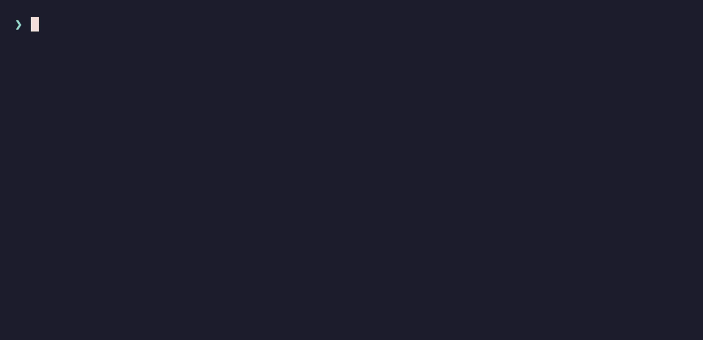
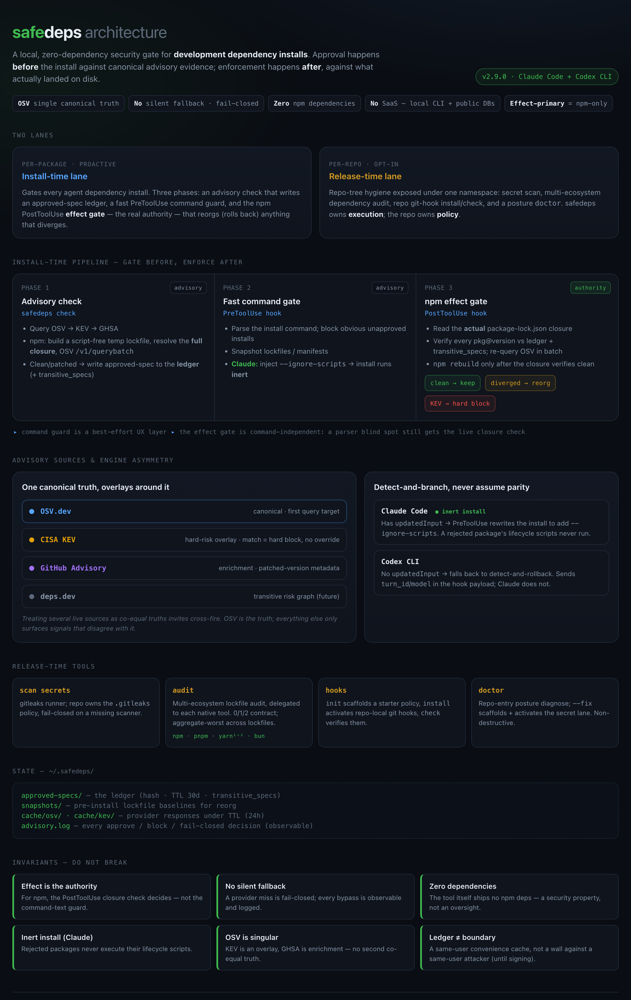

# safedeps

> **Stop your AI coding agent from installing vulnerable or unapproved dependencies — and roll back the ones that slip through.**
>
> `safedeps` gates every dependency install your Claude Code or Codex CLI agent runs. It pre-approves packages against OSV / CISA KEV / GitHub Advisory, re-verifies the closure that actually lands in your lockfile, and auto-rolls-back anything that diverges. Local-only, with zero runtime dependencies. *(한국어 README → [README.ko.md](./README.ko.md))*

- **Pre-approve** — every `pkg@version`, plus its full transitive closure for npm, is cleared against OSV (canonical), CISA KEV, and GitHub Advisory *before* it installs.
- **Enforce the real effect** — after the install, the actual `package-lock.json` closure is re-checked, so a wrapped or obfuscated command can't sneak a package past the gate.
- **Roll back** — anything unapproved or newly-vulnerable is reverted to the last confirmed safe snapshot, or to the state before the command when a project has none yet, and the message says which. On Claude Code safedeps adds `--ignore-scripts` to each npm install, so that a rejected package's lifecycle scripts do not run during the install. That is the design, not a promise: whether npm keeps the flag is decided by shell state the command does not show, so safedeps reports only that it added the flag.

> **A real catch.** The pre-commit audit flagged a vulnerable transitive `hono` advisory that Dependabot missed — by re-querying the advisory DB at commit time. A CVE disclosed *after* you installed a package ("looked safe then, flagged now") surfaces at your next commit, not weeks later.

## Quickstart

```bash
# 1. Install the CLI — the npm package is scoped, note the @aldegad/ prefix
npm install -g @aldegad/safedeps

# 2. Wire the hooks into Claude Code / Codex (idempotent)
cd "$(npm root -g)/@aldegad/safedeps" && node scripts/install/install-safedeps-hooks.mjs

# 3. Done — every dependency install your agent runs is now gated.
```

> `safedeps` is the CLI command; the npm package is **`@aldegad/safedeps`** — the unscoped `safedeps` on npm is an unrelated package. Prefer the full skill source tree? See [Installation](#installation).

> The hooks are one program, `safedeps-core`, written in Rust. The npm package carries it built, for macOS (Apple silicon and Intel) and Linux x64, and the installer runs it once before it registers anything. A checkout builds it with cargo instead. Where the binary comes from, and what you see when it is missing or out of date, is under [Where the hook binary comes from](#where-the-hook-binary-comes-from). What v2.19.0 changed for you is under [What Changed in v2.19.0](#what-changed-in-v2190).



## Distribution Model

Safedeps has two distribution surfaces:

1. **Agent skill + hooks (canonical)** -- the repo itself is the skill folder. `SKILL.md`, the hook entry and its Rust core, provider/ledger libraries, and install helpers stay together in one directory. A checkout holds the core's source and builds its binary; the npm package carries the built binaries.
2. **npm package (CLI convenience)** -- `@aldegad/safedeps` installs the `safedeps` command. npm does **not** make Claude Code or Codex automatically discover the skill; after npm installation, users still need to run the hook/skill installer or manually register the skill folder.

Use the GitHub release when you want the full skill/hook source tree as the canonical artifact. Use npm when you mainly want a versioned global CLI.

Terminology: safedeps is an agent security skill backed by Claude/Codex hooks and a local CLI. It is not a Codex plugin bundle unless it is later wrapped with a plugin manifest.

## Two Lanes

`safedeps` owns two security lanes (full design in [`ARCHITECTURE.md`](./ARCHITECTURE.md) §1):

- **Install-time** (the focus of this README) — advisory check + approved-spec ledger + fast PreToolUse guard + PostToolUse effect enforcement + post-install reorg. Per-package, around the install command and its actual lockfile effect.
- **Release-time** — `safedeps gates run`, `safedeps scan secrets [--repo|--worktree|--staged]`, `safedeps audit [npm|pnpm|yarn|bun]`, `safedeps hooks install|check`. Repo-tree secret scan, dependency audit, repo-local git hook install/check before push/release, plus opt-in remote repository posture checks. Repo-specific policy (gitleaks config, privacy paths) stays in the target repo; safedeps owns local execution. *(Absorbed the former `security-release-gates`.)*

The secret-leak side of the release-time lane is **per-repo and opt-in**. `safedeps doctor` is its repo-entry check: it diagnoses the repo's `.gitleaks` policy, `.githooks/pre-commit`, the active `core.hooksPath`, and scanner availability (and reports the global install-time gate too), then `safedeps doctor --fix` scaffolds a starter policy (`safedeps hooks init`) and activates it (`safedeps hooks install`). That local pre-commit setup is automatic once you choose `--fix`; it does not spend remote CI minutes. The scaffold is non-destructive — an existing repo-owned `.gitleaks.toml` is never overwritten — and the pre-commit hook runs a secret scan (`safedeps scan secrets --staged`) plus, on every commit in a repo with a supported lockfile, a dependency audit (`safedeps audit`, auto-detecting npm/pnpm/yarn/bun): a real finding blocks (fail-closed), while an unreachable advisory DB only warns and lets the commit through (observable offline failover). Remote enforcement is split: blocking direct pushes to `main` with a branch rule is recommended no-runner posture, while GitHub Actions workflows and required status checks remain explicit cost-bearing opt-in because hosted runners can cost money. See [Secret-Leak Lane (per-repo)](#secret-leak-lane-per-repo).

## How It Works

[](./ARCHITECTURE.md)

`safedeps` works in two moves around every install:

- **Before** — `safedeps check` clears a package against OSV (canonical), CISA KEV, and GitHub Advisory, then records the approval in a local ledger. For npm it resolves the package's full dependency closure and checks every transitive package too.
- **After** — the PostToolUse hook re-reads what actually landed, from the lockfiles npm writes, and reorgs (rolls back) anything that isn't in the ledger or that the advisory databases now flag.

The registered command for both hook events is a small entry shim, `scripts/safedeps-hook-entry.sh`, called with `pre` or `post`. It finds the binary for your machine, `bin/native/<os>-<arch>/safedeps-core`, and runs it. That binary is the hook: one Rust program with no dependencies, which replaced the two Bash scripts earlier versions registered. The hooks run live from the repo checkout through a symlink, so a checkout that is temporarily broken (a half-built binary, a missing one, a crash) used to either block every Bash call with a bare error or silently disable the gate, depending on the exit code. The shim turns each of those into an explained fail-closed deny: it names what broke and how to repair it. It also denies a call during which the machine could not start a process, instead of letting the call through ungated. Nothing falls back to Bash, and no environment variable chooses the binary or switches it off. Details: [ARCHITECTURE — Phase 0](./ARCHITECTURE.md).

**Running out of time is an answer, not a gap.** The agent runtime gives each hook a fixed budget and kills it when that expires — and the tool call then proceeds, so a gate that runs long simply disappears. Since the cost of reading a command grows with its length, padding a command was enough to cross that line. The pre-install guard keeps a smaller budget of its own and, if it cannot finish judging in time, blocks and says so: the message leads with `UNDECIDED, not unsafe` so nobody reads a timeout as a finding. The judgment runs in a process of its own, so a judgment that ends without an answer (a crash, a signal) is blocked the same way, and the message says how it ended: an exit code, a signal, or neither. A judgment process that is stopped, not ended, is waited for until the deadline. Commands short enough to be nowhere near the budget are unaffected.

**A command it could not read is treated the same way.** A failed reading used to return nothing, which read as "no install". Now a failed reading is recorded, and before the guard lets anything run it checks: if the command names a package manager anywhere, it is blocked as `UNDECIDED`; if not, it runs, and the failure goes to stderr and `~/.safedeps/advisory.log`. A deny that would report a finding after a failed reading reports `UNDECIDED` instead. The core reads a command the way the shell does -- quotes, comments, heredocs and nested substitutions in one pass -- so a heredoc, a comment with an apostrophe or a multi-line string cannot hide the install after it, and a command that never closes is treated as unread. An assignment in front of the install (`FOO="a b" pip install ...`) is read the same way, so its value cannot hide the install either, and so is an install in a `case` arm or a nested substitution. Where bash, zsh and dash would read a command differently, the guard reads it the way each of them does and judges every install any of them would run. It adds `--ignore-scripts` only where all three agree on where the npm installs are, and otherwise blocks the command as `UNDECIDED`.

The pre-install command hook (PreToolUse) is a fast advisory nudge — it blocks obvious unapproved installs and risky command forms so the agent gets immediate feedback. But for npm the real authority is the post-install effect gate: it judges what was *actually installed*, not what the command looked like, so a wrapped or obfuscated install command can't slip a package past it.

**Script safety (inert install).** On Claude Code, the PreToolUse hook rewrites an npm install to add `--ignore-scripts`. The aim is an **inert** install: packages land on disk, and their lifecycle scripts run only through the rebuild below, once the closure verifies. That is the aim, not a promise. Whether npm keeps the flag is decided by the shell the command runs in, so safedeps says only that it added the flag. The flag goes where npm reads it as true. npm keeps the last value an option is given, so the hook first puts it after the install's last argument, where `--ignore-scripts=false` or `--no-ignore-scripts` in the install cannot turn its scripts back on. It then reads the install with the flag in place, the way npm reads it, and keeps that place only if the flag comes out true and nothing else changed. A last word such as `--cache` takes the next word as its value, so there the flag would become the cache directory. In a command with more statements the flag goes before that word. In a one-statement command the flag owed at the end has no such place, and the command is `UNDECIDED` (below). Every rewrite also keeps the rewrite safedeps made before it read the install's words: one flag at the end of a one-statement command, and one right after each verb otherwise. It also puts one right after each verb in every case. That is a floor. Delete some of the flags the hook added and you get that earlier rewrite, so npm always receives at least what that rewrite gave it, even when the hook misreads a word or the shell changes one. The flag does not always have a place. Three things are owed at once: the floor above, the command's own arguments and data exactly as written, and a flag npm reads as the option it is. Some commands cannot give all three. `npm install left-pad@1.3.0 --cache` is one: a flag at the end becomes the value of `--cache`. `npm install true` is another: a flag after the verb takes `true` as its value. A third is an install's own words in a heredoc body that another command reads, where the flag would change what that command prints. For these the hook does not choose between the duties, and it does not drop the floor. It sends no rewrite and blocks the command as `UNDECIDED`, and `advisory.log` names the reason. The cost, and how to write such a command, is under [What Changed in v2.19.0](#what-changed-in-v2190). On Codex CLI no rewrite is sent, so no flag has to be placed there. A script handed to `sh -c`, `bash -c`, `zsh -c`, `dash -c`, `ksh -c` or `eval` is read as a script, and an install in it gets the flag inside the script where the flag has a place. The one text that is still only recorded is a heredoc fed to a shell whose output is piped on (`sh <<E | tee log`), beside an install that already carries the flag. Whether the command is recorded does not depend on where that text goes. The hook keeps a list of what it read, not of what it did not read. An npm install verb counts as read only where its `npm` is the command word of text the hook read, such as `npm ci` at the start of a statement or of a script it read. The hook takes every such `npm` out of the command and removes the quotes and backslashes. It also reads the command through the shell's own quote removal, one level at a time for up to three levels, as a script handed on reads what the level above left, with each `$'...'` string decoded where it stands. If an npm install verb is still left anywhere in any of these, `advisory.log` records that text the hook did not read as a command holds one. The install verb is the one the install check reads: options may stand between `npm` and the verb, with an empty value or a value of several words, and nothing has to stand in front of `npm`, because a program can take its command glued to an option, as `env -S'npm ci'` does. A word the shell builds can become `npm` or its command with no character of the command spelling it, so it is recorded the same way, wherever the text goes, a here-string or a heredoc body handed to a shell included: a command word the shell builds (`$(echo npm) ci`, `{npm,ci}`), the word npm reads as its command when the shell builds it (`npm $V x`, `npm "$@"`), and any `npm` inside a substitution (`hash -p "$(command -v npm)" n`). A word counts as built by the test described below for an install's own words. Where the hook flagged another install, the record says nobody read the flag. Where it flagged nothing, even beside an install that already carries the flag, the downgrade is recorded. The cost is noise. Install text that is only data next to an install, in an `echo`, a commit message or a heredoc written to a file, is recorded too, and so are `pnpm i` and `$(npm root -g)` next to one. A comment is not. Three things are outside the record. Text another program builds while the command runs, as in `printf '\156pm ci' | sh` or `base64 -d | sh`, spells no install in the command, so the effect gate is what checks it. A name an alias binds to npm runs it from a statement with no `npm` in it; bash runs aliases in a script only after `shopt -s expand_aliases`. And a command the install check does not see as an npm install at all is neither rewritten nor recorded here. A word the shell changes when it runs the command could be anything. The hook does not list what the shell expands. It lists what it leaves alone: a word counts as written only when every character outside quotes is a letter, a digit or one of `. _ / @ : + , = % -`, and the word does not start with `~` or `=`. Anything else, such as a tilde, a brace, a `$`, a glob or a parenthesis, means the shell may decide the word at run time. A `$` inside double quotes counts too, because it still expands there. An install that holds such a word cannot be read in advance. It keeps both flags, and `advisory.log` records that nobody could read which one npm keeps. The post hook never claims that an install ran no scripts. For such an install it adds that safedeps did not read all of the command it wrote as the shell will. An install that asks for its scripts, as with `--ignore-scripts=false`, is recorded there too, and its scripts run only through the rebuild below. The hook leaves an install alone only when its own arguments already set the flag true, read the way npm reads them, and the earlier rewrite left it alone too. The same text in an `echo` or another statement does not count. The hook reads each install's arguments as the shell joins them, so a quoted line that looks like the flag is part of an option's value. An install with a `--` before its verb leaves npm no place to read the flag as an option, so the command is `UNDECIDED` (`npm -- ci -- x`). The effect gate then verifies the closure; only if it passes does the PostToolUse hook run `npm rebuild` to execute the now-verified scripts. A package the gate rejects is reorged before any of its scripts run. The rebuild covers only the tree the gate read: it runs in the directory the gate read with `--global=false --location=project`, so a project `.npmrc` cannot point it at the global tree. The rebuild runs over the whole tree, so it asks about the whole tree, not only about what this install changed. It is skipped, with a warning that names the package, when `node_modules` carries no `.package-lock.json` record, or when npm says the rebuild would run over any of these: a package, or a version of one, that neither lockfile records; a package the lockfiles do not record as coming from the public registry (a private registry, a git URL, a tarball); a package they do record there that npm fetched from another registry; or a directory that is not a declared workspace member (a `file:` directory dependency). npm is asked that with `npm query '*'`, which follows a `file:` dependency into its own `node_modules` the way `npm rebuild` does. If npm does not answer, the rebuild is skipped too. A record on `registry.npmjs.org` does not say where the bytes came from: npm's default `replace-registry-host=npmjs` fetches such a URL from whatever registry npm is configured with, and writes the URL down unchanged. So npm is also asked which registry it fetches from, with `npm config ls --json`: once with the install's own arguments and environment before the command, and once in the directory the gate read after it. A record counts as the public registry's only when both answers say so. (This uses the Claude Code hook `updatedInput` capability. Codex CLI does not expose it, so on Codex the install runs normally and the effect gate is detect-and-rollback — a malicious install script can run once before the rollback.)

This effect-primary model is npm-only for now. `pip`, `cargo`, `go`, `gem`, `maven`, and `nuget` stay on the v2.1 command-gate + reorg model until their closure resolvers land.

```
                         PreToolUse                          PostToolUse
                  (safedeps-core pre)              (safedeps-core post)
                            |                                    |
  install cmd ──> [ Advisory/ledger UX ] ──> [ Execute ] ──> [ npm effect gate ]
                     |            |                           |       |
                  Block obvious Snapshot                  Clean?  Suspicious?
                  misses/risk   lock/manifest files,        |       |
                                package listings          Confirm  REORG
                                                              |       |
                                    |                       v       v
                                    +--- parent_snapshot_id ──> confirmed
                                                                    |
                                                              Rollback to last
                                                              confirmed snapshot
```

### Phase 1: Advisory Check (`safedeps check`)

Before an agent installs a dependency, it should run:

```bash
safedeps check <ecosystem> <pkg>@<version|range> --json
```

That command queries OSV (canonical), CISA KEV (hard-risk overlay), and GitHub Advisory (enrichment). For npm, it first creates a script-free temp lockfile with `npm install --package-lock-only --ignore-scripts`, extracts the full dependency closure, and queries OSV `/v1/querybatch`. Clean or safely narrowed specs are written to `~/.safedeps/approved-specs/`; npm entries also record `transitive_specs`.

**Yarn project-scoped closure.** When the target directory is a Yarn Berry project with a root `resolutions` entry, `check` resolves the closure from that project's actual `yarn.lock` via `yarn info`, instead of a fresh published-package probe. This lets a project that pins a vulnerable transitive dependency to a patched version through `resolutions` get approved on its real, resolved dependency tree -- the published package closure alone would still show the vulnerable version and deny the install. The approval only covers that exact project: the ledger key folds in a hash of the project directory, `resolutions`, and `yarn.lock` content, so it cannot satisfy the check for a different project or after `resolutions`/`yarn.lock` changes. If `resolutions` is declared but the requested package can't be verified in the project's resolved graph, or the lockfile isn't a supported Yarn Berry lockfile, the check stays fail-closed.

**Yarn candidate materialization (v2.11.0).** The closure above needs the package to already be in `yarn.lock`, which is not true for the case that matters most: checking a dependency you are about to add. For that candidate, `check` builds the closure in a private mirror instead of denying. safedeps copies a temporary mirror of the project's canonical resolution inputs -- the root and workspace `package.json` files, `yarn.lock`, `.yarnrc.yml`, and the `.yarn/releases`, `.yarn/plugins`, and `.yarn/patches` files. Nothing else is copied; `node_modules`, caches, unplugged packages, install state, and VCS data stay out. The candidate is added to the mirror's manifest only, then Yarn resolves it there with `yarn install --mode=update-lockfile --no-immutable`. That mode updates lock resolution without the link step, so no lifecycle script from the candidate ever runs, and your own project tree is never written to.

The approval records what produced it: a hash of the exact input set, the list of input files, the hash of the generated lockfile, the candidate locator, the exact Yarn command, and the `private-project-mirror` isolation mode. The ledger rejects an entry missing any of them. safedeps re-hashes the project inputs before and after Yarn runs; if a manifest, `resolutions`, config, or lockfile changed in between, the candidate is invalidated rather than approved against a mixed project state. Any failure to copy the inputs, run Yarn, or resolve the candidate in the generated lockfile denies with `project-candidate-materialization-unavailable`. There is no fallback to the published-package closure -- a materialization that cannot be verified is a denial, not a downgrade.

**npm `overrides` awareness (v2.12.0).** The same problem exists for plain npm. `overrides` is the standard way to pin a vulnerable transitive to a patched version, but the closure probe used an empty manifest, so it resolved the *published* tree and denied installs that the repo had already fixed. `check` now discovers the consuming repo's `overrides` and applies them to the probe, so it resolves transitives the way the real install will. Discovery reads `SAFEDEPS_NPM_OVERRIDES_JSON` if set, otherwise the nearest `package.json` with a non-empty `overrides`, walking up from the working directory and stopping at the repository root -- including a worktree root, whose `.git` is a file rather than a directory. Only concrete version pins are honored; `$`-references like `"$react"` are dropped, because they have no meaning in a standalone probe.

Honoring `overrides` cannot hide a vulnerability. The probe still resolves each override to a concrete version and OSV is queried for that exact version, so an override pointing at a still-vulnerable release is flagged like any other. If the overrides cannot be applied to the probe manifest, safedeps says so and continues without them, which only makes the check stricter.

Because the closure now depends on the consuming project, the approval is scoped to it. A published-package approval is global precisely because it is project-independent; one derived from `overrides` is not. The ledger entry therefore carries the project root, the override set, and a hash of both, and the key folds that hash in. An approval earned in a repo that patched a transitive does not satisfy the check in a repo that did not, whose real install would resolve the vulnerable version. Changing the override set changes the key. Repos with no `overrides` are unaffected and keep the ordinary global approval.

### Phase 2: Fast Command Guard + Snapshots (PreToolUse)

When Claude Code or Codex CLI is about to run `npm install`, `pip install`, `cargo add`, `go get`, `gem install`, or similar commands, the guard hook provides a fast advisory/UX layer:

1. **Snapshots** the current `package-lock.json`, `pnpm-lock.yaml`, `yarn.lock`, and `package.json` into `~/.safedeps/snapshots/`.
2. **Records metadata** including a `parent_snapshot_id` linking to the previous confirmed snapshot (forming a chain, just like blocks).
3. **Captures pre-install state** of `node_modules` (package listings and binary listings) for diff-based detection later.
4. **Fast-checks the approved-spec ledger** for explicit `pkg@version` install commands.
5. **Runs pre-flight checks** and **blocks** the command entirely if it detects:
   - Typosquatting package names (`lod_sh`, `reacct`, `axois`, etc.)
   - A non-standard registry (anything outside `registry.npmjs.org` and `registry.yarnpkg.com`) named on the command line with `--registry`. A registry npm reads from an `.npmrc` or `npm_config_registry` is not blocked, because a company registry, a mirror or a proxy is set up that way and there is no way yet to approve one. npm is asked which registry it fetches from, with the install's own arguments and environment, and the post-install hook keeps what such a registry serves under a public-registry URL, but safedeps does not run `npm rebuild` for it. A new package recorded from the registry's own URL is a non-standard source and is rolled back (the table below). safedeps records the bytes it kept, so no other project on this machine that receives them rebuilds them either, and this version has no way to release that record (see the boundaries)
   - Piped remote execution patterns (`curl ... | bash`)
   - Explicit disabling of install script safety (`npm config set ignore-scripts false`)

If the ledger gate or a pre-flight check fails, the command is **blocked before execution** -- nothing is installed. This command guard is intentionally best-effort; it improves the agent loop and catches direct misses, while npm authority lives in the post-install effect gate.

**What the command guard reads.** An install spelled the way its manager documents it, or the way the shell allows it: aliases (`npm i`, `pnpm i`, `bun a`) and, for npm, every command word its parser accepts (`npm upd`, `npm installTest`), options before the verb (`pip --quiet install`), versioned interpreters (`pip3.11`, `python3.11 -m pip`), runners that fetch and execute a package (`npx`, `npm exec`, `pnpm dlx`, `yarn dlx`, `bunx`, `uvx`, `pipx run`, `go run <module>@<version>`), each manager's `create` (`npm create vite` and `npm init vite` run `create-vite`, so `create-vite` is the package checked and recorded; `pnpm create`, `yarn create`, `bun create`), grouping and control statements (`( ... )`, `if ...; then ...`), a command glued to a reserved word, `!` or zsh's `{` with a redirection or an assignment first (`then>/dev/null pip install`, zsh `{X=1 pip install ...; }`), zsh's `&!` (`true&!pip install`), redirections wherever they stand (`pip 2>/dev/null install`, `{fd}>/dev/null npm install`, `< <(true) pip install`), the words a shell allows before a command or inside a redirection target (an array assignment `a=(x) pip install`, zsh's `noglob pip install`, a glob qualifier `>/dev/null(N) pip install`), quoted specs, and line continuations. An install's last word may stand right against the operator after it, as in `npm ci; echo x` or `(go get)`, or against a closing backtick, because the shell ends the word there. Backslashes and quotes are read the way the shell reads them. Which word is the command, which is an option's value and which is a package is read from each manager's own option tables, so `npm --prefix x install evil@1.0.0`, `pnpm --dir x add`, `cargo --config x install` and `pip install --log x` are read as the installs they are, and npm is read the way both npm 11 and npm 10 read their options. Until v2.18.0 most of these spellings passed the gate with no verdict and no record.

**What the command guard does not see, and what that costs per ecosystem.** Text handed to a shell is recognized only in the forms the guard enumerates -- `sh -c`, `eval`, command and process substitution, a pipe into a shell. A `sh -c` or `eval` script is read as the word the shell passes it, escaped quotes and all, so the install inside it is judged with the real package. A pipe into a shell is asked the same question beside an install the guard reads as alone, and that question counts the visible install's own words, so such a pipe beside an install is denied when its consumer is one the check names: a shell by name (`sh`, `bash`, `zsh` and the others it lists), also inside a compound command. A consumer it does not name passes with no record, alone and beside an install alike: a shell function, `source` or `. /dev/stdin`, `eval`, `coproc`, a loop that reads and evaluates lines. A later release replaces the list with a closed rule. A command that mixes an install with an unrelated pipe into a shell, such as `npm install x && cat setup.sh | sh`, is denied; run the two as separate commands. A pipe inside a command substitution, a backquote, a double-quoted `sh -c` or `eval` is asked of that inner text only, so one that rebuilds the install's words from `$_` passes with no record, as it did in v2.17.2; a later release takes it. Forms outside that list get through: a herestring, a heredoc fed to a shell's standard input (`bash <<E` with an install in the body), a command line built by `xargs`, a script written to a file and then run. So do argv-passing wrappers that run the install unchanged: `sudo`, `timeout`, `nohup`, `nice`. The guard also does not recognize a command word or a runner's package that the shell assembles from quotes: `'pip' install x==1`, and `npx "evil@1.0.0"` with nothing but options after the package. Nor does it see past a word the shell decides at run time between the manager and its verb, such as `pip $x install x==1`, where an empty `x` leaves `pip install x==1`. v2.17.2 missed these too, and reading them the way the shell does is planned. Two strings that run with a grammar of their own are not read that way yet either: an `env -S` string, which env(1) splits by its own rules (its options, `--`, `\_`, `#`), and code in a zsh glob qualifier (`ls *(e:'pip install x':)`). An `env -S` string is read as a shell script, which finds the install in most of them but not all. For npm this is *delayed* detection, not a miss, because the effect gate reads the live lockfile and catches the result regardless of how the command was written -- while the gate finishes inside its 30s hook budget, which is a measured range and not a given (see below). For `pip`, `cargo`, `go`, `gem`, `maven`, and `nuget` there is no closure resolver behind the guard, so the same form is a **complete miss** -- it is recorded as `UNVERIFIED` in `~/.safedeps/advisory.log` and nothing else happens. Do not read "the guard does not parse this form" as npm-shaped. The boundary is measured and pinned in `scripts/test/consumer-forms.sh`, and `ARCHITECTURE.md` explains why widening it is not the fix.

**How far "delayed detection" actually reaches.** The effect gate is registered at 30s and the runtime kills it there, so npm's delayed detection is real only while the gate finishes. Its cost rides on the size of the project's lockfile closure. It used to ride on the size of your approved-spec ledger too -- the gate asked the ledger about every closure package separately, and each question read the whole ledger directory -- which on a 738-entry ledger put it past 30s at a closure of **four packages**. v2.16.0 reads the ledger once per closure, and on the same machine with a cold advisory cache the Bash gate then crossed 30s at a closure near **390 packages**. That number belongs to the Bash hook. It was measured with the real advisory network, on another machine and another day, and it is why this paragraph gives a measured range and not a promise. For the Rust post hook the measurement is this. On an Apple M1 running macOS 15.6.1, on 2026-10-07, the first synthetic closure size to take longer than 30 seconds was 128,000 packages (33.55 to 72.92 seconds across four conditions), and 64,000 packages took 12.77 to 29.60 seconds. Each size was measured once, with either an empty ledger or a ledger approving every package, and with either prefilled advisory caches or empty caches served by a local fixture on 127.0.0.1. The real OSV and CISA network, the rollback, the rebuild, a real `node_modules` and the entry shim were not measured. Nothing between 64,000 and 128,000 packages was sampled, so these samples give no exact package-count limit. Below the crossing the backstop is there; above it -- a very large lockfile -- the gate is killed and does not judge the install. The crossing point moves with the machine, the network, and the cache. `scripts/measure/effect-gate-cost.sh` reproduces the measurement on synthetic closures (see its `--help`), not on your lockfile.

**If a rollback is cut off, safedeps says so.** When the gate rejects a closure it rolls the project back: restore the lock and manifest files, then remove the project's own `node_modules`. Until v2.16.0 the log entry and the report came last, so a hook killed mid-rollback left no record at all -- in some cases with the project already reverted, which looks like an install that silently undid itself. The gate now writes what it is about to do before it does it, and clears that note once the rollback has reported itself. A note that outlives its run is an unfinished rollback: the next command reports it once, records it in `~/.safedeps/rollback-incidents/`, appends `REORG INTERRUPTED` to `~/.safedeps/reorg.log`, and says which stage it reached, what a test of the process that ran it returned, and which of the project's dependency files are not what the snapshot holds. It gives no cause and no repair command; [how to read it](#reading-what-safedeps-says-after-a-rollback) is below. "Outlives its run" means the process that wrote it is gone, not merely that the note is there -- a rollback still working has its note on disk on purpose, so an unrelated command during one stays quiet (v2.16.1).

**An install with no version pin is not gated either, and it says so.** The ledger check runs on a parseable `pkg@version` operand. `pip install evil`, `cargo add evil`, `go get example.com/evil`, and `gem install evil` name a package without pinning one, so no spec is produced and the ledger gate never runs. No wrapper is needed for this -- omitting the version is enough. Where the effect gate reads the result, it still enforces on it. That is an npm CLI install that left its trace in the directory the gate reads. npm records such an install in `package-lock.json`, or only in `node_modules/.package-lock.json` when told not to save (`--no-save`, `--no-package-lock`), and the gate reads both. Everywhere else the install proceeds unverified: pip, cargo, go, gem, maven and nuget, and also pnpm, yarn and bun, an npm install that the project's or the user's `.npmrc` keeps off the record, `npm link <pkg>`, which installs a package the global tree lacks, also behind a path (`npm link ../lib <pkg>`), an npm install inside a `sh -c` or `eval` payload, whose landing is decided inside it, and runners such as `npx` that fetch a package without touching a lockfile. That case is now recorded as `UNGATED` in `~/.safedeps/advisory.log`, naming the command and each package it installs without a pin. An npm install that left no trace where the gate looked is recorded too, by the post-install hook: a global one (however npm reads it: `-g`, `-gf`, `--location=global`, `npm_config_global=true`, or `global` in an `.npmrc`; npm is asked, so no list of spellings decides it), or one moved by something the shell decides at run time (`cd "$DIR"`). See "An install is read only where it left a trace" below. The unit is the package as written, not its name: `pnpm add left-pad@1.0.0 && pnpm add left-pad` pins one install and not the other, so the second is recorded. The record reads the command the way the gate does, so a version passed as a flag (`gem install rails -v 7.1.0`) counts as pinned, and a package the gate misread shows up in the record instead of disappearing. A few records are harmless and kept on purpose: pip resolving `pip install x==1 x` to the pin, a second install of a pinned package that changes nothing, a runner whose binary the first half of the command is about to install, and a flag the record does not know takes a value. The record does **not** block: refusing every unpinned install is a policy change that would break ordinary `cargo add x` workflows, so it stays a decision for the repo owner -- one the record makes answerable from evidence. Routine installs stay out of the log on purpose, and the line is drawn at whether a package is named rather than at which flags appear -- which flags carry a value is a property of the tool, so pip's `-t`/`-f` take one while go's and gem's do not. `pip install -r requirements.txt` and `npm install` name none, and neither does `pip install .`, which builds from the working tree instead of fetching. A runner of a binary the project already has, such as `npx tsc`, fetches nothing and stays out too. A source flag consumes only its own argument, so `pip install -r requirements.txt evil` still installs `evil` and is still recorded. A record that fires on every install is noise rather than signal, but one that goes quiet whenever a flag appears is worse -- it reads as coverage it does not have.

**An npm install that saves nothing is still read.** Before v2.18.0 the effect gate read `package-lock.json` alone, in the directory the command started in. `npm install x --no-save`, `--package-lock=false`, the same settings from the environment or an `.npmrc`, `npm -C sub install x` and `cd sub && npm install x` all left that file untouched, so the gate confirmed each of them clean. On Claude Code that confirmation is what triggers `npm rebuild`, so the inert install then ran the unverified package's install scripts. Measured with a real npm against a local registry, npm still records every one of these installs: the ones that do not save in `node_modules/.package-lock.json`, the relocated ones in the other directory's `package-lock.json`. The gate now reads the hidden lockfile and follows `-C` and a literal `cd`, and each of these forms is rolled back. Every check reads it, not only the closure. The install-script and source checks below once ran only when `package-lock.json` or `package.json` changed, so a tarball carrying an approved name and version, from a file or an http URL, passed them when it was not saved, and the rebuild ran its scripts. They now read what the install brought into either record, saved or not. It follows them to where npm installs, which is not always the directory named, and it asks npm where that is (`npm prefix` and `npm root`, with the install's own arguments). npm walks up to the nearest directory with a `package.json` or a `node_modules`, and from a workspace member on to the root that declares it, unless the member was reached through a symlink. `cd src && npm install x`, with no `package.json` in `src`, writes the project's lockfiles, and so does an install run inside `packages/a` of a workspace. The gate reads those. A copy of npm's rules in bash got the symlinked member wrong, which is why npm is asked now. Where npm cannot be asked or does not answer in time, or the command hands it something the shell decides at run time, the gate says why and looks in the cwd. In a workspace the root lockfile keys each member by its path. The gate no longer reads that path as a package name, and a rollback now restores the member's `package.json` as well as the root's, so `npm install x -w packages/a` is undone on disk too. An `.npmrc` that keeps the install out of both records is a different case, covered in the boundaries below. `scripts/test/lockless-forms.sh` runs them end to end.

**An install is read only where it left a trace.** Picking the directory from the command text went wrong in three rounds of review, and each time the result was a silent pass. `false && cd sub; npm install x` installs in the current directory, and the gate followed the `cd` that never ran. `command cd sub; npm install x` installs in `sub`, and the gate did not follow that spelling. Either way it read a directory the install never touched and called it clean. No list of spellings closes this, because a command can also change what npm reads, by running `npm init` or writing an `.npmrc` first. So the text now only picks where to look. Just before the command runs, safedeps notes the time and npm's two lockfiles there. Afterwards it checks whether either was rewritten. npm rewrites `node_modules/.package-lock.json` on every install that installs anything, even a reinstall of what is already there. If neither was rewritten, the install is recorded as `UNGATED` with the check that found nothing, `no install trace in <dir>: neither npm lockfile there is newer than the baseline taken before this command or has another inode`. Nothing is rebuilt there, and on Claude Code you are told. safedeps does not say whether the install landed elsewhere or installed nothing, because it cannot tell. A `--dry-run` or a failed install shows up the same way, which is noise rather than a pass. Two npm installs in one command with something between them, such as `npm install a; cd sub; npm install b`, are recorded too, because the first one's trace would answer for the second. A `cd` that may not run is followed only as far as it provably ran, so `false && cd sub; npm install x` is read in the current directory and rolled back, and `cd sub || exit` is still followed. `scripts/test/effect-trace-grid.sh` runs every form end to end.

### Phase 3: Post-install Effect Enforcement (`safedeps-core post` -- PostToolUse)

After the install command completes, the verify hook analyzes what changed. For npm, this is the primary enforcement surface: it reads the actual closure from `package-lock.json` and npm's hidden `node_modules/.package-lock.json`, verifies every package against approved direct entries and their `transitive_specs`, and re-checks the closure with OSV batch.

1. **npm effect gate** -- Reorgs if any lockfile package is unapproved, KEV-blocked, vulnerable, or cannot be verified fail-closed.

2. **Install script analysis** -- Scans the packages the install brought in for `preinstall`, `install`, and `postinstall` scripts. Those are the packages new in `node_modules`, and the ones either npm record now holds at a version, source or integrity no record held before the command. It looks for:
   - Network access (`curl`, `wget`, `fetch`, `http`, `socket`, `dns`)
   - Dynamic code execution (`eval`, `exec`, `spawn`, `child_process`, `Function()`)
   - Sensitive path access (`~/.ssh`, `.env`, `.aws`, `credentials`)
   - Obfuscated content (`base64`, `atob`, `Buffer.from`, hex/unicode escapes)

3. **Lock file diff analysis** -- Compares the lock files with the copies taken before the command. For npm, the sources come from both records, and a source counts only when no record held it before the command:
   - Resolved URLs pointing to non-standard registries. Only a URL that starts with `https://registry.npmjs.org/` or `https://registry.yarnpkg.com/` is the public registry, and only where npm says it fetched it from there (npm fetches such a URL from its configured registry unless `replace-registry-host` is `never`). A directory dependency the install linked is a non-standard source too, unless it is one of the project's declared workspaces
   - Insecure protocols (`http://`, `git://`) in resolved URLs
   - Unusually large dependency additions (>50 new resolved entries in `package-lock.json`, indicating potential dependency confusion)

4. **Binary inspection** -- Checks `node_modules/.bin/` for newly added native binaries (ELF, Mach-O, shared objects) that should not appear in a JavaScript project.

### Confirm or Reorg

- **All checks pass** -- The lock and manifest files, as the verified install left them, are recorded as a new snapshot, and that snapshot is marked **confirmed** in `~/.safedeps/confirmed_<dir hash>`. This becomes the new safe baseline, so a later rollback keeps this install.

  The baseline used to be the snapshot taken *before* the verified install, which put it one install behind. Measured with a real npm against a local registry: an approved `npm install a`, then an unapproved `npm install b`, rolled the project back to one without `a` in `package.json`, the lockfile or `node_modules`. Now `a` stays and only `b` goes, on Claude Code and Codex alike (`scripts/test/lockless-forms.sh`).

  The baseline is the files, not `node_modules`. The rollback removes `node_modules`, and the next install builds it again from the restored files. So a verified install that saved nothing (`--no-save`) is not part of the baseline, and its packages leave with `node_modules` at a later rollback. If the verified state cannot be recorded, the baseline stays where it was and you are told that a later rollback would undo this install too.

  The files are copied before the checks read them, and the copy becomes the baseline only if the project still holds the same bytes when the checks finish. If another install changed them in the meantime, what is there now was not checked, so the baseline does not move and you are told why.
- **Any check fails** -- A **reorg** is triggered:
  1. Lock files are restored from the last confirmed snapshot. A project with none yet goes back to the snapshot taken just before the command. Nothing verified that state, and it may still hold what was rejected, so the message, `reorg.log` and `advisory.log` all say that the snapshot was taken before this command and that no confirmed snapshot names it.
  2. `package.json` is restored if it was modified.
  3. The project's own `node_modules` is removed to purge any malicious artifacts, when the command is seen to have written the project: an install trace, a `package.json` or lockfile that differs from the snapshot taken just before the command, or a `node_modules` that differs from the listing taken then or was modified after it. A command that wrote nothing leaves `node_modules` in place, and the message lists each check that found nothing. The rollback runs no package manager, so it runs no install script, and it gives no reinstall command. It says what it restored and removed, and what a test of `package.json`, `package-lock.json` and `npm-shrinkwrap.json` returned afterwards. Where a reinstall would write is npm's to decide; the gate checks that install like any other. A restore or a removal that fails is a line with the operating system's error, and the rollback goes on with the rest.
     A rollback never follows a symbolic link out of the project. When `node_modules`, `package.json` or a lockfile is a link to another directory, that step is refused and named in the message and in `reorg.log` (`REORG REFUSED`), with the place the link points to.
  4. The event is logged to `~/.safedeps/reorg.log`, in the same lines the message carries.
  5. Claude Code receives a system message detailing the detected threats and rollback actions.

#### Reading what safedeps says after a rollback

A rollback message, a refused step, a skipped rebuild and the report of an unfinished rollback are written in one closed set of lines. Each line is something safedeps did, or the result of a check it ran when it wrote the line. No line says why something happened, what npm would do, what a directory contains, or what to do next. The rules behind the lines are here instead.

| Line | What it means |
|---|---|
| `Rollback snapshot: <id>, a confirmed snapshot` | The project's confirmed record names this snapshot: an install safedeps verified left these files. |
| `Rollback snapshot: <id>, taken before this command; no confirmed snapshot names it` | The project had no confirmed snapshot. The files went back to what they were before the command. Nothing verified that state, and it can still hold the package that was rejected. |
| `restored <path>` / `removed <path>` | The file now equals the snapshot, or the path is gone. safedeps looked after it acted. |
| `not restored <path>: copy returned OS error <n>; ...` / `not removed <path>: removal returned OS error <n>; <path> exists` | The step failed. The line says the error the operating system returned and what a test of the path returned. It says nothing about what is left inside a directory: a removal takes what it can before it fails. The same lines with `copy returned without error` say the copy reported no error and the file still differs from the snapshot. |
| `not restored <path>: <path> exists and is not a regular file` | The path is a directory or another kind of file, so safedeps did not copy onto it. |
| `refused restore of <path>: ...` / `refused removal of <path>: ...` | The path is a symbolic link, and the line says where it leads. safedeps does not follow a link or write outside the project it read. |
| `kept <path>`, then one line per check | No check showed that the command wrote `node_modules`, so it was not removed. The lines after it are the checks. When `node_modules` is a symbolic link, the next line says so and where it leads, and the checks read what it leads to. The package lists read `package.json` files at most three levels below `node_modules`, so a package written deeper (`node_modules/<a>/node_modules/<b>`) does not show in them. |
| A reason, then `removed <path>/node_modules` | The first check that showed the command wrote `node_modules`: an install trace, a node manifest or lockfile that differed from the snapshot taken just before the command, an entry that snapshot's listing lacks, something newer than that snapshot, or no snapshot from before the command at all. |
| `<path> exists` / `<path> does not exist` / `<path>/package.json has the key workspaces` | What the project root holds after the rollback. safedeps does not reinstall packages, and it does not judge where a reinstall would write. It removes only the project's own `node_modules`, never a workspace member's. |
| `The rollback changed nothing.` | No restore or removal was tried. A step that was tried and failed is not called no change: a removal takes what it can before it fails. |
| `no install trace in <dir>: ...` | Neither npm lockfile in that directory changed during the command, so nothing there shows this install. |
| `safedeps added --ignore-scripts to this install` | The pre-guard record this hook used says safedeps rewrote the install with the flag, and the command the post hook received is the command that record holds, byte for byte. The record is this call's own (below). The command safedeps wrote carried the flag. A command that runs `npm rebuild` on its own still runs install scripts, as with a skipped rebuild. |
| `safedeps asked for --ignore-scripts on this install; the command this hook received is not the one safedeps wrote` | The pre-guard record this hook used says safedeps rewrote the command, and the post hook received a different one: the runtime did not run the rewrite as safedeps wrote it. Treat the install's scripts as having run. |
| `safedeps did not add --ignore-scripts to this install` | The pre-guard record this hook used says safedeps did not rewrite the command. On Codex it cannot. A pre-guard that cannot write the record does not rewrite the command, and says so in `advisory.log`. Where the record file is missing, no line is said (below). |
| `... did not run npm rebuild: <fact>` | safedeps rebuilds only where `package.json`, the lockfiles and `node_modules` at the project root are not links, and only in a directory that shows this install's trace. The line says what safedeps did. It does not say whether install scripts ran: a command that rebuilds on its own has run them. |
| `... ran npm rebuild: exit <n>` | The rebuild safedeps ran exited with that code and failed. |
| `... npm rebuild terminated by signal <n>` | The rebuild ended because of that signal. It has no exit code, and the line does not invent one. |
| `... could not start npm rebuild: OS error <n>` / `... could not start npm rebuild: error without an OS code` | The rebuild never started. The line says what the operating system returned, or that the error carried no code. |
| `... could not read npm rebuild process status: OS error <n>` / `... npm rebuild ended without an exit code or signal` | safedeps started the rebuild and could not learn how it ended. The first line says the wait failed. The second says the status held neither an exit code nor a signal. |

These three lines say what safedeps did, not what the command carries. safedeps does not read the command for the flag. "did not add" does not say whether install scripts ran: the command may set the flag itself, in its words, its environment or an `.npmrc`. On Codex safedeps cannot add it.

Each of the three is said only where the post hook found the pre-guard's record of this command. A rollback by the backstop has none of them. The backstop runs because the post hook found no such record, found one whose snapshot has no meta file, found one that names no snapshot, or found a record that is not one JSON object, and its headline says which ("this hook found no record of this command from before it ran", "this hook found a pre-guard record, and the snapshot it names has no meta file", "this hook found a pre-guard record, and the record names no snapshot", or "this hook found a pre-guard record, and the record is not one JSON object"). For a call that names no `tool_use_id` the record may still exist under a key the post hook did not compute, and a snapshot with no meta file, or none at all, holds no record of the rewrite, so the backstop does not say what safedeps did.

Each line is said only from a fact the record states. A record carries a version, and only a version 2 record, written since v2.18.0, states these facts. In it, "safedeps did not rewrite the command" is the value false, and "safedeps rewrote it" is the value true together with the command it wrote. A v2.17.2 record has no version and states neither. Its false did not mean no rewrite, because its write could fail while the rewrite still went out, and its true holds no command to compare. A record like that, a missing one, or one that does not state either fact gets none of the three lines, and `advisory.log` names the record. A record the post hook could not read, such as a file that is not one JSON object, gets none either, and `advisory.log` says it could not read it. Each of these used to get "did not add" or "asked" from a value the record did not hold, and the line could be false.

**The record a post hook uses is the record of its own call.** The pre-guard keeps the record of an install under the call's `tool_use_id`, which both hooks of one call receive and no other call does, and the post hook reads that record and no other. When two sessions run the same command in the same directory at the same time, each post hook uses its own call's record. A call refused after the pre-guard let it through runs no post hook, and neither does a call cancelled while it runs. Its record waits for the 24-hour cleanup; no later call reads it. Until v2.18.1 the record was found by the directory the command ran in and the command, and in both cases a post hook could use the other call's record: every line that came from it could be about the other call, and a rollback with no confirmed snapshot restored the other call's snapshot, so an edit made between the two calls was lost. A hook input that names no `tool_use_id` is still matched that way, and `advisory.log` says so; Claude Code and Codex both send one. A failed call is judged too. Claude Code runs `PostToolUseFailure`, not `PostToolUse`, after a Bash call that ran and failed, and the installer registers the post hook for both, so a failed install is checked like any other and leaves no record. Codex runs `PostToolUse` after a failed Bash call. The one record per machine that a pre-guard kept before records were kept per install (`current_state`, `current_snapshot_id`) names no call and is not read. A record can also outlast its snapshot: a record lasts 24 hours, and the snapshot cleanup can remove its snapshot sooner. A call whose record names a snapshot with no meta file goes to the backstop, and `advisory.log` names the record. So does a call whose record names no snapshot, which only a damaged record does, and a call whose record is not one JSON object. Until v2.18.0 the post hook stopped at the first two, said nothing, and did not check the install. The third ended it with an error on every call of that command for 24 hours. A record that names no project directory is judged in the directory the command ran in, never in the hook's own working directory. A rollback to a confirmed snapshot always uses the confirmed snapshot of the directory being judged, whatever else a damaged record says. The tests run two overlapping calls of one command, one per engine, and check that each speaks from its own record.

The report of an unfinished rollback has the same shape. Its `Rollback snapshot:` line says whether the project's confirmed record names that snapshot when the report is written, as the rollback message does. `Owner:` is the test that showed the process is not at work: it is not running, it is a zombie, its pid belongs to a process that started later, or it is stopped. A stopped owner has not died. The rollback resumes if the process is continued, so decide what to do with that process before you repair the project. Under `Checked at the time of this report` the report says what `node_modules` is and lists only the monitored files that are not what the snapshot holds. Check those files before you trust them, then reinstall.

Warnings about a registry that is not the public one, and about a tree safedeps would not rebuild, are still sentences. They tell you to confirm with the user before you rebuild, and that is on purpose.

## Why "reorg"?

The name borrows from blockchain, where a **reorganization (reorg)** invalidates a sequence of unconfirmed blocks and reverts the chain to its last confirmed safe state. `safedeps` treats every install the same way: an unconfirmed block candidate until it passes a battery of supply-chain checks. If the installed effect diverges, the tool performs a **reorg**. It rolls the lock file and `package.json` back to the last confirmed safe snapshot, or to the state before the command when the project has none yet. It removes `node_modules` when the command is seen to have written it, and the next install puts it back through the gate.

But the reorg is the **backstop, not the front line.** Most bad installs never reach it: the pre-approval gate *denies* an unapproved or flagged package before it runs, and on Claude Code the install runs **inert** (`--ignore-scripts`) so lifecycle scripts do not execute until the closure verifies clean. The reorg fires for the residual case -- an approved direct package that pulls in an unapproved or vulnerable transitive, or a wrapped command that slips past the advisory layer -- and even then it rolls back files that never got to run.

Fast advisory feedback, observable rollback, and no hidden fallback. The command guard is best-effort UX; the installed effect is the backstop.

## The Blockchain Analogy

| Blockchain Concept | Safedeps Equivalent |
|---|---|
| **Block candidate** | Snapshot taken before `npm install` |
| **Block validation** | Post-install effect checks (npm closure, scripts, lock diff, binaries) |
| **Finality / confirmation** | The verified post-install state, recorded as a snapshot and written to `~/.safedeps/confirmed_<dir hash>` |
| **Chain reorganization** | Rollback to the last confirmed snapshot, or to the state before the command when there is none, and `node_modules` removed when the command wrote it |
| **Parent hash linking** | `parent_snapshot_id` in each snapshot's `_meta.json` |
| **Chain pruning** | Old unconfirmed snapshots cleaned up, confirmed chain preserved |

## Detection Rules

| Category | What it catches | Phase | Action |
|---|---|---|---|
| Typosquatting | Known misspelling patterns of popular packages | PreToolUse advisory guard | **Block** |
| Pipe execution | `curl \| bash`, `wget \| sh` | PreToolUse advisory guard | **Block** |
| Registry hijack | A registry outside the public ones, named with `--registry` | PreToolUse advisory guard | **Block** |
| Configured registry | A registry outside the public ones, from an `.npmrc` or `npm_config_registry` (asked of npm) | PostToolUse effect verify | **Keep, no rebuild** |
| Script safety bypass | `npm config set ignore-scripts false` | PreToolUse advisory guard | **Block** |
| Command indirection | `eval "npm install ..."`, subshell expansion, variable indirection | PreToolUse advisory guard | **Guard** |
| npx/dlx execution | `npx`, `npm exec`, `pnpm dlx`, `yarn dlx`, `bunx`, `uvx`, `pipx run` package execution, and `npm create`/`npm init <initializer>`, `pnpm create`, `yarn create`, `bun create` | PreToolUse advisory guard | **Guard** |
| Unapproved transitive dependency | npm `package-lock.json` package missing from direct ledger or `transitive_specs` | PostToolUse npm primary effect gate | **Reorg** |
| Vulnerable closure package | npm direct/transitive package with OSV/KEV hit | PostToolUse npm primary effect gate | **Reorg** |
| Malicious install scripts | Network calls, `eval`/`exec`, sensitive path access in hooks | PostToolUse effect verify | **Reorg** |
| Obfuscated code | Base64, hex encoding, `Buffer.from` in install scripts | PostToolUse effect verify | **Reorg** |
| Non-standard sources | A resolved URL outside the public registries, or a linked directory that is not a declared workspace, that the install brought in (a committed lockfile installs as recorded; see the boundaries) | PostToolUse effect verify | **Reorg** |
| Insecure protocols | An `http://` or `git://` resolved URL that the install brought in | PostToolUse effect verify | **Reorg** |
| Dependency confusion | >50 new dependencies in a single install | PostToolUse effect verify | **Reorg** |
| Native binaries | Compiled executables in `node_modules/.bin/` | PostToolUse effect verify | **Reorg** |

## Secret-Leak Lane (per-repo)

The install-time gate is global, but stopping a secret or a real `.env` from being committed is **per-repo** and stays opt-in — its detection policy lives in each repo, not in safedeps. `safedeps doctor` is the entry point that closes that gap.

```bash
# Diagnose this repo's posture (read-only). Exits non-zero if the secret lane has gaps.
$ safedeps doctor
safedeps doctor — repo security posture
repo:    /path/to/repo
profile: public

Secret-leak lane (per-repo)
  ✓ git worktree
  ✗ gitleaks config (.gitleaks.toml)             → safedeps hooks init --root "/path/to/repo"
  ✗ .githooks/pre-commit (present)               → safedeps hooks init --root "/path/to/repo"
  ✗ git hooks active (core.hooksPath=<unset>)    → safedeps hooks install --root "/path/to/repo"
  ✓ secret scanner available (gitleaks)

Dependency-install gate (global, all repos)
  ✓ dependency-install gate installed (~/.claude/skills/safedeps)

Remote repository governance (opt-in; no-runner vs CI-cost)
  ! remote PR security workflow (opt-in; may spend CI minutes)              → safedeps gates run --root "/path/to/repo" --strict
  – main direct-push protection for main (no runner minutes; opt-in)        → no-runner opt-in: require pull requests before updating main; do not require status checks unless CI cost is accepted
  – required PR status checks for main (CI-cost opt-in)                     → cost-bearing opt-in: add a safedeps workflow, then require it before merging main

3 gap(s) in the secret-leak lane.
Fix all at once:  safedeps doctor --fix --root "/path/to/repo"

# Scaffold the starter policy + activate the hooks (non-destructive).
$ safedeps doctor --fix
```

What the lane is made of:

- **`safedeps hooks init`** scaffolds a starter `.gitleaks.toml` (or `.gitleaks.private.toml` for a private repo) and a `.githooks/pre-commit`. Existing files are kept, never overwritten — the repo owns the policy.
- **`safedeps hooks install`** activates the repo-local hooks (`core.hooksPath = .githooks`).
- The **pre-commit hook runs two checks**:
  - **Secret scan** (`safedeps scan secrets --staged`) on every commit, **fail-closed**. If the scanner (local `gitleaks` or Docker) cannot run, it blocks the commit instead of skipping silently.
  - **Dependency audit** (`safedeps audit`) on **every commit** in a repo that has a supported lockfile. It auto-detects the ecosystem from the lockfile(s) present — npm (`package-lock.json`), pnpm (`pnpm-lock.yaml`), yarn (`yarn.lock`), or bun (`bun.lock`) — and delegates to that tool's native audit. This catches a vulnerable direct *or transitive* dependency — including a CVE that was published *after* you installed the package ("looked safe then, flagged now"), the kind of thing a human never reviews by hand. Running it every commit (not only when the lockfile changes) is the point: it re-queries the advisory DB so a newly-disclosed CVE on an already-installed dependency surfaces at the very next commit. The verdict and an availability failure are kept apart: a real finding **blocks** (fail-closed), but if the advisory DB is **unreachable** (offline / registry error) the hook **warns and lets the commit through** — an observable availability failover, never a silent skip. (CI and the daily re-check then re-cover what the offline commit could not verify.)

  The only intentional bypass is `git commit --no-verify`, which the human owns.

The scaffolded `.gitleaks.toml` is a **starter you tune**: it extends gitleaks' default ruleset, adds a rule for a committed `.env` with an assigned secret (the `.env.example`/`.sample`/`.template` variants are allowlisted), and leaves a repo-owned `[allowlist]` block for your fixtures. safedeps owns *execution* — running gitleaks via `safedeps scan secrets` — not the policy content.

`safedeps doctor --json` returns `{ command, repo, profile, gaps, ok, checks[] }`; `gaps`/`ok` reflect the per-repo secret-leak lane only. Remote posture appears as `lane: "remote"` checks, but missing remote workflows, branch rules, or required status checks do not change `ok`. `doctor --fix` is local-only: it scaffolds repo hooks and never creates `.github/workflows`, enables GitHub Actions, or mutates branch protection. A no-runner branch rule that blocks direct pushes to `main` is recommended when the user asks for "install everything that does not cost money"; Actions-backed required checks are not included in that no-cost bundle.

## Installation

### Prerequisites

- [Claude Code](https://docs.anthropic.com/en/docs/claude-code) with hook support
- `curl` -- advisory queries, from the hook and from the CLI
- `jq` -- JSON parsing in the CLI, the build script and the release checks. The hook binary does not use it.
- `shasum` or `sha256sum` -- hash computation in the CLI and the build script
- `file` (optional) -- the post hook uses it to tell a native binary from a script among new files in `node_modules/.bin`
- `cargo`, to build the hook binary from a checkout only. It has to read a version 4 `Cargo.lock`. The npm package carries the binary built and needs no Rust.

```bash
# macOS
brew install jq

# Ubuntu / Debian
sudo apt-get install jq
```

### Where the hook binary comes from

The hooks are one Rust program, `safedeps-core`. The entry shim runs it from `bin/native/<os>-<arch>/safedeps-core`. No binary is committed to git, so it comes from one of two places.

- **A checkout builds it.** `scripts/build-core.sh` runs `cargo build --release --locked --offline` on `rust/` and places the result for this machine. The crate has no dependencies, so the offline build needs only the toolchain. The installer runs this build for you, then runs the entry once on a call it does not judge. If the build or that run fails, the installer stops with the reason and registers nothing.
- **The npm package carries it built.** The publish workflow builds three binaries, `darwin-arm64`, `darwin-x64` and `linux-x64` (a static musl build), and the package holds them with no `rust/` directory beside them. The installer only runs the entry once. Another platform has no binary, and the entry says so.

The binary carries a stamp of the source it was built from. When a hook starts in a checkout, the binary hashes the `rust/` directory beside it and compares. After a `git pull`, a branch switch or an edit to `rust/`, the binary no longer matches, and until you rebuild it you see this:

- **Before an install** the pre hook blocks the command as `UNDECIDED`. The message says the binary was built from another source than the one beside it, and `Rebuild it: scripts/build-core.sh`. A command that names no package manager still runs, and the same message goes to stderr and to `~/.safedeps/advisory.log`.
- **After an install** the post hook reports `post-verify UNVERIFIED` with the same reason and judges nothing. Treat the install as unchecked.

Run `scripts/build-core.sh` from a terminal outside the agent. Hooks do not run there. A published binary has no source to compare, so a package install never reads this message.

A missing or unusable binary is explained too, never skipped. The entry names which case it is (no `bin/native` at all, no binary for this platform, the file missing, no exec bit, the system refused to run it, a crash with the signal, a non-zero exit). In every one of them the pre hook blocks, the post hook says to treat the last install as unverified, and nothing runs the old Bash hooks instead. In a checkout the repair is `scripts/build-core.sh`. For a package it is `npm install -g @aldegad/safedeps`, then the installer again.

A checkout that other sessions run live through a symlink has one more rule. When you move it to new source, build the binary before the next install. Until you do, installs are blocked as above.

### Setup From GitHub (Skill + Hooks)

**1. Clone the repository:**

```bash
git clone https://github.com/aldegad/safedeps.git
cd safedeps
```

**2. Install the skill + hooks:**

```bash
node scripts/install/install-safedeps-hooks.mjs
```

In a checkout the installer first builds the hook binary and runs the entry once, as described above, and it registers nothing if either step fails. The installer is idempotent. It symlinks the skill into `~/.claude/skills/safedeps` and `~/.codex/skills/safedeps` when those roots exist, patches the matching hook config, and — with `--link-bin` — can also place `safedeps` on PATH through `~/.local/bin`. That PATH link is optional: the hooks name an absolute fallback path in their block messages, so the gate is self-contained and works with zero PATH setup.

**3. Manual hook registration, if needed:**

The registered command is the entry shim with `pre` or `post`, not the binary itself — that is what the installer writes, and it is what turns a missing or stale binary into an explained fail-closed deny instead of a silently disabled gate. Build the binary first (above), because the entry has nothing to run without it.

Edit `.claude/settings.json` (project-level) or `~/.claude/settings.json` (global):

```json
{
  "hooks": {
    "PreToolUse": [
      {
        "matcher": "Bash",
        "hooks": [
          {
            "type": "command",
            "command": "~/.claude/skills/safedeps/scripts/safedeps-hook-entry.sh pre",
            "timeout": 30
          }
        ]
      }
    ],
    "PostToolUse": [
      {
        "matcher": "Bash",
        "hooks": [
          {
            "type": "command",
            "command": "~/.claude/skills/safedeps/scripts/safedeps-hook-entry.sh post",
            "timeout": 30
          }
        ]
      }
    ],
    "PostToolUseFailure": [
      {
        "matcher": "Bash",
        "hooks": [
          {
            "type": "command",
            "command": "~/.claude/skills/safedeps/scripts/safedeps-hook-entry.sh post",
            "timeout": 30
          }
        ]
      }
    ]
  }
}
```

Claude Code runs `PostToolUseFailure`, not `PostToolUse`, after a Bash call that ran and failed, so the post hook is registered for both: an install that fails can still have written the project's tree. Codex runs `PostToolUse` after a failed call too and documents no `PostToolUseFailure`, so its config gets `PreToolUse` and `PostToolUse` only.

**4. Verify permissions:**

```bash
chmod +x ~/.claude/skills/safedeps/scripts/safedeps-hook-entry.sh
```

The binary under `bin/native/` has to be executable too. `scripts/build-core.sh` and the package both leave it so, and a binary that lost its exec bit is reported by the entry.

That's it. The guard activates automatically whenever Claude Code or Codex CLI runs a package install command.

### Setup From npm (CLI First)

```bash
npm install -g @aldegad/safedeps
safedeps version
```

npm puts `safedeps` on PATH through its standard `bin` entry. It does **not** register the agent skill or hooks for Claude Code / Codex. To enable the hooks from the npm-installed copy, run the installer from the installed package root. It runs the packaged binary once before it registers anything:

```bash
cd "$(npm root -g)/@aldegad/safedeps"
node scripts/install/install-safedeps-hooks.mjs
```

The installer is idempotent and only adds symlinks/hook entries. The `--link-bin` flag is **only useful when you installed via GitHub clone instead of npm** — npm already places the CLI on PATH, so the flag is redundant in this path.

If you want the skill folder itself to be the canonical local source, prefer the GitHub setup above.

### Daily Re-check With macOS Alerts

Install a per-user LaunchAgent to re-check the approved-spec ledger once per day:

```bash
node scripts/install/install-safedeps-recheck-agent.mjs install --hour 9 --minute 0
```

This runs `safedeps re-check --json` against `~/.safedeps/approved-specs/`. It does not use LLM tokens; it only calls the advisory providers used by safedeps. If a new CVE/KEV is found, a spec is revoked, a provider check is skipped, or a ledger entry has no matching `advisory.log` approval record (a suspected forgery), the wrapper writes `~/.safedeps/recheck-alerts.jsonl` and raises a macOS notification.

Useful commands:

```bash
node scripts/install/install-safedeps-recheck-agent.mjs status
node scripts/install/install-safedeps-recheck-agent.mjs uninstall
tail -f ~/.safedeps/recheck.log
```

## What Changed in v2.19.0

The two Bash hook scripts, `safedeps-pre-guard.sh` and `safedeps-post-verify.sh`, are gone. One Rust program, `safedeps-core`, judges every call. What safedeps is for did not change: it still blocks what is not approved, records what it cannot gate, and rolls back what diverges. The ledger, `~/.safedeps/`, the CLI and the registered entry are the same. What differs is the verdict on a short list of commands and the wording of some report lines.

What did change:

- **The hook is a binary, and it has to be there.** A checkout builds it with cargo, and the package carries it built. A missing or out-of-date binary is an explained deny, not a skipped gate. See [Where the hook binary comes from](#where-the-hook-binary-comes-from).
- **Nothing falls back to Bash.** No environment variable chooses the binary or turns it off. The hook starts only `npm`, `curl`, `file` and `gzip`, and its own judgment process, and it needs no `awk`, `grep`, `sed` or `jq`.
- **Rollback lines name the operating system's error.** A failed restore or removal says `copy returned OS error <n>` or `removal returned OS error <n>`, where it used to say a `cp` or `rm` exit status. No program of that name runs.
- **A command safedeps cannot rewrite safely is blocked, not rewritten.** That is the cost of this release, and it is next.

### The cost: some commands stop as `UNDECIDED`

On Claude Code safedeps adds `--ignore-scripts` to an npm install. It owes that flag a place where npm reads it as the option, where the rest of the command stays exactly as written, and where it keeps the floor of earlier releases. Some commands have no such place. The Bash hook put the flag there anyway, and the command ran with a flag in the wrong place or with its data changed. The Rust hook sends no rewrite for these commands. It blocks them as `UNDECIDED`, and says so:

```
safedeps: UNDECIDED - required --ignore-scripts flags could not be placed while preserving command data and how npm reads its options. This command is blocked and no rewritten command was sent. This is not a finding about the packages.
```

`~/.safedeps/advisory.log` names the reason, as `pre-guard DENY: inert rewrite obligations conflict (<reason>); UNDECIDED, no rewrite was sent.`, and a denied command leaves no snapshot and no pending record. Three examples, each one of the rows that `scripts/test/smoke.sh` holds:

- **A one-statement install that ends in an option that takes a value.** `npm install left-pad@1.3.0 --cache` (reason `end-flag-not-an-option`). A flag at the end would be the cache directory. `-C` is the same.
- **An install whose package npm would read as the flag's value.** `npm install true` (reason `floor-not-an-option`). A flag after the verb takes `true` as its value.
- **Install words in a heredoc body that another command reads.** `npm install left-pad@1.3.0 && cat <<E | wc -l`, with `npm install left-pad@1.3.0` as the body (reason `floor-outside-command`). The flag would be written into the text `wc` counts.

How to write them so safedeps can rewrite them. Each of these was put to the registered entry as a hook payload (the commands were not run), with `left-pad@1.3.0` approved in the ledger:

- Put an option and its value before the package. `npm install --cache ./cache left-pad@1.3.0` is rewritten to `npm install --ignore-scripts --cache ./cache left-pad@1.3.0 --ignore-scripts`. The last word is then the package, and a flag after it is an option.
- Write a package whose name npm could read as a value with its version: `npm install true@1.0.0`. The version removes the collision, and the command is rewritten like any other install (`npm install --ignore-scripts true@1.0.0 --ignore-scripts`). What happens next is the ledger's question, as for every install: it passes when `true@1.0.0` is approved, and it is blocked as an unapproved install when it is not.
- Run the install as its own command, and keep install text out of a body that another command reads. `npm install left-pad@1.3.0` alone is rewritten to `npm install --ignore-scripts left-pad@1.3.0 --ignore-scripts`. Write a file that holds install text with a file-writing tool.

A rewrite is not an approval. Run `safedeps check` for the package first, as for any install.

The same rule blocks a few more commands, for the same reason. An install after `--` (`npm ci -- x`, `npm -- ci -- x`) leaves npm no place to read the flag as an option. Where bash, zsh and dash would put a command's npm installs in different places, no single rewrite is inert for all three, and the command is blocked with `the readings (bash zsh dash) put this command's npm installs in different places`. The zsh reading follows zsh more closely than before, so more commands read apart (a lone closing brace, a glob qualifier, an alternation or an extglob group). On Codex CLI no rewrite is sent, so none of these blocks applies there. That does not mean the install was checked: on Codex the install runs as written, and the post-install check and the rollback judge it, as before.

Two things went the other way. A script handed to `sh -c`, `bash -c`, `zsh -c`, `dash -c`, `ksh -c` or `eval` is read as a script, and an install in it gets the flag inside the script where the flag has a place, where the Bash hook recorded a downgrade. And a denied command leaves no snapshot or pending record.

## Real-World Attack Coverage

`safedeps` is designed to catch the patterns behind real supply-chain incidents:

- **`event-stream` (2018)** -- Malicious `postinstall` script with obfuscated code that exfiltrated cryptocurrency wallet keys. Caught by: install script analysis (obfuscation + network access detection).
- **`ua-parser-js` hijack (2021)** -- Compromised package added a `preinstall` script that downloaded and executed cryptominers. Caught by: install script analysis (network access + code execution).
- **`colors` / `faker` sabotage (2022)** -- While these were author-initiated, the abnormal dependency behavior would trigger the dependency explosion check.
- **Typosquatting campaigns** -- Ongoing campaigns publishing packages like `crossenv` (instead of `cross-env`) or `babelcli` (instead of `babel-cli`). Caught by: pre-flight typosquatting pattern matching.
- **Dependency confusion attacks** -- Internal package names published to the public registry with higher version numbers. Caught by: non-standard registry detection + large dependency count changes.

## Logs and Snapshots

| Path | Description |
|---|---|
| `~/.safedeps/reorg.log` | Full reorg event history with timestamps, reasons, and rolled-back files |
| `~/.safedeps/confirmed` | Current confirmed (safe) snapshot ID |
| `~/.safedeps/snapshots/` | All snapshot files (lock files, package.json copies, metadata) |

```bash
# View reorg history
cat ~/.safedeps/reorg.log

# Check current confirmed snapshot
cat ~/.safedeps/confirmed

# List all snapshots
ls -la ~/.safedeps/snapshots/
```

Old unconfirmed snapshots are automatically pruned (keeping the 10 most recent), while the confirmed snapshot chain is always preserved. A run that was killed before it finished writing a snapshot leaves its files behind. They are never used as a baseline, and they are not pruned, because they look the same as a snapshot another run is still writing.

## Security Hardening

`safedeps` includes multiple layers of defense against attacks targeting the guard itself:

| Measure | What it prevents |
|---|---|
| **JSON-safe metadata** | `project_dir` is written as an escaped JSON string, which prevents JSON injection in snapshot metadata |
| **Path canonicalization** | Symlinks and `..` traversal in `cwd` are resolved before it is used |
| **Atomic state files** | Snapshot ID and project directory are written as a single JSON file, preventing TOCTOU races |
| **Stale lock recovery** | Locks older than 60 seconds are automatically removed, preventing permanent DoS from `SIGKILL`/OOM |
| **Project-scoped state** | Each project gets its own confirmed snapshot chain (`confirmed_${dir_hash}`), preventing cross-project interference |
| **Restrictive permissions** | `umask 077` ensures `~/.safedeps/` is readable only by the owner |
| **Indirection detection** | Commands using `eval`, `$()`, or backticks with package manager keywords are treated as install candidates |

## Project Structure

```
safedeps/
  bin/
    safedeps      # CLI -- advisory gate, ledger, revoke, re-check
  lib/
    providers/    # OSV / CISA KEV / GHSA adapters
    ledger/       # approved-spec ledger
    npm/          # lockfile closure resolver
    gates/        # repo-tree lane: scan / audit / hooks / doctor + templates/
  rust/             # the hook core's source: PreToolUse judgment + PostToolUse npm effect verification and reorg
  bin/native/       # built hook binaries, bin/native/<os>-<arch>/safedeps-core (not in git; a checkout builds them, the package carries them)
  scripts/
    safedeps-hook-entry.sh      # the registered entry: runs the binary for this platform, explains it when it cannot
    build-core.sh               # builds the binary from rust/ for this machine, or the publish targets
    install/install-safedeps-hooks.mjs
    install/install-safedeps-recheck-agent.mjs
    install/migrate-safedeps-state.mjs
    safedeps-recheck-alert.sh
    ci/               # run the tests on our own hosts, release checks
    measure/          # measurements the docs cite
    test/
  package.json
  SKILL.md        # Claude Code / Codex skill manifest
  LICENSE         # PolyForm Noncommercial 1.0.0
```

### Running the tests

`npm test` is the development run: every test battery except the two that only a release needs, `scripts/test/native-scan-failures.sh` (the census that breaks each place the core reads a command, on a copy of its source) and `scripts/test/effect-trace-grid.sh`. `npm run test:release` runs every battery, those two included. Releases run the release set on our own macOS machines, and in WSL1 for Windows. Linux is not tested. GitHub Actions does not run the tests. `scripts/ci/run-on-hosts.sh` runs either set on several of our macOS machines at once. It splits the longest batteries into row shards, and a run is green only when the shards add up to the whole set, every battery printed at least one passing row, every log came from this run, and no machine was lost on the way. `scripts/ci/release-checks.sh` runs the release checks that are not tests: ShellCheck, the secret scan over every commit with the pinned gitleaks binary, and the package contents. `scripts/test/run-all.sh --list` prints which batteries a run would start. The batteries run the Rust core: a host builds one core binary and checks its stamp before any unit starts, and each unit checks it again without rebuilding.

## What's Different

`safedeps` intercepts package installs at **the moment an AI coding agent writes the install command** — not at CI scan time, PR review time, or runtime sandbox time. That timing is the core differentiator.

Typical flow:

1. The agent writes `npm install foo@1.2.3` (or any of the other supported install verbs).
2. The PreToolUse hook does a fast advisory ledger check. If the direct spec is missing, expired, or obviously risky, it **blocks** the install and returns the exact `safedeps check npm foo@1.2.3` command the agent should run next, in the block reason.
3. The agent runs `safedeps check`. The CLI queries OSV / CISA KEV / GitHub Advisory and, if safe, **adds the spec to the ledger**. KEV matches are hard-block (no override). CVEs with an available patch are auto-narrowed to the fixed version.
4. The agent retries the install. The ledger entry now matches, so the install **proceeds**.
5. After the install, the PostToolUse hook is the npm primary authority: it verifies the actual lockfile closure against direct ledger entries, `transitive_specs`, and OSV batch, then checks install scripts and native binaries and **auto-reorgs** to the last confirmed snapshot if anything diverged.

Every install command gets fast advisory feedback before it runs; every npm install gets closure-level enforcement after it runs. The suspicious package a human would catch at PR review is already caught at install time — and there is no SaaS dependency, only the local CLI plus public databases (OSV / KEV / GHSA).

Seven honest boundaries:

- **The command hook is a heuristic, not a sandbox.** Argv-passing wrappers (`sudo`, `timeout`, `nohup`, `nice`, `xargs`), text handed to an interpreter in a form it does not enumerate (a herestring, a script file), and same-user tampering with local `~/.safedeps` state sit outside its trust boundary. The npm effect gate is the backstop — it catches what the command hook misses, because it inspects the installed result rather than the command text. It is **command-independent**: when an install-looking command leaves no pending state (the PreToolUse parser did not recognize it), the PostToolUse hook still runs the npm closure check against the live `package-lock.json`, so a parser blind spot does not also blind the backstop. It judges only a command that left a trace. Just before every command the backstop's pattern matches, the pre-guard takes a baseline for that one call, and the backstop checks the closure only where an npm lockfile or `node_modules` changed after it. The baseline is tied to the call by the `tool_use_id` both Claude Code and Codex CLI send to the hooks, so a call whose second hook never ran does not move another call's baseline. The pattern also matches commands that install nothing, such as `grep -n "npm install" README.md`. Until v2.18.0 such a command rolled the project back and removed its `node_modules` wherever the closure had become unapproved outside the gate: after a pull, a checkout, or an approval that expired. A command that left no trace is recorded as `BACKSTOP UNTRACED` in `advisory.log`. Where the check cannot tell, the backstop judges as it did before, and so it does for every matched command on an engine whose hooks receive no `tool_use_id`. Detection is always command-independent; *automatic rollback* of such a parser-missed install needs a prior confirmed-safe snapshot for that project — the first-ever install with no baseline is flagged loudly (systemMessage + advisory log) but not auto-reverted.
- **An `.npmrc` can move an install, or keep it off the record.** `global` or `location` set in an `.npmrc` keeps a plain `npm install x` out of the records the gate reads. The package lands in npm's global prefix, or, for `global=0` and for `location=global` beside `--location=project`, in `node_modules` with no record at all. An install that goes global leaves no trace where the gate looks, whichever `.npmrc` set it, so it is recorded as `UNGATED`. npm cannot say before the install that it will write no record, so for that the hook reads the project's and the user's `.npmrc` itself and records the install, naming the file and the setting. It records the install rather than checking it: a check would have to find the package by name wherever npm put it, and that is left as a boundary. The settings that keep a project install unrecorded are not read from the global or builtin npmrc, so such an install there is not recorded. In every case none of the package's scripts run. The install is inert, and the rebuild is skipped when the tree npm would rebuild holds a package, or a version of one, that neither lockfile records. That second half matters: the same settings can write a new version over one that is on record and leave the record unchanged.
- **The trace belongs to the directory, not to the command.** Another npm writing to the same directory while the command runs leaves a trace the install did not, and so does a command that touches a lockfile itself; the second is a same-user attacker, the same boundary as the ledger's. For the backstop, any process writing the project's `node_modules` during a command leaves a trace too, a dev server's cache among them. On a filesystem that keeps whole-second timestamps, an install that finishes within the second it started in shows no trace and is recorded `UNGATED`. On such a filesystem the backstop's baseline is set two seconds back, so a change outside the gate in the two seconds before a matched command counts as that command's trace. The backstop sets it back unless every part of the project's node tree it reads keeps time below one second, the target of a linked lockfile included, so a `node_modules` on a whole-second mount beside a lockfile that keeps nanoseconds is enough. A call the backstop pattern matches is judged by its own trace entry, never by a pre-guard record found by its directory and command. A call with no usable entry counts as traced, and can be rolled back. That is a call whose input names no `tool_use_id`, whose pre-guard could not write the entry, or whose entry was taken for another directory or command. Which install record belongs to which install call is the record boundary above. On Codex CLI an install that left no trace has already run its scripts wherever it landed, so the record is all there is.
- **A committed lockfile is installed as recorded.** The source check reads what an install brought in, measured against the records from before the command, and a committed `package-lock.json` is one of those records. So `npm ci` in a fresh clone, or a bare `npm install` that follows the lockfile, installs whatever sources the lockfile names, including one edited to send an approved name and version to another tarball. Checking committed sources would roll back the first `npm ci` of every project that installs from a private registry, a git URL or a tarball, and safedeps cannot yet approve a source. That is left for a later release. What it does not do is run such a source's scripts: the rebuild reads the whole tree, finds it, and is skipped (next point). That holds for a record on the public registry too, when npm says it fetched that record from another registry. The install-script checks also read only what an install brought in, so an approved public-registry package already on record is not read by them again; that was so in v2.17.2 too. A project with no lockfile and no installed tree has no earlier record, so everything its first install brings in is new, and a source outside the public registries is rolled back. A public-registry record that npm says it fetched from another registry is not: it is kept, and its scripts do not run (the registry point below).
- **A source or directory nobody approved turns off the automatic rebuild for the whole project.** If the tree holds a package the lockfiles do not record as coming from the public registry, or a `file:` directory dependency that is not a declared workspace member, the install is kept and nothing in it is rebuilt. The rebuild is all or nothing, so the approved packages' scripts do not run either. A project that sets `omit-lockfile-registry-resolved` in its `.npmrc` is in the same place, because its lockfile names no source at all. The warning names each package or directory that stopped the rebuild; review them, then run `npm rebuild` yourself. Measured with npm 10.8.2, v2.17.2 rolled such installs back when the project had a committed `file:` directory dependency. A source approval would let the rebuild run again, and it is left for a later release.
- **Which registry npm fetched from is npm's answer, from what the hooks can see.** npm is asked with the install's own arguments and environment before the command, and in the directory the gate read after it. safedeps asks its own npm, on the hook's `PATH`, and never runs code the command chooses to judge it: a `PATH`, `NODE_OPTIONS` or other setting that chooses what npm loads at start is left out of the question, and so is an npm the command names by its path. A registry set only where neither ask can see it is in neither answer: in the environment of the agent's shell but not of the hook processes, or in an `.npmrc` the command writes and removes again. There the rebuild runs whatever that registry served. What the command exports, assigns or unsets before npm is in the first ask whatever its name, those settings aside, because npm reads more of its environment than its own settings: after `export HOME=<dir>`, npm reads `<dir>/.npmrc`, and so does the ask. An earlier statement that can change npm's environment unseen (`source`, `.`, `eval`, `set -a`, a `declare -xi` that changes the value it stores, an `npm_config_*` assignment on its own line, an export whose value the shell decides at run time) leaves the answer unknown. An unknown answer skips the rebuild with a warning and is never a reason to roll back. A registry outside the public ones that npm reads from its configuration is not denied either: a company registry, a mirror and a proxy all look like that. What it serves under a public-registry URL is installed, and its install scripts do not run. safedeps records those bytes by their integrity, the value npm checks them against, in `~/.safedeps/npm-withheld`. No tree that holds them is rebuilt automatically after that, in this project or any other on the machine: npm's cache hands the same bytes to a later `npm ci` long after the registry setting is gone, and a later approved install would otherwise rebuild them. This version has no way to release the record. A person who has checked the registry runs `npm rebuild` themselves, and automatic rebuilds of trees that hold those bytes stay off until a later release can approve a registry. A mirror serves the public bytes, so this costs mirror users too: a package fetched once through the mirror is not rebuilt automatically in another project either. Nothing is blocked for it. A package recorded under the registry's own URL is a non-standard source, as it was before (the detection table). The warning names the registry and tells the agent to ask the user rather than rebuild on its own. On Codex CLI the install runs its own scripts before any hook can withhold them, so the warning says they already ran. Only a registry the command names with `--registry` is denied. A way to approve a registry is planned for the next release. A lockfile does not vouch for its bytes, neither the committed one nor the one inside `node_modules`: only what an earlier install here left in the tree, as safedeps saw it, is left out of the record. So the first `npm ci` of a clone that installs from a company registry records its bytes too. An install safedeps cannot ask npm about because of a setting it cannot reproduce, such as `set -a && npm ci`, costs more. In a fresh clone, or in a project where safedeps has not seen an install yet, it records every package in the tree, public ones included, and no project on the machine that holds one of them is rebuilt automatically after that. Once an ordinary install has run there through safedeps, such an install records only what it brings in. An install after `source`, `.` or `eval`, such as `source ~/.nvm/nvm.sh && npm ci`, records nothing when npm says it fetches from the public registry, and neither does one that runs npm under a `PATH` or `NODE_OPTIONS` of its own, such as `export PATH="$HOME/.nvm/versions/node/v22/bin:$PATH" && npm ci`. Its scripts are not run, and the warning says why, but the next install that npm says fetches from the public registry rebuilds as usual. So `NODE_OPTIONS=--max-old-space-size=4096 npm ci` is not rebuilt automatically either. Whoever controls that code already runs code in the agent's shell, so a record would protect nothing against them, and it would turn off the automatic rebuild of every package in the tree on the whole machine. The other side of that choice: if a sourced file points npm at another registry, the next such install rebuilds what that registry served, and the same holds for a global `.npmrc` that only the command's own npm reads. A registry the command itself names is recorded whatever runs before it, whether it is set in front of npm, exported, or named in the text of an `eval`. What the record cannot cover is bytes the gate never saw fetched: an install run outside the hooks, one the command hook did not recognize or that was recorded `UNGATED`, the registry neither ask can see, above, and packages a clone carries inside `node_modules`, which nothing fetched. Their bytes reach npm's cache or the tree unrecorded, and a lockfile that names their integrity installs them from there.
- **Effect-primary enforcement is npm-only today.** `pip`, `cargo`, `go`, `gem`, `maven`, and `nuget` stay on the v2.1 command-gate + reorg model until their closure resolvers land.

## Legacy / Migration: v1 `npm-reorg-guard`

The v1 product was named `npm-reorg-guard` and used `~/.npm-reorg-guard/` as the state directory. v2 moves state to `~/.safedeps/`. A one-shot migration is provided:

```bash
safedeps migrate
```

- If `~/.npm-reorg-guard/` exists, it copies the snapshot chain, confirmed pointers, and logs into `~/.safedeps/` and archives the legacy directory so there is no second active state root.
- If it does not exist, the command is a no-op (fresh v2 users do not need it).

## License

From v2.19.0 on, safedeps is under the [PolyForm Noncommercial License 1.0.0](LICENSE). The text is in `LICENSE`.

The license lets you use, change and share the software for any noncommercial purpose. It names three kinds of use that count: personal use (research, experiment, testing, study, hobby projects, private entertainment), use by a charitable, educational, public research, public safety or health, or environmental protection organization or a government institution, and any other noncommercial purpose. If you share a copy, you must pass on the license (or its URL) and the `Required Notice:` line in `LICENSE`.

Use for a commercial purpose needs a separate license from the copyright holder. To ask for one, open an issue in this repository or write to the copyright holder through the profile at [github.com/aldegad](https://github.com/aldegad).

Versions up to and including v2.18.1 were released under the Apache License 2.0, and they stay under it.
